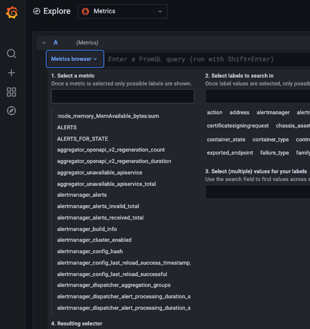

Prometheus is currently the leading tool for metric collection, it's easy to integrate and easy to use.

Still, short-term retention is a big struggle faced by Prometheus users.

Coralogix helps you overcome this struggle by providing you a way to automatically ship your metrics into your Coralogix account and store them long-term without making complex changes to your Prometheus architecture.

Enjoy our new [APM](https://coralogixstg.wpengine.com/docs/apm/) features when using OpenTelemetry collector with a Kubernetes processor and Prometheus.

## Send Prometheus Metrics to Coralogix

In order to send metrics to Coralogix, select a **Prometheus RemoteWrite** [endpoint URL](https://coralogixstg.wpengine.com/docs/coralogix-endpoints/) for the domain associated with your Coralogix account.

### Using a YAML File

Under root level add remote\_write using the following format:

```
remote_write:
- url: <endpoint>
  name: '<customer_name>'
  remote_timeout: 120s
  bearer_token: '<Send_Your_Data_API_key>'
```

### Using Prometheus Operator

Prometheus Operator provides Kubernetes native deployment.

You can add remoteWrite in the following format (note the camel case):

```
remoteWrite:
    url: <endpoint>
    name: '<customer_name>'
    remoteTimeout: 120s
    bearerToken: '<Send_Your_Data_API_key>'
```

**Note**:

- The Prometheus operator must be in **v0.59.0 at least** in order to support the agent mode.

## Guidelines & Parameters

- `url`: query params that send metric information to Coralogix. These params contain appLabelName, subSystemLabelName and severityLabelName. The parameters you should provide are the **keys** you choose to send to Coralogix, they are mapped to metric labels.

- `name`: The name of the time series. This attribute was added **after** Prometheus **v2.15.0**. If added before, it will produce an error.

- `remoteTimeout`: Timeout for requests to the remote write endpoint.

- `bearerToken`: Input your Coralogix [Send-Your-Data API key](https://coralogixstg.wpengine.com/docs/send-your-data-api-key/).

- Severities values that are valid in Coralogix are as follows: debug, verbose, info, warning, error, and critical. The default severity when leaving `severityLabelName` empty is info.

## Server Responses

The following is a list of possible server responses.

- `HTTP 200`: The protobuf file is valid and contains Prometheus Metadata.

- `HTTP 201`: The protobuf file is valid and processed by Coralogix.

- `HTTP 204`: The protobuf file is valid, but the Prometheus.WriteRequest is empty.

- `HTTP 400`: The REST API request itself was malformed. Check the query params.

- `HTTP 401`: The customer is unauthorized. Verify your private key.

## Grafana Visibility

Coralogix enables you to integrate and view your metrics from Grafana as well.


To connect Grafana to your account you can follow this tutorial: [https://coralogixstg.wpengine.com/tutorials/grafana-plugin/](https://coralogixstg.wpengine.com/tutorials/grafana-plugin/)

## Coralogix Visibility

To view the metrics in your Coralogix dashboard:

1. Navigate to 'Grafana Explore'

3. Choose 'Metrics' as a data source.

5. Expand 'Metrics browser.'

7. Select a metric.



**Enabling Metrics Archive in Coralogix**

Learn more on how to enable your S3 archive for metrics:  
[Connect S3 Archive](https://coralogixstg.wpengine.com/docs/archive-s3-bucket-forever/)

## Support

**Need help?**

Our world-class customer success team is available 24/7 to walk you through your setup and answer any questions that may come up.

Feel free to reach out to us **via our in-app chat** or by sending us an email at [support@coralogixstg.wpengine.com](mailto:support@coralogixstg.wpengine.com).
