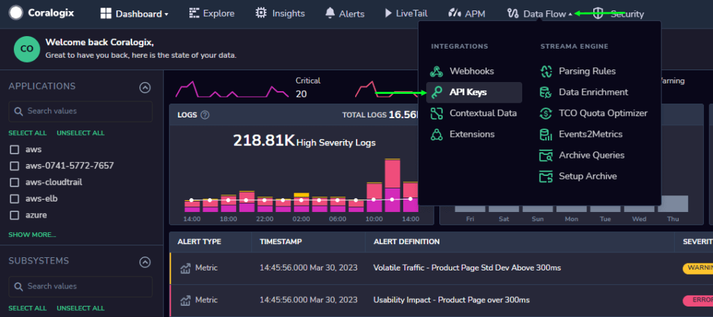
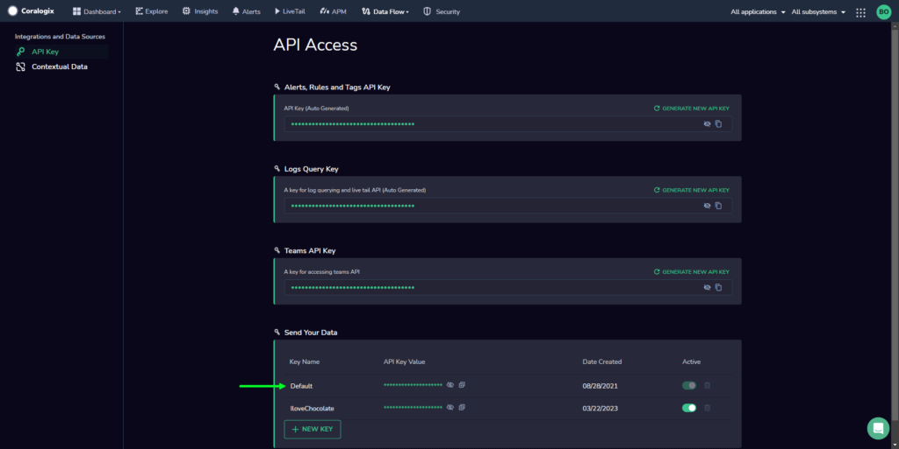

To send your data to Coralogix, you are required to access and use your unique **Coralogix Send-Your-Data API key**.

This tutorial demonstrates how to access the default Send-Your-Data API key associated with your Coralogix account, as well as to add **unlimited** Send-Your-Data API keys with **advanced security settings**.

**Note**! Customers wishing to enjoy unlimited Send-Your-Data API keys with advanced security settings should reach out to us **via our in-app chat** or by sending us an email at [support@coralogixstg.wpengine.com](mailto:support@coralogixstg.wpengine.com).

## Feature

To send your data to Coralogix, you are required to access and use your unique Send-Your-Data API key. This sensitive information is required to send us your telemetry data securely and allows us to authenticate the identity of those sending it.

Coralogix offers its customers the option of creating multiple Send-Your-Data API keys with advanced security settings, allowing you to:

- Minimize security vulnerabilities

- Utilize different keys across different systems, deployment methods, and teams

- Avoid the need to revoke one 'Send Your Data' API key in all of your systems, as well as the associated downtime, in the event of exposure

Our **recommended best practice** is to create multiple keys for your organization with all keys enjoying our advanced security settings.

**Notes:**

- Multiple Send-Your-Data API keys with advanced security systems are supported by our [Send-Your-Data Management API](https://coralogixstg.wpengine.com/docs/private-keys-management-api/).

- This feature supports sending data using [Logstash](https://coralogixstg.wpengine.com/docs/coralogix-logstash-integration/), [Fluent Bit](https://coralogixstg.wpengine.com/docs/fluent-bit/), [Vector](https://coralogixstg.wpengine.com/docs/vector/), [Fluentd](https://coralogixstg.wpengine.com/docs/fluentd/), [OpenTelemetry](https://coralogixstg.wpengine.com/docs/opentelemetry/), [Prometheus](https://coralogixstg.wpengine.com/docs/prometheus/), [Prometheus Server](https://coralogixstg.wpengine.com/docs/prometheus-server/), [Prometheus Agent](https://coralogixstg.wpengine.com/docs/prometheus-agent/), [Prometheus Operator](https://coralogixstg.wpengine.com/docs/prometheus-operator/), [Metrics Cardinality](https://coralogixstg.wpengine.com/docs/metrics-cardinality/), [Grafana API](https://coralogixstg.wpengine.com/docs/grafana-api/), [Telegraf](https://coralogixstg.wpengine.com/docs/telegraf/), [Telegraf Operator](https://coralogixstg.wpengine.com/docs/telegraf-operator/), [Zabbix](https://coralogixstg.wpengine.com/docs/zabbix/), [Nagios](https://coralogixstg.wpengine.com/docs/nagios/), [StatsD](https://coralogixstg.wpengine.com/docs/statsd/), [Custom Metrics](https://coralogixstg.wpengine.com/docs/custom-metrics/), [RabbitMQ Metrics](https://coralogixstg.wpengine.com/docs/coralogix-rabbitmq-agent/),

- At present, this feature does **not** support [Windows Event logs with Winlogbeat](https://coralogixstg.wpengine.com/docs/event-viewer-logs/),  [Beats: Filebeat](https://coralogixstg.wpengine.com/docs/filebeat/), and [Prometheus Alertmanager](https://coralogixstg.wpengine.com/docs/prometheus-alertmanager/).

## Manage Send-Your-Data API Keys

**The following section demonstrates how to (i) view and create Send-Your-Data API keys and (ii) set up your advanced security settings.**

### View and Create Send-Your-Data API Keys

**STEP 1**. In your Coralogix account, open the **Data Flow** dropdown menu in the toolbar > **API Keys**.

**STEP 2**. Under the heading **Send your Data**, you will see your default Send-Your-Data API key, which you can view and copy, as well as any other keys that you have created.

**STEP 3**. Click **+NEW KEY** to add a Send-Your-Data API key.

**STEP 4**. Input a key name and click **CREATE**.

**STEP 5**. The system will generate your key. Click **VIEW** or **DOWNLOAD**.

**STEP 6**. Click **DONE**.

Your new key will now appear with all of your existing keys under the **Send your Data** heading with its name and date of creation. **View**, **copy**, **activate, deactivate** and even **delete** it on your Coralogix UI as necessary.

**Notes:**

- Once a key is generated, only its name can be changed.

- If a key is deactivated and reactivated, it is reactivated with the same value.

- Your default key can never be deleted.

### Advanced Security Settings

**Send-Your-Data API keys created after the API Key Security Settings have been activated will be encrypted, without the possibility of viewing them after their creation.**

**STEP 1**. To enjoy advanced security settings, navigate to your personal account > **Settings**.

**STEP 2**. In the left-hand sidebar, select **API Key Security Settings**. **Activate** or **deactivate** as required.

**Notes**:

- Only account administrators have permissions to activate these settings.

- Once these settings are in place, they will apply to **new keys** generated after this time.

**STEP 3**. Open the **Data Flow** dropdown menu in the toolbar > **API Keys**.

**STEP 4**. Under the **Send your Data** heading, you will see your default 'Send Your Data' API key, as well as any other additional keys that you have generated. View the names and dates of keys, as well as the value of those keys created prior to the activation of the advanced security settings. You will **not** have the option to view and copy the value of any new keys created after the API Key Security Settings have been activated.

**Note**:

- When generating a new key once the API Key Security Settings have been activated, you will have a **one time opportunity** to view and copy it on your UI upon its creation. You will be **required** to download it as a text file to be save locally.

## Additional Resources

<table><tbody><tr><td>Documentation</td><td><a href="https://coralogixstg.wpengine.com/docs/private-keys-management-api/">Send-Your-Data Management API</a></td></tr></tbody></table>

## **Support**

**Need help?**

Our world-class customer success team is available 24/7 to walk you through your setup and answer any questions that may come up.

Feel free to reach out to us **via our in-app chat** or by sending us an email at [support@coralogixstg.wpengine.com](mailto:support@coralogixstg.wpengine.com).
