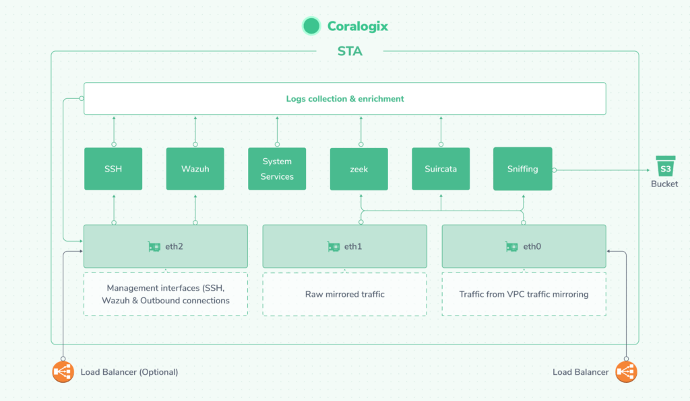

We are glad to know that you are joining our many clients who have already installed the STA. Now, you would like to know which components are installed as part of the installation of the STA and the architecture of the solution. If so, you came to the right place.

## Structure

As you have seen in the article "[How to install Coralogix STA](https://coralogixstg.wpengine.com/docs/how-to-install-coralogix-sta/)", there are multiple ways to install the STA which we will touch soon but first, let's take a closer look at the STA instance itself:

The STA's instance, listens for incoming traffic on its first two network interfaces (eth0 and eth1) but will never respond to those packets since no daemon is configured to listen on these NICs. The traffic from these network interfaces is then analyzed by Zeek and Suricata and optionally copied to the packets S3 bucket if specified during the installation. The data from Zeek and Suricata is then enriched automatically by several services within the STA and eventually - shipped to the Coralogix account specified during the installation.

Some of the enrichment services require Internet access on port 80 (RDAP) and port 443 (NIST, ET Rules updates and Coralogix connection) and the ability to perform DNS requests to several servers (RDAP, DNSRBLs, NIST, ET Rules updates and Coralogix connection).

The STA's cloud installation (either AWS CloudFormation or Terraform) will also install the following components to support the STA and facilitate its maintenance and integration:

1. **Load balancers**: An NLB will be installed and connected to the first network interface of the STA as its target and to a VPC mirror target as its source. If you chose to install Wazuh, another NLB will be created for you and will be connected to the third network interface for Wazuh ports.

3. **Elastic IP**: If you chose to install an elastic IP, one will be created and attached to the third network interface.

5. **VPC Mirror Filter**: A default mirror filter that mirrors all traffic will be created for you. This has no effect on your system unless you choose to use it in a mirror session.

7. **VPC Mirror Target**: A mirror target pointing to the sniffing NLB will be created for you to facilitate the creation of mirror sessions later.

9. **Security Group**: A security group allowing the mirrored traffic to pass through will be created and attached to the first two network interfaces.

11. **EC2 Instance**: If you chose to run the STA as an on-demand instance then an EC2 instance of the type you selected will be launched with the STA image.

13. **Spot Fleet**: If you chose to run the STA as a spot-fleet, such a spot fleet will be created and configured to automatically select an available instance out of a list of about 7 instance types similar to the one selected during the installation

15. **Launch Template**: If you chose to run the STA as a spot instance as part of a Terraform template, a Launch Template will be created as part of the installation

## Next Steps

Now that you know what each component of the STA is for and what it is doing, the next step can be to understand the default set of alerts by reading [Security Traffic Analyzer (STA) Alerts](https://coralogixstg.wpengine.com/tutorials/the-default-set-of-alerts-in-the-coralogix-security-traffic-analyzer-sta/) or to learn how to modify a Suricata rule by reading [How to Modify an STA Suricata Rule](https://coralogixstg.wpengine.com/tutorials/how-to-modify-an-sta-suricata-rule/) or, if you already know that, you will probably find the article about [Writing Effective Suricata Rules with Examples \[Best Practices\]](https://coralogixstg.wpengine.com/blog/writing-effective-suricata-rules-for-the-sta/) helpful.

**As always, please do not hesitate to contact us through the chat with any issue you may have.**
