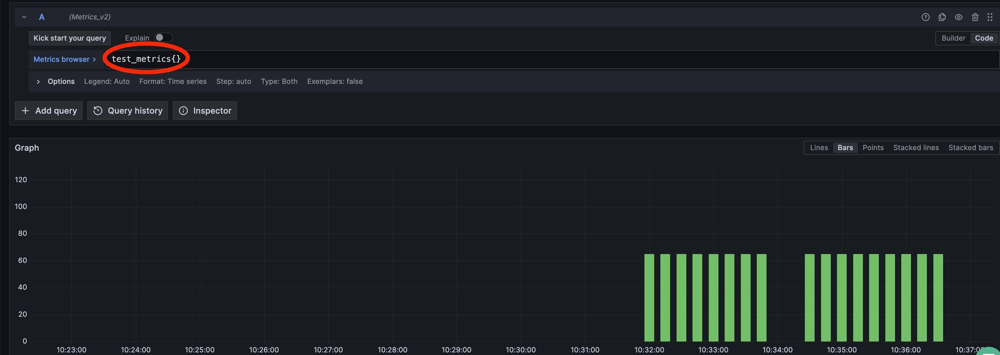

StatsD is an open-source standard and, by extension, a toolkit designed for sending, collecting, and aggregating custom metrics from diverse applications. Initially, StatsD denoted a daemon crafted by Etsy using Node.js.

This tutorial demonstrates installing and running StatsD using OpenTelemetry to send your metrics to Coralogix.

## Prerequisites

- Otel-contrib installed

- Coralogix account

## Deploy using Otel

**STEP 1**. Save this config file as `config.yaml`:

```
receivers:
  statsd:
    endpoint: "localhost:8125"
    
processors:
  batch:
    send_batch_size: 1024
    send_batch_max_size: 2048
    timeout: "1s"
  
exporters:
  coralogix:
    domain: "<coralogix_domain>"
    private_key: "<private_key>"
    application_name: "applicationName"
    subsystem_name: "subsystemName"
    timeout: 30s
  
service:
  pipelines:
    metrics:
      receivers: [ statsd ]
      processors: [ batch ] 
      exporters: [ coralogix ]

```

> **STEP 2**. Replace the `private_key` with your [Send-Your-Data API key](https://coralogix.com/docs/send-your-data-api-key/), and the `coralogix_domain` with your [Coralogix domain](https://coralogix.com/docs/coralogix-domain/).
> 
> **STEP 3**. Run the config file.

```
otelcol-contrib --config config.yaml

```

## Deploy using Docker

**STEP 1**. To deploy StatsD using Docker, change the endpoint to `0.0.0.0:8125` in the `config.yaml` file.

```
receivers:
  statsd:
    endpoint: "0.0.0.0:8125"

```

**STEP 2**. Run these commands to deploy the configuration:

```
docker pull otel/opentelemetry-collector-contrib
docker run -d -v ./config.yaml:/etc/otelcol-contrib/config.yaml -p 8125:8125/udp otel/opentelemetry-collector-contrib
```

## Validation

**STEP 1**. To send test metrics, run the following command to test the configuration:

```
echo "test_metrics:65|c|#tag_1:value,tag_2:value_2" | nc -u -w1 127.0.0.1 8125
echo "test_metrics:65|g|#tag_1:value,tag_2:value_2" | nc -u -w1 127.0.0.1 8125

```

View more configuration options for the StatsD receiver [here](https://github.com/open-telemetry/opentelemetry-collector-contrib/blob/main/receiver/statsdreceiver/README.md).

**STEP 2**. Access your Grafana account to view the metrics sent.



## **Support**

**Need help?**

Contact us **via our in-app chat** or by emailing [support@coralogix.com](mailto:support@coralogix.com).
