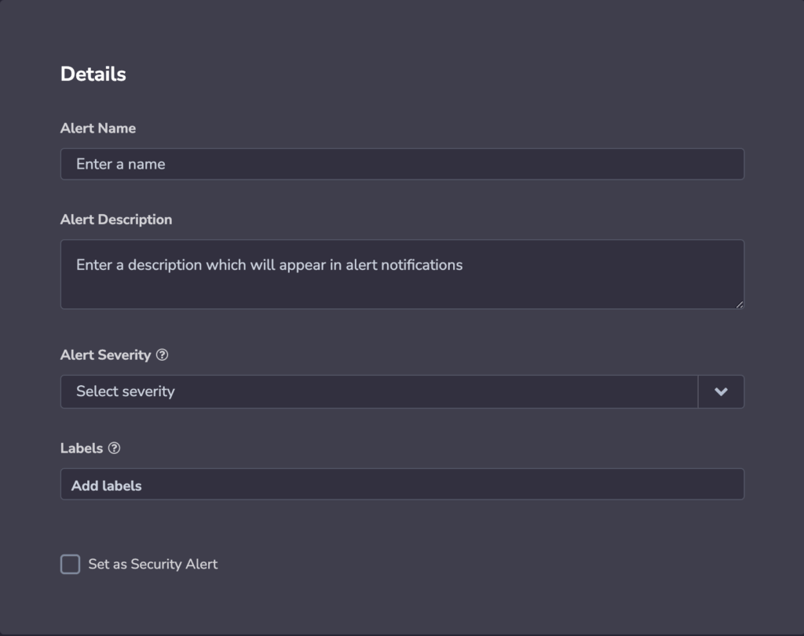
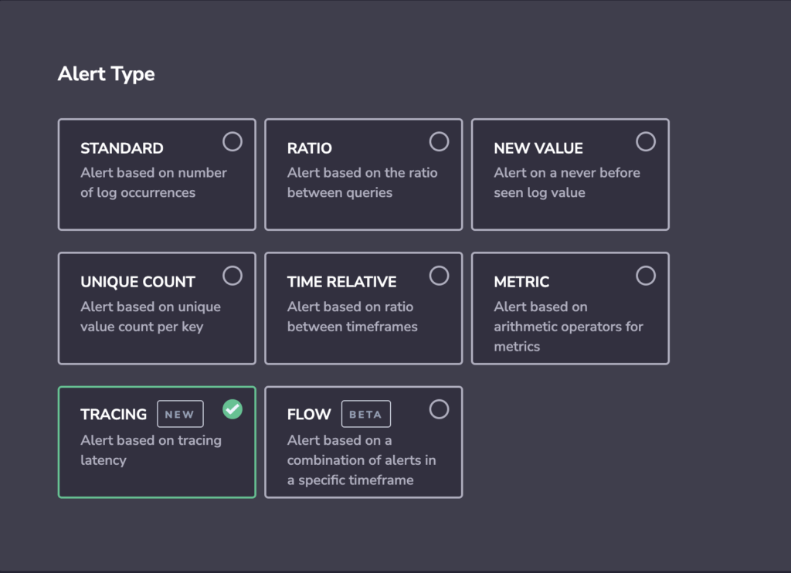
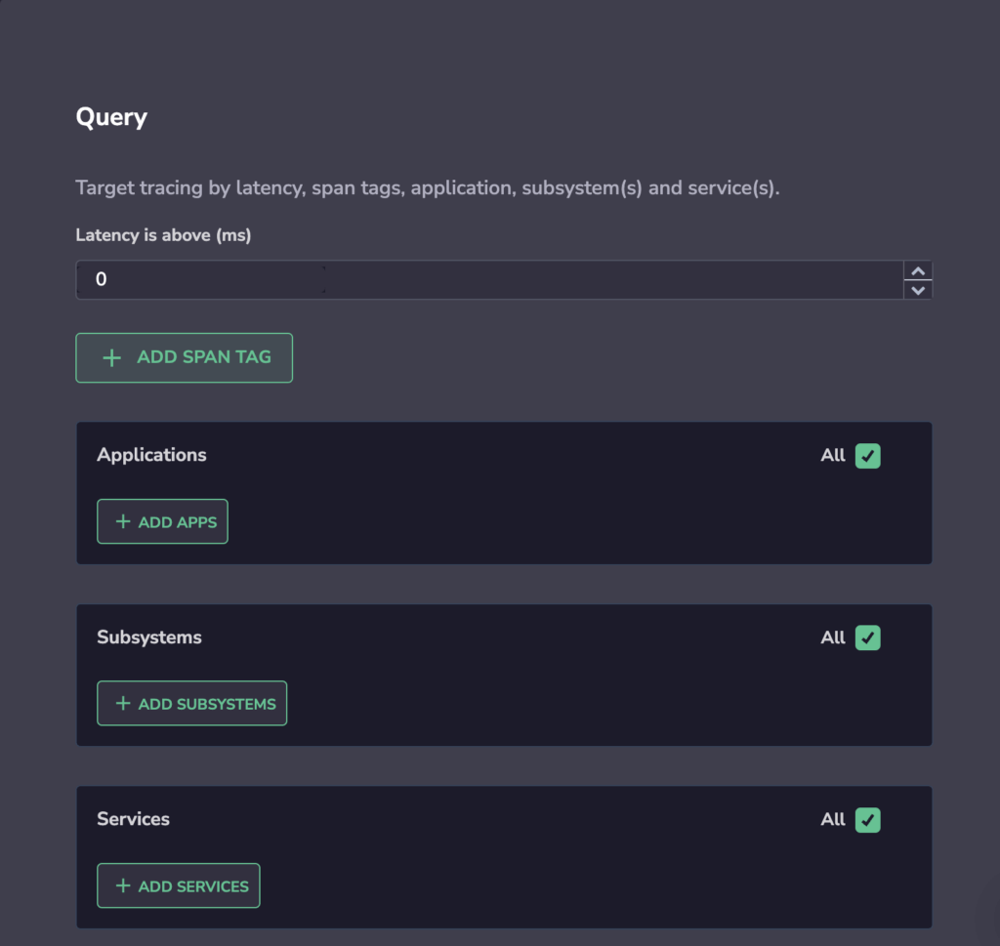
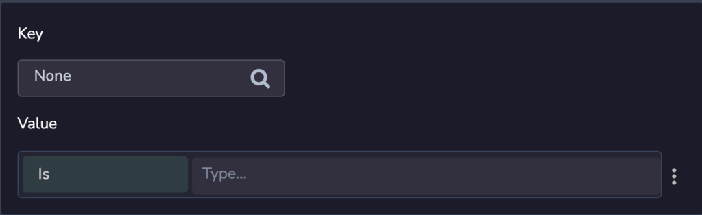
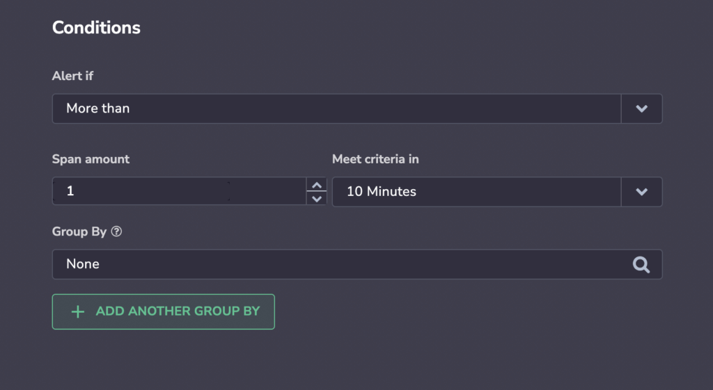
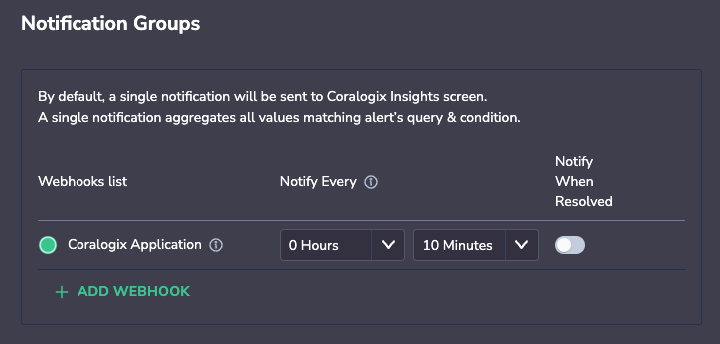
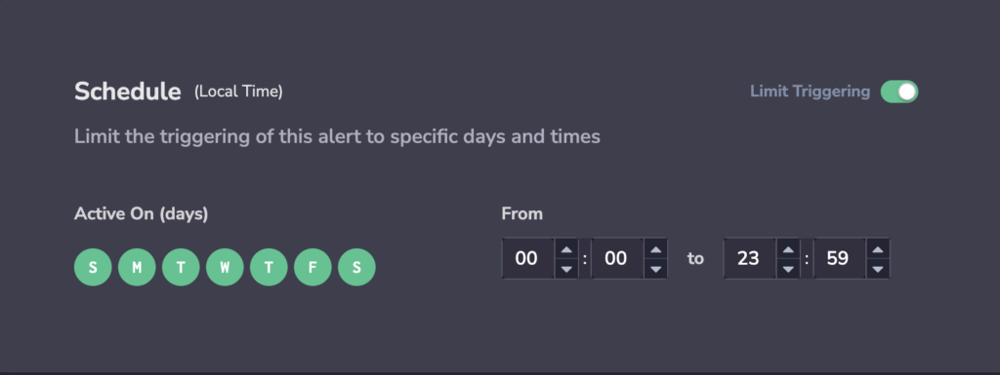
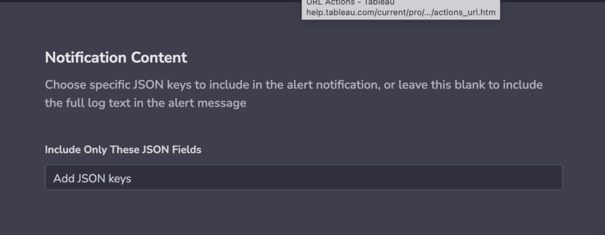

Tracing is one of the fundamental pillars of observability. It allows you to track interactions between all of your applications and understand where performance bottlenecks or errors are occuring.

Coralogix allows you not only to visualize your traces, but also set alerts on them. Our tracing alert allows you to be alerted automatically of specific tags and services on the basis of a specified latency.

## Create a Tracing Alert

**STEP 1**. Create a new Alert.

- Click on **Alerts** > **Alert Management** in the Coralogix toolbar.

- Click **NEW ALERT** on the upper right-hand corner of your dashboard.

**STEP 2**. Define **Alert Details**.

- Define:
    - **Alert Name.**
    
    - **Alert Description**.
    
    - **Alert Severity**. Choose from one of four options: **Info**, **Warning**, **Error**, **Critical**.
    
    - **Labels**. Define a new label or choose from an existing one. Nest a label using `key:value`.
    
    - **Set as Security Alert**. Check this option to create an alert related to [Coralogix security solutions](https://coralogixstg.wpengine.com/docs/cloud-security-quick-start/).

**STEP 3.** Select **TRACING** **Alert Type**.

**STEP 4**. Define **Query** parameters.

- **Latency is above (ms)**. Set this value to maximum latency - that is, the latency you are prepared to tolerate. Values greater than this will cause your spans to be counted as part of the data that will trigger your alerts.

- **\+ ADD SPAN TAG**. You may choose to add span tag to filter your spans. For example, if your span has a label that indicates it is a customer-facing component, you can add this **Key** - **Value** pair to ensure the alert does not consider any of those spans. **Value** may be followed by any of the following: **Is**, **Starts With**, **Includes**, **Ends With** or **Is**.

- You may choose to add **Application**, **Subsystem** and **Services** filters. Maintain default options by selecting the **All** option. **Note**: Each span may have a different application and / or subsystem.

**STEP 5**. Define Alert **Conditions**.

- **Alert if**. Select whether to trigger the alert immediately, or define a rule based on the number of occurrences within a specified time window.

- **Group By**. You have the option of grouping alerts by tag, with the alert monitoring each value of the specified tag.
    - An alert is triggered whenever the condition threshold is met for a specific aggregated value of the tag selected within the specified timeframe.
    
    - If using 2 labels for **Group By**, matching metrics will first be aggregated by the parent label (ie. **region**), then by the child label (ie. **pod\_name**). An alert will fire when the threshold meets the unique combination of both parent and child. Only metrics that include the **Group By** labels will be included in the count.

**STEP 6**. Define **Notification settings**. Select how to be notified when an alert is triggered. By default, a single notification, aggregating all values matching an alert query and conditions, will be sent to your Coralogix **Insights** screen.

- **\+ ADD WEBHOOK**. Define additional alert recipient(s) and notification channels.

- **Notify** **Every**. Sets the alert cadence. After an alert is triggered and a notification is sent, the alert will continue to work, but notifications will be suppressed for the duration of the suppression period.

- An **individual notification** for each of the values of the **Group By** fields will be sent when query conditions are met. Choose the recipient of the notification and the notification parameters.

**STEP 7**. Set a **Schedule** for trigger the alert.

**STEP 8**. Define **Notification Content**. Choose specific JSON keys to include in the alert notification, or leave this blank to include the full log text in the alert message.

## **Support**

**Need help?**

Our world-class customer success team is available 24/7 to walk you through your setup and answer any questions that may come up.

Feel free to reach out to us **via our in-app chat** or by sending us an email at **[support@coralogixstg.wpengine.com](mailto:support@coralogixstg.wpengine.com)**.
