Get up to speed on everything new and improved in the Coralogix platform!

## January 2024

### Take Control with Our New Role Based Access 

Whether you’re a growing business or enterprise, you need to manage your users’ permissions clearly and effectively. With Coralogix’s new RBAC, you can easily control user access. Create a brand new user role by choosing from over 300 different permissions, or select one of our seven predefined system roles—all customizable.

[View Documentation>](https://coralogixstg.wpengine.com/docs/roles-permissions/)

### Suppress Your Alerts When Needed

Use our new Alert Suppression Rules to mute alerts you don’t need during scheduled maintenance, testing, auto-scaling events or outside working hours. Simply select your specific parameters to suppress what, when and which alerts go off in your system.  

[View Documentation>](https://coralogixstg.wpengine.com/docs/alert-suppression-rules/)

### More RUM Anyone? Core Web Vitals Now Available To Optimize User Experience 

In addition to our updated [RUM Browser SDK](https://coralogixstg.wpengine.com/docs/browser-sdk-installation-guide/) and [error tracking alerts](https://coralogixstg.wpengine.com/docs/error-tracking-user-manual/#add-an-alert-to-track-an-error), we’ve added Core Web Vitals, so you can easily keep an eye on your web performance and overall user experience.   
  
[View Documentation>](https://coralogixstg.wpengine.com/docs/core-web-vitals/?embedded=true)

### Easily Import and Export Custom Dashboard 

Effortlessly share your custom dashboards across teams within your organization by importing and exporting them, eliminating the need to recreate dashboards and minimizing overhead.

[View Documentation>](https://coralogixstg.wpengine.com/docs/import-export-custom-dashboards/)

### View Metrics And What They Monitor

Adding metrics to your Custom Dashboard? You can now use free text to search for a metric of your choice and see what that metric monitors. Simply hover over any metric to view its system-generated metadata labels and values.

[View Documentation>](https://coralogixstg.wpengine.com/docs/custom-dashboards/#metrics-exploration)

##   
December 2023

### RUM User Sessions

Track every step of your users’ interaction with your website or application. Analyze and correlate real-time data for rapid response to critical issues. Gain insight into user flow for improved conversions and high user satisfaction.

[View Documentation>](https://coralogixstg.wpengine.com/docs/user-sessions/)

### GenAI Query Assistant

Our new Query Assistant is an AI-powered search feature that lets you use natural language for querying data. Just type in what you are looking for and the Query Assistant will translate your request into Coralogix’s DataPrime query language. You can modify your query, either in natural language or by changing the generated DataPrime query itself.

[Learn More>](https://coralogixstg.wpengine.com/blog/generative-ai-for-querying/)

### Incidents Screen

Gain more insights into your triggered alerts with our improved Incidents feature. With a secondary set of notifications, you’ll get more contextual information to drill down around any issues that come your way. Group by tags by region, environment, and more.

[View Documentation>](https://coralogixstg.wpengine.com/docs/incidents/)

### Metric Alert - Less Than Usual Condition

Our AI-leveraged alerts give you full visibility of what is happening in your services, setting the most accurate threshold for your data. The alert system allows for prediction modeling methods and variability to enhance your system’s overall performance.

[View Documentation>](https://coralogixstg.wpengine.com/docs/machine-learning-metric-alert/#create-a-metric-alert-with-the-less-than-usual-condition)

### Apdex Score

Check out our latest widget added to our [Service Catalog](https://coralogixstg.wpengine.com/docs/service-catalog/), the Apdex Score, or Application Performance Index. Measure and quantify user requests with a configured response time threshold that’s true to customer satisfaction, from tolerated to frustrated categorization.

[View Documentation>](https://coralogixstg.wpengine.com/docs/apdex-score/)

### OpenTelemetry Lambda Auto Instrumentation

Coralogix now supports the latest version of OpenTelemetry Lambda auto instrumentation wrappers, together with our AWS Lambda Telemetry Exporter. Continue to get complete telemetry and generate traces for Lambda.  

[View Documentation>](https://coralogixstg.wpengine.com/docs/otel-lambda-auto-instrumentation/)

## October 2023

### Error Template View

Simplify error management with advanced templating of similar errors into definable issues. Effectively reduce unnecessary noise with drill-down based on customizable filters such as error type, username, URL, session ID, data source and more. 

[View Documentation>](https://coralogixstg.wpengine.com/docs/error-template-view/)

### GCP Traces

Expand your APM coverage by sending your Google Cloud traces seamlessly to Coralogix, being able to search, analyze and visualize your applications’ performance and health.

[View Documentation>](https://coralogixstg.wpengine.com/docs/gcp-traces/)

### AWS Kinesis Data Firehose Metrics

Monitor all your AWS services with real-time streaming data delivered from AWS Kinesis Data Firehose directly to Coralogix. With our simple integration, you can get started in just a few steps.

[View Documentation>](https://coralogixstg.wpengine.com/docs/amazon-kinesis-data-firehose-metrics/)

### Azure Resource Manager (ARM) Integration

We’ve added more to our ARM integration so you can create custom Coralogix templates to send events from not only Event Hub but also Blob storage, Queue storage and Diagnostic storage.

[View Documentation>](https://coralogixstg.wpengine.com/docs/azure-resource-manager-arm-integration-packages/)

## September 2023

### **New Quota Manager**

For extensive org-level data management, the Quota Manager now presents data consumption as both Coralogix Units and GB sent; with group by options: Pillar (Logs, Metrics, Traces) and Priority (Blocked, Low, Medium, High).

[View Documentation>](https://coralogixstg.wpengine.com/docs/managing-your-organization-quota-manager/)

### **Extensions Improvements**

Our evolving extensions page simplifies data transfer to Coralogix. We've added new integration flows for GCP Spans, Azure ARM, Azure Metrics, and Slack. Plus, you can now preview flow alerts in Coralogix extensions.

[View Documentation>](https://coralogixstg.wpengine.com/docs/integration-packages/)

### **Dashboard Improvements**

Exciting dashboard updates include interlinked filters, stacked bar charts, and a new colour scheme for graphs. Plus, enjoy design flexibility with the new Markdown Widget and query archived data within custom dashboards.

[View Documentation>](https://coralogixstg.wpengine.com/docs/custom-dashboards/)

### **RUM Onboarding**

Enable Real User Monitoring quickly with the RUM Integration Package. It automates RUM Browser SDK setup and source map uploads, capturing and sending network requests and errors to Coralogix once configured.

[View Documentation>](https://coralogixstg.wpengine.com/docs/rum-integration-package/)

### Robust CSPM

We've improved our CSPM (Cloud Security Posture Management) offering by extending GCP support, offering enhanced clarity and guidance on issue resolution across AWS and GCP in around 600 scenarios.

[View Documentation >](https://coralogixstg.wpengine.com/docs/cloud-security-posture-management-cspm/)

## August 2023

### Unified Threat Intelligence

Coralogix’s ‘Unified Threat Intelligence’ relies on our Streama technology to provide you with built-in seamless integration with some of the world’s leading threat intelligence feeds. These feeds show hundreds and thousands of threat entities curated by our security experts, allowing you to discover malicious network activities.

API integration, special syntax, or format change is not required. You can automatically enrich your log data with malicious indicators in real time, letting you query, visualize, and set alerts on potential threats.

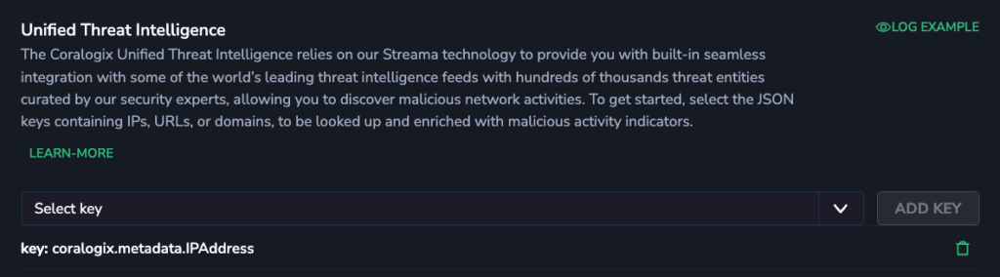

[View Documentation>](https://coralogixstg.wpengine.com/docs/unified-threat-intelligence/)

### Kubernetes Collector

You can now leverage our powerful Kubernetes dashboard with greater ease, thanks to the newly added ‘Kubernetes Collector’ extension in Coralogix Apps. With the new collector, you can collect the exact data (metrics and K8s events) needed for the installation and install via OpenTelemetry, without the need to manually install each different component.

A preset of the OpenTelemetry collector, this collector is designed to enhance your open telemetry data and seamlessly push it to Coralogix and view it in the Kubernetes dashboard. The Kubernetes Collector is the first step towards simplifying the open telemetry configuration.

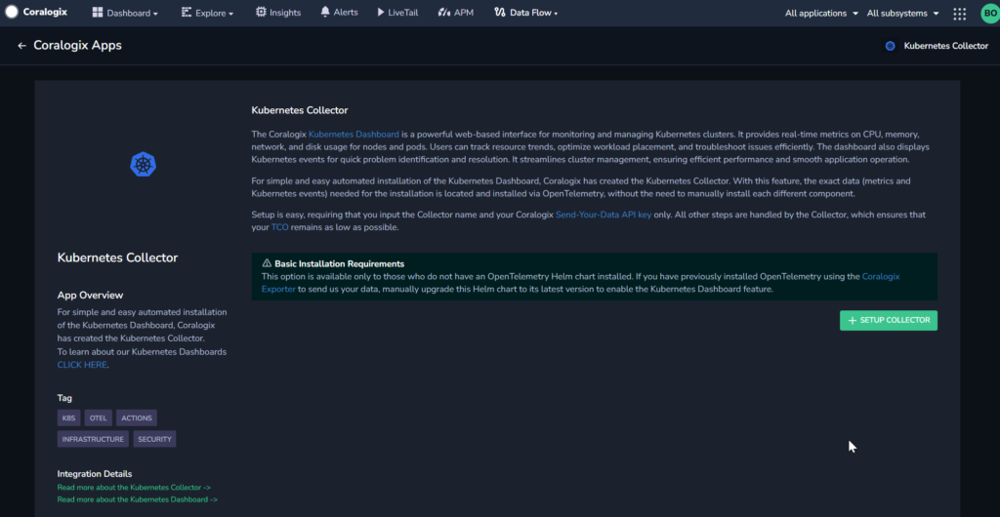

[View Documentation>](https://coralogixstg.wpengine.com/docs/kubernetes-collector/)

### Dashboard Improvements

Here’s what’s new in this month’s edition of ‘Custom Dashboard’ improvements: 

- Custom dashboards will now support a longer time range, to query data from as past as 90 days. This ability will be helpful to query metrics especially.

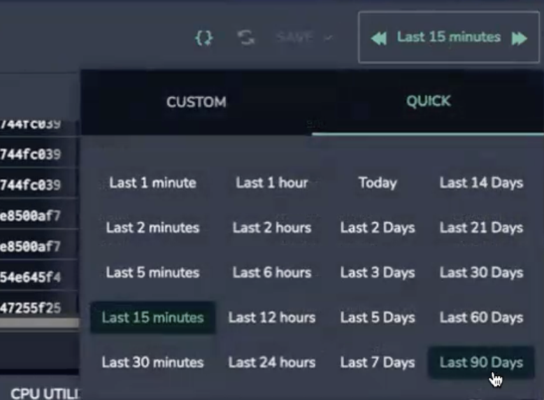

- Line chart widgets now come with an option to create a new alert. You can just set the alert thresholds and customize the alert conditions, group-by etc. to get started.

- Money has been added as a new set to the ‘Unit’ field, with currencies like cents, euros and US dollars.

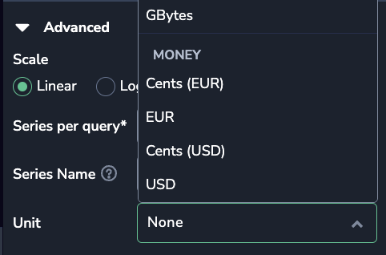

- Lastly, you can now edit multiple queries even further, with quick options to hide, rename and duplicate the queries.

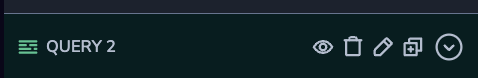

[View Documentation>](https://coralogixstg.wpengine.com/docs/custom-dashboards/)

### DataPrime Log Enrichment

You can now use Coralogix’s DataPrime query language to enrich and filter your logs using additional context from a lookup table. With this feature, you can enrich old logs already ingested into Coralogix. Moreover, the on-demand log enrichment doesn’t increase the size of the stored logs.

This becomes immensely useful when you need to get more context into your existing logs. For example, assume you would like to explore all activity logs of all users in your Finance department, while your logs only include the user names. Enrichment of your existing user activity logs with the user's department allows you to run such a query.

[View Documentation>](https://coralogixstg.wpengine.com/docs/dataprime-cheat-sheet/#enrich) (skip to "enrich" section)

## July 2023

### Multiple Queries within a Single Widget

Custom dashboards now support multiple queries, allowing you to compare logs, metrics and spans on the same line chart. Each query gets a dedicated query panel at the bottom and a collapsible side panel on the right, with options to customize each query.

The side panel includes options to change the data source, add multiple group-by values, define data aggregation type, switch between linear and logarithmic scales, select time or data units and view only errors if required.

[View Documentation>](https://coralogixstg.wpengine.com/docs/multiple-queries-in-custom-dashboard-widgets/)

### Tracing Visualization

While adding group-by values for tracing graphs, you can now choose to display what aggregate value is shown, the options being ‘max, min and avg’. You can also share a tracing dependency graph as a shareable URL, that can be opened without changing the saved view.

A “Services” tab displays the execution time of the services in the selected trace. Clicking on the listed services takes you to the respective service catalog. An option to recenter the traces dependency view is also added as a part of the tracing enhancements.

[View Documentation>](https://coralogixstg.wpengine.com/docs/distributed-tracing/)

### Coralogix Apps

The integrations on “Coralogix Apps” have been extended to include CloudTrail, S3 Log Collection, CloudWatch and VPC Flow Logs from AWS. When deploying, you must add all the required details to automatically collect data from your AWS account. These deployments execute a CloudFormation that adds your relevant resources. To remove an integration, you just need to delete the CloudFormation from your AWS console.

Apart from the AWS resources, Okta can also be integrated in a much easier way. All you have to do is add your Okta domain and the API key to kickstart the data ingestion. The extensions that can be applied to any integration are mentioned right below the integration details.

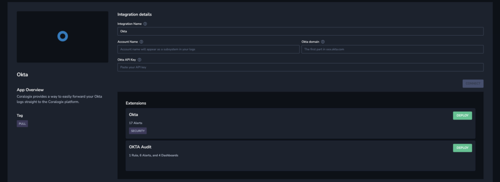

[View Documentation>](https://coralogixstg.wpengine.com/docs/integration-packages/)

### Bar Chart Additions

Bar charts in custom dashboards now have the option to group charts either by time buckets or multiple group-by values. The time buckets can either be auto-set on pre-defined time intervals or manually changed by specifying the required time interval.

You can also customize the bar chart visuals by defining the number of bars, slices per bar, stacking options, selecting time or data units, and switching between linear and logarithmic scales. When stacking, you can also define a custom stack name using free text and labels.

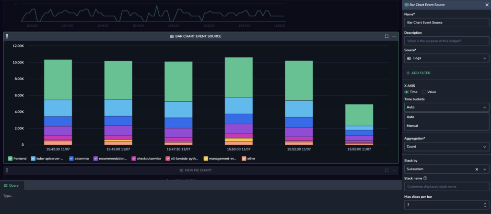

[View Documentation>](https://coralogixstg.wpengine.com/docs/custom-dashboards-bar-charts/)

### Recording Rules

You can now see/update existing recording rules and create new ones using the new UI for Recording Rules. It allows you to easily define a recording rule and categorize it under rule sets and rule groups.

Rule group, with its evaluation interval and series limit, is applied to all the recording rules under it. Rule sets are a way for you to logically sort all of your recording rules. 

You can also see a preview of the recording rules for the last 3 hours (limited to 100 permutations). Lastly, recording rules are also supported in extensions as read-only.

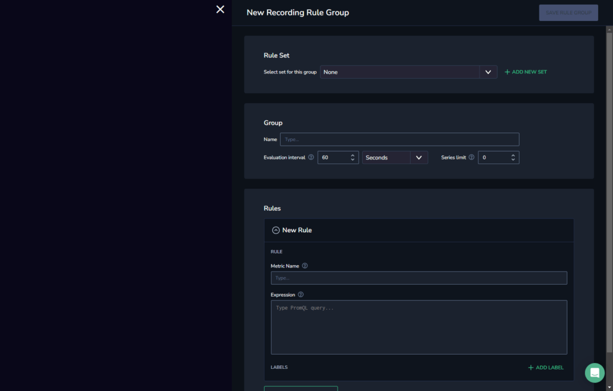

[View Documentation>](https://coralogixstg.wpengine.com/docs/recordingrules/)

### Dashboard Improvements

Here are some new additions and improvements made to custom dashboards:

- Going forward, when a dashboard is saved, the selected timeframe will be saved too. Also, an error message will be displayed when the dashboard fails to save.  
    

- Multiple group-by fields can be selected for Spans in pie charts, bar charts and line charts. Also, Spans in the data table are now clickable, directing you to the relevant trace.  
    

- You can choose from multiple time, data and currency units to customize the data series graphs. The data units can either be base 2 or base 10.

- A new tooltip tab is added to dashboard widgets, to show a single time series or all time series, with and without labels.

- In Pie Charts, you can define which group-by keys should be grouped together in the “other” category by setting a display threshold.

- A context menu with follow-up actions like ‘include, exclude and explore’ is added to the legend area of Line Charts.  
    

- When multiple y-axes are used for the same panel, hovering a graph of one series now also highlights the relevant y-axis.

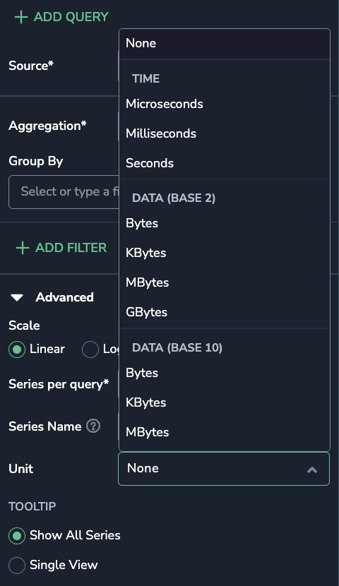

[View Documentation>](https://coralogixstg.wpengine.com/docs/custom-dashboards/)

### Traces Flame View

A new ‘Flame View’ is added to the existing Traces Dependency view and Gantt view. The flame view is particularly useful for large traces. Like the dependency view, the flame view also supports group-by with aggregation. 

This view has the unique feature of zooming onto a specific span for more details and a reset button to return to the original chart view. The view also comes with a context menu that has follow-up actions to view related logs, pod, host, service map and service catalog.

[View Documentation>](https://coralogixstg.wpengine.com/docs/distributed-tracing/)

### More Than Usual Alerts

You can now set the 'More Than Usual' condition for metric alerts, to detect anomalies in the values of any metric received (including E2M).

The new mechanism utilizes an improved machine learning-based prediction algorithm, which creates a forecast for the metric's values for the coming 24 hours, based on the last 7 days of data. 

It creates a prediction for every group-by permutation of the selected metric, selecting the evaluation time window and setting a minimal threshold for triggering.

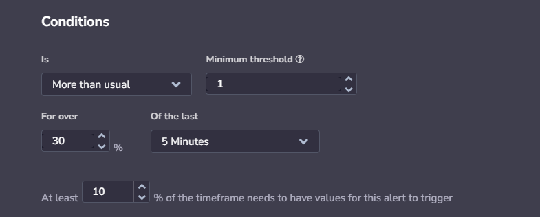

[View Documentation>](https://coralogixstg.wpengine.com/docs/machine-learning-metric-alert/)

## June 2023

### Traces TCO Optimizer

Prioritize important traces and reduce up to two-thirds of your tracing costs. Assign high, medium and low priority levels and access a different range of features for each. Allocate data pipelines for your traces based on the importance of that data to your business. Priority levels will simplify assigning TCO pipelines and will capture any applicable future traces on ingestion.

‘High’ priority, frequent search traces will be fully ingested and all Coralogix capabilities will be available for the same. Monitoring traces will be processed and archived when a ‘Medium’ priority level is assigned. Compliance traces will be archived and assigned a ‘Low’ priority.

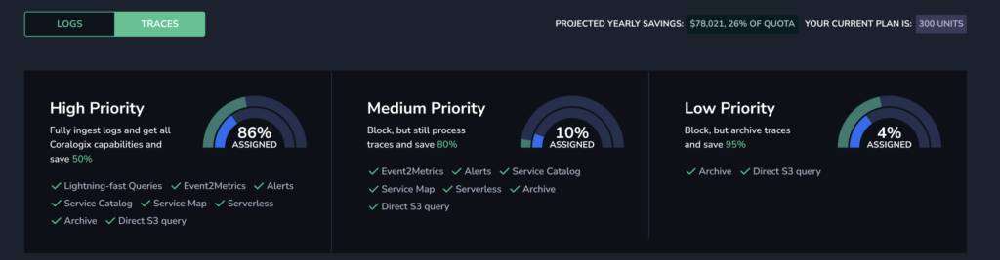

[View Documentation>](https://coralogixstg.wpengine.com/docs/tracing-tco-optimizer/)

### Data Usage Metrics

Admins can now enable the collection of data usage metrics as native Prometheus metrics, to get granular details on their data consumption. This feature requires the team to have a valid S3 metrics archive bucket configured. With these new metrics, you will be able to create custom dashboards, insights, alerts, and an overview of your data.

The Data Usage Metrics feature creates two new metrics – GB Sent and Counted Units – which count toward your team’s daily metrics quota. Metric names will appear as: ‘cx\_data\_usage\_units’ and ‘cx\_data\_usage\_bytes\_total’ on dashboards.

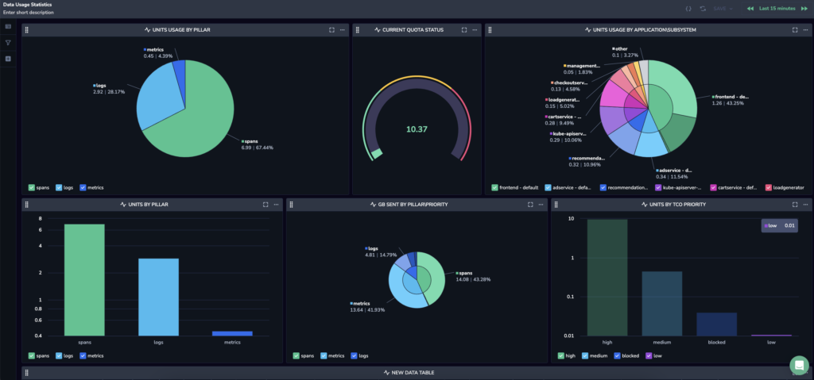

[View Documentation>](https://coralogixstg.wpengine.com/docs/data-usage-metrics/)

### Incoming Webhooks

It’s now easier to connect your applications to Coralogix with our new simplified process that lets you generate webhook URLs. This simplifies the process of generating a webhook URL to connect applications and systems with Coralogix, expanding your selection of connections.

Each webhook is associated with an API key and you can define whether the incoming data is plain text or JSON, application & subsystem names, and lastly the timestamp located in the log. This new integration flow will be available on CloudTrail to start with.

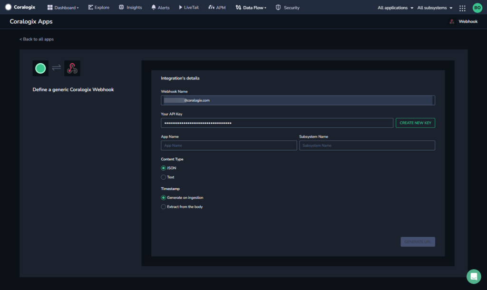

[View Documentation>](https://coralogixstg.wpengine.com/docs/generic-incoming-webhooks/)

### Dashboard Improvements

Custom Dashboards are now more powerful. Pie charts and bar charts have been added as new additions to widgets, along with pre-existing line charts, gauge and data tables. All 5 widget types will support all 3 data types (logs, metrics and spans) going forward.

In addition, for advanced filtering and customization, both pie charts and bar charts come with options like group-by, stack-by, linear and logarithmic scales, advanced visualization filters and more. Data tables have been upgraded too, with a ‘values over time’ graph which generates a small plot to understand the behavior over the dashboard’s query time.

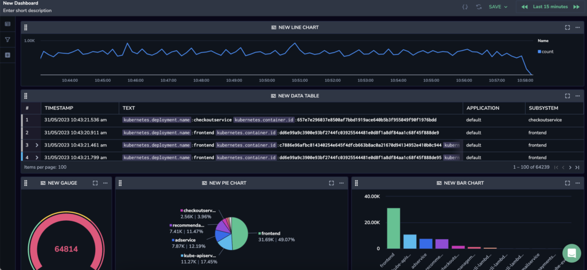

[View Documentation>](https://coralogixstg.wpengine.com/docs/custom-dashboards/)

### Explore Screen Improvements

Here are some of the new additions to the ‘Explore’ screen:

- A ‘Group-by’ option has been added to the logs archive histogram to cluster the graph by any log field. You can access this option either by the graph menu at the top or by the key context menu. This is enabled only for customers who have moved to the datafusion query engine.

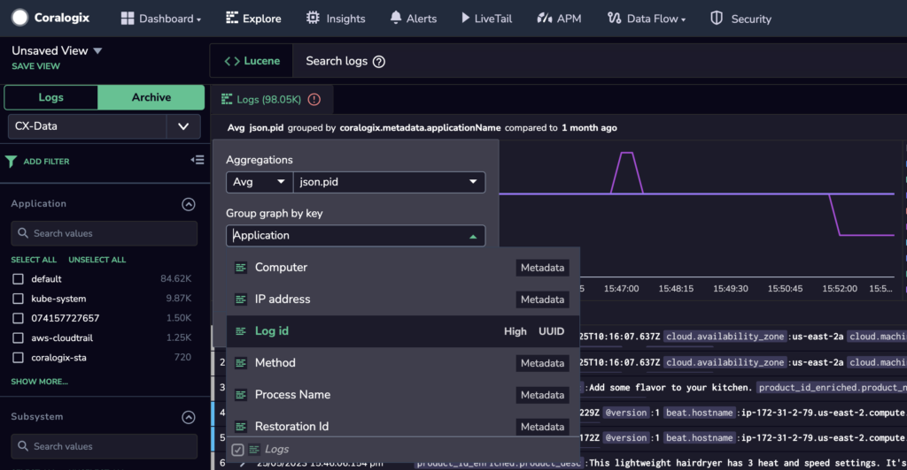

- The traces dependency graph now supports a few 1,000s of spans instead of only 500. A context menu is added to each span which serves as a shortcut to the window containing details on related logs, events, pod and host. Lastly, a group-by option is added to focus on only relevant span tags at a time, producing a simpler traces graph. The two default group-by options are operationName and serviceName.

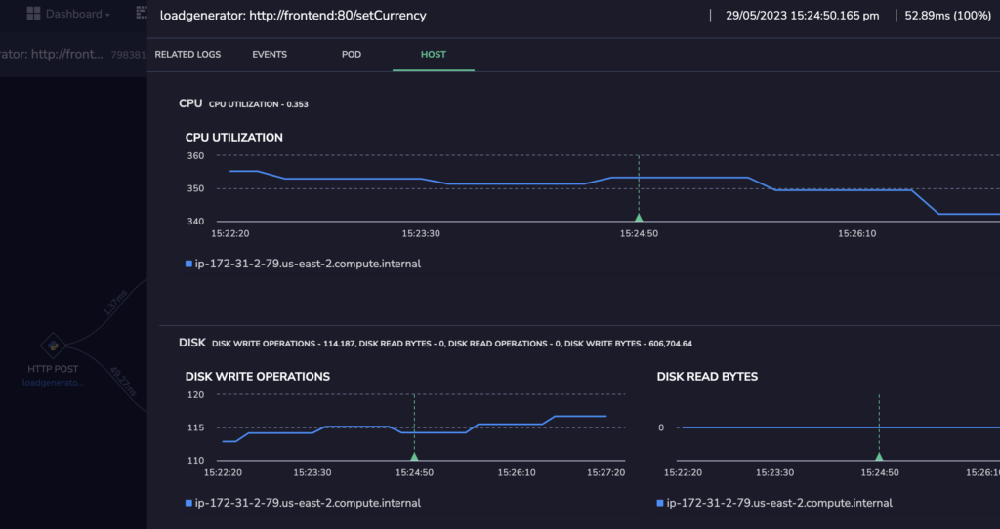

- Lastly, a ‘Manage Keys’ pop-up is added to columns displaying objects in the Explore screen. This will allow you to pin, sort and exclude log keys of your choice; bring important log information to the top and stay focussed on the current context.

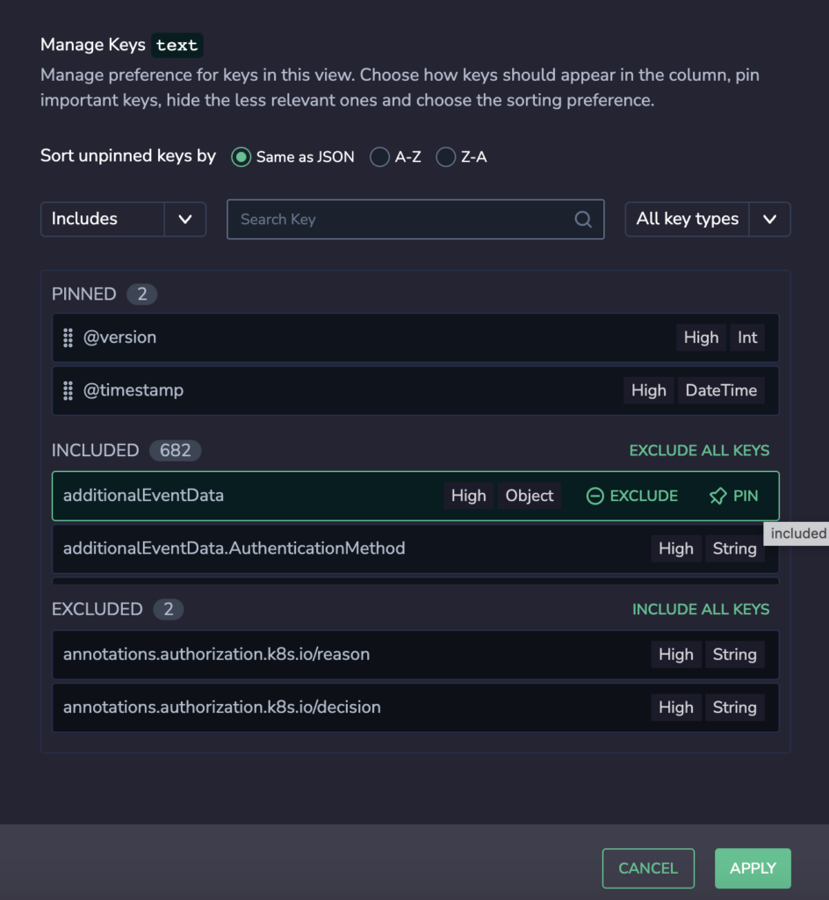

[View Documentation>](https://coralogixstg.wpengine.com/docs/explore-screen/)

### Service Catalog Filters

The service catalog now includes a filter panel, similar to the logs Explore screen. This allows you to filter services based on specific characteristics in the span tags. The selected filters are also passed on to any service you dive into.

[View Documentation>](https://coralogixstg.wpengine.com/docs/service-catalog/)

### Permutations Graph

Events2Metrics now includes a graph that displays the amount of permutations actually used and permutations left from the logs archive and the high tier for spans, for a 7-day period. You can choose up to 10 labels for the visualization and once the changes are made, hit refresh.

[View Documentation>](https://coralogixstg.wpengine.com/docs/event2metrics/)

### Metric Recording Rules

With the latest UI improvements in Recording Rules, it is now much easier to create new recorded metrics, from the existing ones in Coralogix. The new UI allows you to create new metrics either by importing a YAML file or creating a rule group.

This will simplify complex and resource-intensive PromQL queries into leaner and more quickly queried metrics, which can be used in various dashboard visualizations and high-performance analytics.

[View Documentation>](https://coralogixstg.wpengine.com/docs/recordingrules/)

## May 2023

### Service Catalog

Service Catalog is a new feature added under Coralogix’s APM offering. It includes a list of all the services in your system and you can view details such as service type, number of requests sent by the service, the error rate, and the P95 latency by specifying a time range.

You can drill down on each service to look at a service map in the left pane and additional details in the right pane. The service map shows all the services connected to a root service and the right pane provides tabs for a detailed overview, actions taken by the services, health status of resources and logs of each service.

[View Documentation >](https://coralogixstg.wpengine.com/docs/service-catalog/)

### Rolling Window

Under standard user-defined alerts, if the alert conditions are set for ‘More than’, you can now choose a new type of evaluation window to define the queried time window. You can choose between the newly added Rolling Window and the existing Dynamic Creation. 

Rolling Window is a fixed timeframe and doesn’t change with alert triggers. Dynamic Duration changes the queried time period when an alert is triggered. Rolling Window is now the default choice of evaluation window and is recommended to be used when using ‘Group-by’ with an alert.

[View Documentation >](https://coralogixstg.wpengine.com/docs/coralogix-user-defined-alerts/)

### Dashboard Improvements

Pie Chart is added as a new visualization widget under custom dashboards. It comes with abilities to group-by, aggregate and stack-by data sources and other advanced controls to customize the visuals. Pie Chart is the 4th visualization widget added to custom dashboards.

In addition, ‘Metrics’ is added as a new filter type to make dashboards customizable by the source of data. A ‘Save As’ button is added to clone existing dashboards easily, and a ‘Show Only Errors’ button is added to highlight only errors in span-based widgets.

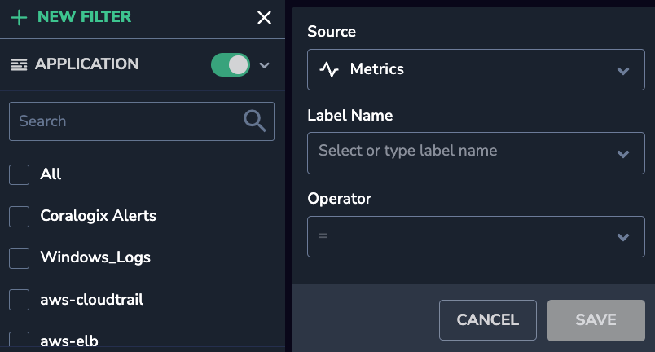

[Go to Platform >](https://dashboard.coralogixstg.wpengine.com/#/login)

### Extensions Improvements

With the new feature and design improvements, you can now do more with Extensions on Coralogix. Prometheus recording rules can now be deployed as part of an extension. Security and AWS enrichments can be deployed in addition to Geo and Custom Enrichments. Also, selective deployment of enrichments is now possible, allowing you to select only specific enrichment rules when deploying an extension.

A notification will be displayed if deploying the extension will take you over the maximum enrichment quota. Also, hover backgrounds are now shown on dashboard screenshots. And lastly, design and UI improvements have been made to Extensions.

[View Documentation >](https://coralogixstg.wpengine.com/docs/extension-packages/)

### Flow Alert Group-by

The flow of alerts can now be grouped by the common group-by keys used in the defined alerts. This allows you to examine all alert stages in the context of a single field value. The group-by options available for each alert can be viewed in the Flow Builder by hovering over the alerts. 

The group-by fields that can be selected are automatically pulled from the list of fields (from Log-based alerts) and tags (from Span-based alerts), and only ones that show up throughout all alerts will be pulled out automatically for selection.

[View Documentation >](https://coralogixstg.wpengine.com/docs/flow-alert/)

### OTEL Metrics

The K8S dashboard in Coralogix now supports OTEL metrics if you are using an OpenTelemetry collector with a Kubernetes orchestration together with Prometheus to send your data to Coralogix. You can use this feature along with our other application performance monitoring (APM) features, to get a full picture of your system performance.

The K8S dashboard gives you a comprehensive view of your system's clusters, nodes and pods. In addition, the dashboard also shows the health status of your resources and displays all Kubernetes events. Collect Kubernetes events using OpenTelemetry.

[View Documentation >](https://coralogixstg.wpengine.com/docs/kubernetes-dashboard/)

## March 2023

### Spans in Custom Dashboards

Custom Dashboards are now more flexible. Use spans as a new data source, along with logs and metrics. The data source is available across all existing visualizations including Line Chart, Data Table and Gauge visualizations.

Spans can also be added as a data source for filters on any Custom Dashboard, allowing you to apply filters on parameters such as Span Service. Filters in Custom Dashboards also support Span Tags, which can be added as fields in the filter. Spans filters will only affect spans widgets on a dashboard, and will not affect any widgets based on logs or metrics.

[View Documentation >](https://coralogixstg.wpengine.com/docs/custom-dashboards/)

### Notification Groups

Alert notifications can now be grouped into multiple ‘Notification Groups’ for different keys. You can add multiple webhooks to split the alert triggers and customize the notification frequency for each webhook. 

You can further activate the ‘Notify when Resolved’ trigger to stay on top of alert notifications.

In addition, an individual notification is sent to each value of the Group By key when the unique query conditions are met within the specified timeframe. 

For example, if you have used “region” as a Group By key and let’s say, it has 2 values i.e. Region A and Region B; individual notifications will be sent to both A and B respectively.

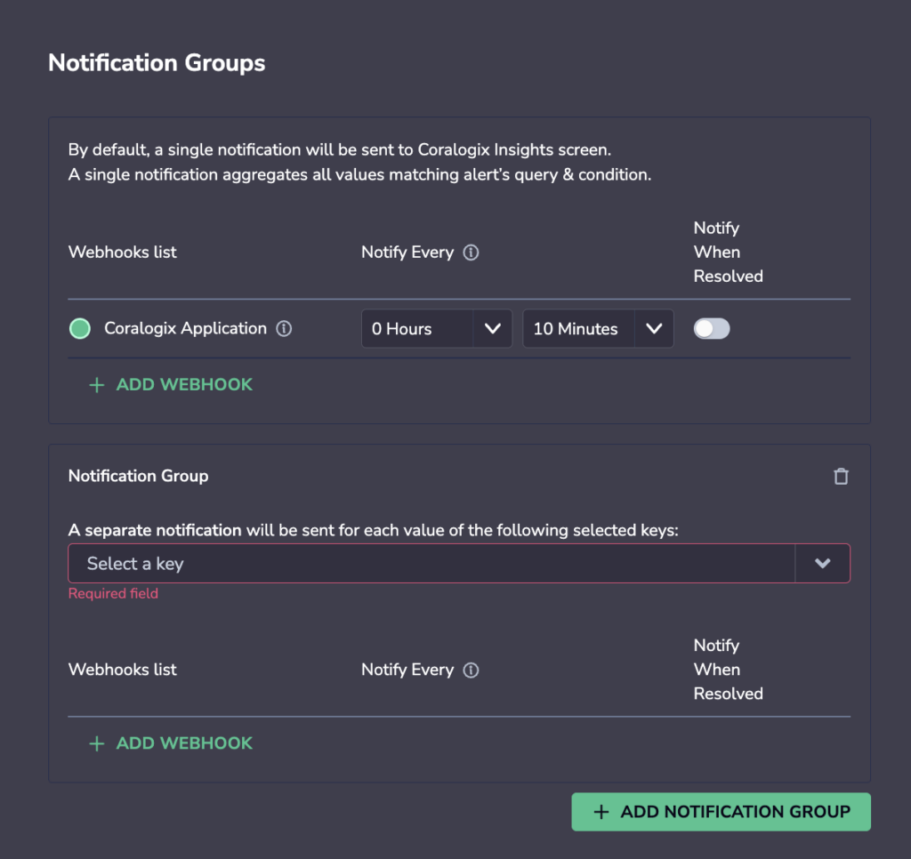

[View Documentation >](https://coralogixstg.wpengine.com/docs/alerts-api/)

### Content Column

A new Content Column is added to the ‘Explore’ screen grid, to improve visibility for content fields and distinguish them from the labels fields. Most logs will have content fields and it is now easy to extract these fields from logs, according to a predefined order list (message, log, k8s.log 

etc).

You can edit the content list and truncate long keys and values in the label fields and show them flattened instead of JSON. With this new feature, you can define important/favourite labels that will be sorted first, have a default favourites list and allow an extension to update it.

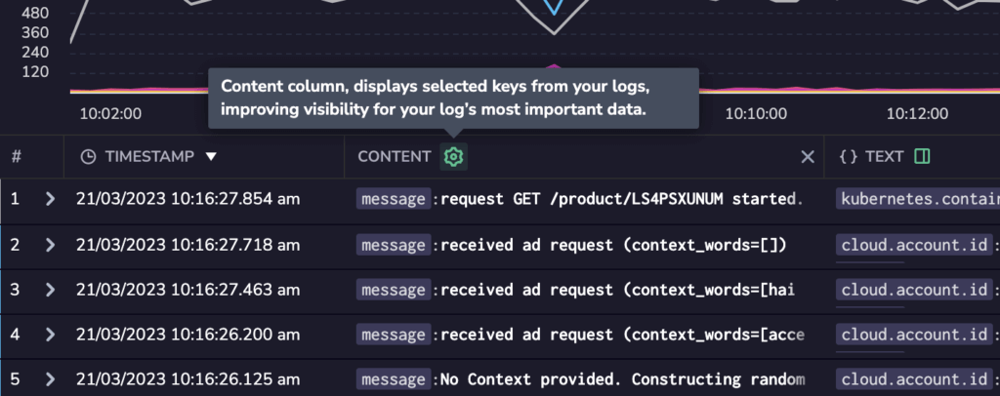

[View Documentation >](https://coralogixstg.wpengine.com/docs/explore-screen/#content-column)

### Multiple API Keys

Admins can now configure multiple private API keys to send data to their Coralogix teams. You can further customize these API keys and activate/deactivate them as required. After creating the new key, it is visible in the Send Your Data section.

Customizations are made available to the [Send-Your-Data API key](https://coralogixstg.wpengine.com/docs/send-your-data-api-key/) management to create, modify, activate, deactivate, reactivate and delete the private API keys created.

To enable this feature please contact your TAM or Coralogix’s support.

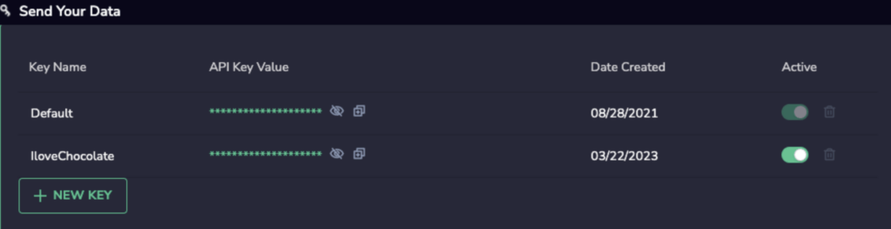

[Go To Platform >](https://dashboard.coralogixstg.wpengine.com/#/login)

### Extensions

Managing your extensions is now easier as you will be notified about the updates available for your extensions through a notification bar found at the top of the Extensions screen. Further, an ‘Update’ button is added, that can be used to update an already deployed extension. 

For some older extensions, you may have to remove and redeploy them by selecting the required applications and sub-systems. This way you can switch between versions and stay up to date with the extensions you are actively using.

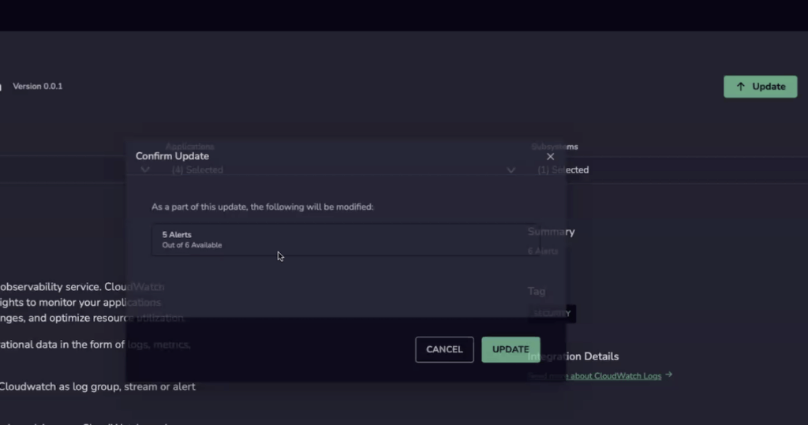

[Go To Platform >](https://dashboard.coralogixstg.wpengine.com/#/login)

### Data Usage Report

Under the Data Usage section, you can now download a detailed data usage report. The report 

is exported as a CSV file and the generation of these reports is available by API.

The detailed usage report will contain multiple fields including the application, sub-systems, severity, TCO tier, type of data source, amount of GBs sent and amount of units sent.

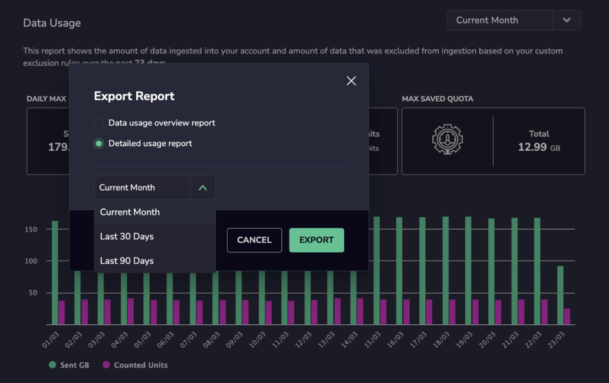

[Go To Platform >](https://dashboard.coralogixstg.wpengine.com/#/login)

### Metric Usage Trend

Along with the Metrics Cardinality feature, the ‘Metrics Usage’ screen can offer you a visual representation of your metrics-related data. Expanding on this capability, we have now added a new visualization i.e. ‘Metrics Usage Trend’. This allows you to visualise 7 days of history for each metric value within the Metrics Usage screen.

The time history can help you identify the metrics that are using up your quota very frequently. Identifying such metrics can help you in cost optimization and get better insights into noisy or expensive applications.

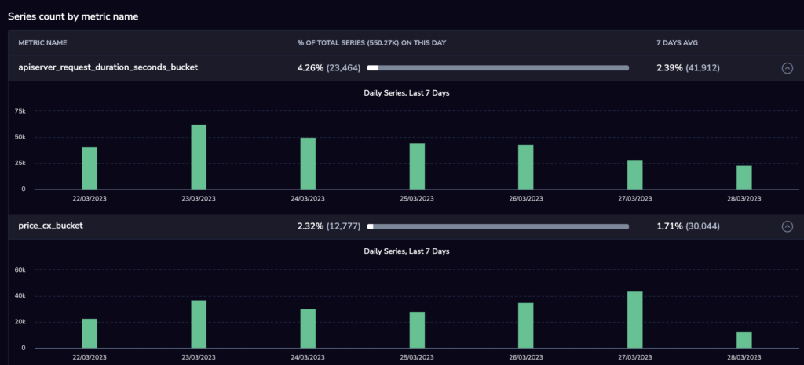

[View Documentation >](https://coralogixstg.wpengine.com/docs/metrics-usage/)

## February 2023

### New! Custom Dashboards

Create unlimited, personalized custom dashboards. Use three new visualizations – Data Table, Line Chart, and Gauge – to define and create a dashboard catered to your specific observability needs. Then query across your widgets using our new Filter and Variable capabilities.

[View Documentation >](https://coralogixstg.wpengine.com/docs/custom-dashboards/)

### Logs2Metrics is now Events2Metrics!

You can now generate metrics from spans in addition to log data! Get started in the platform under Data Flow > Events2Metrics.

[Go to Platform >](https://dashboard.coralogixstg.wpengine.com/#/login)

[View Documentation >](https://coralogixstg.wpengine.com/docs/event2metrics/)

### New! Service Map

In the Dashboard menu dropdown, find the new Service Map screen which shows a system overview on all services based on the traces being sent.

Service Map works out-of-the-box if you’ve already got tracing data in Coralogix!

[Go to Platform >](https://dashboard.coralogixstg.wpengine.com/#/login)

### DataPrime Available on Frequent Search

DataPrime is now available across fully indexed, frequent search logs AND data that sits in your own archive.

Use DataPrime to explore your data, perform schema on read transformations, group and aggregate fields, extract data, and much more!

[Go to Platform >](https://dashboard.coralogixstg.wpengine.com/#/login)

### Set Multiple Retention Periods with Archive Tags

Control the length of archive retention for different groups of logs. Define different lifecycle policies in the Setup Archive page and configure permissions in your bucket.

In the TCO Optimizer, you can configure which logs are tagged with each retention. Only logs that are received **AFTER** the rule has been created will be tagged.

[View Documentation >](https://coralogixstg.wpengine.com/docs/archive-retention-policy/)

### Content Column

New column in ‘Explore’ screen grid automatically extracts the key with the meaningful textual content in the log (i.e. ’message’ / ‘msg’ / ‘info’…)

[Go to Platform >](https://dashboard.coralogixstg.wpengine.com/#/login)

## January 2023

### UI/UX Improvements

We’ve added some fine touches to the logs view to help you find what you’re looking for faster.

- Default ‘flat’ mode makes the display a lot cleaner for the 1-line, 2-line, and condensed presentation modes.

- New ‘List’ presentation mode presents log data in an easy-to-read list of key-value pairs.

- Object columns can now be filtered to display a subset of the fields contained within the object.

[View in Platform >](https://dashboard.coralogixstg.wpengine.com/#/login/)

### Lucene Syntax Highlighting

Lucene syntax highlighting makes it easier to read and write queries.

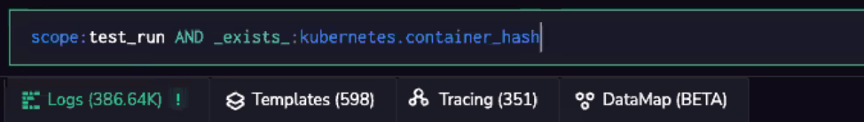

Highlighting is available everywhere in the platform where you can write Lucene queries. In the Explore Screen, terms and fields that match your query are also highlighted within the resulting logs.

[View in Platform >](https://dashboard.coralogixstg.wpengine.com/#/login/)

### Incident Management in Insights Screen

You can now **acknowledge, assign, and resolve alerts directly from the Insights UI**. Use Coralogix as a task allocation and process control UI to extend and consolidate your monitoring and alerting workflow.

[View in Platform >](https://dashboard.coralogixstg.wpengine.com/#/login/)

### Alerts Map

**Visualize logical groupings of your alerts and their statuses** for a powerful “at a glance” view of what’s going on in your systems.

For example, if you group your alerts by cluster and node, the Alerts Map will highlight which cluster-node pairings have one or more triggered alerts.

[View Documentation >](https://coralogixstg.wpengine.com/docs/alerts-map/)

### Tracing Updates

Query your tracing data with Lucene syntax in the tracing UI. You can now build complex searches for specific fields and phrases contained within traces and spans.

The dependency view is now the default tracing view with the metadata about the trace now shown on the right-hand side of the screen. Hovering over a given node in the graph will reveal a tooltip with information about the trace and associated span.

[View in Platform >](https://dashboard.coralogixstg.wpengine.com/#/login/)

### Create New Teams in Org Admin Screen

Organization admins can now create new teams from the “My Teams” tab in the Settings page. To create a new team, fill in the 3-step wizard with your new team name, unit allocation, and team admins.

**_If you need help getting started, reach out to our support team using the in-app chat!_**

### Extended Integration Support

**Prometheus Recording Rules**  
Prometheus Recording Rules can now be pulled from Coralogix using cURL commands. Use recording rules to pre-compute new timeseries based on existing ones. Once defined, the corresponding recording rules are automatically created as additional metrics in Coralogix.  
[View Documentation >](https://registry.terraform.io/providers/coralogix/coralogix/latest/docs)

**AWS Lambda Metrics**  
Our Lambda extension now supports the collection of AWS Lambda metrics for essential invocation measurements. Additionally, CX\_Metadata is included alongside incoming documents on the Coralogix platform to provide context around cloud provider, account ID, cloud region and more.  
[View Documentation >](https://coralogixstg.wpengine.com/docs/coralogix-aws-lambda-telemetry-exporter/)

**APM for Amazon EC2**  
Using Amazon Kinesis Data Firehose, you can now send Amazon EC2 metrics to Coralogix and view them on your Coralogix dashboard correlated with relevant traces and spans.  
[View Documentation >](https://coralogixstg.wpengine.com/docs/apm-amazon-ec2/)

**JumpCloud SCIM Identity Management**  
New SAML integration with JumpCloud allows you to manage groups and users from in JumpCloud. Once integrated, those changes will be automatically reflected in the Coralogix UI.  
[View Documentation >](https://coralogixstg.wpengine.com/docs/jumpcloud-scim-identity-management-integration/)

## November 2022

**Application Performance Monitoring (APM)**

Coralogix now offers key features of **[Application Performance Monitoring](https://coralogixstg.wpengine.com/blog/application-performance-monitoring-visibility/)** (APM) for modern, cloud-native environments!

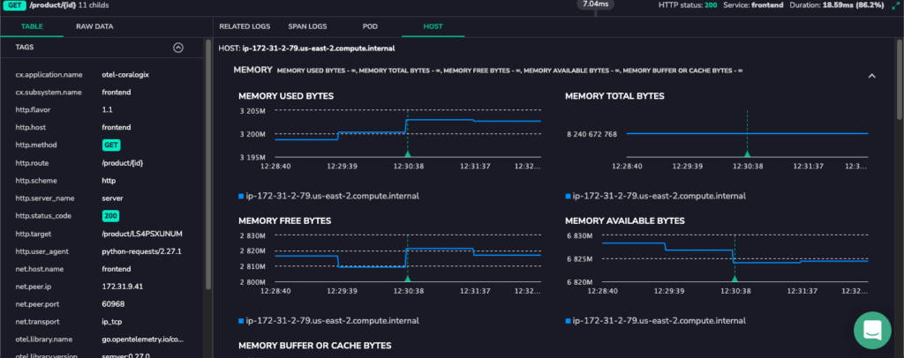

With expanded visibility into service performance, you can more effectively monitor latency and pinpoint components responsible for issues like performance degradation or an increase in errors.

Read more about our [unique approach to APM](https://coralogixstg.wpengine.com/blog/application-performance-monitoring-visibility/) and how we can help you turn 30-minute investigations into 30-second discoveries.

[Get Started >](https://coralogixstg.wpengine.com/docs/apm/)

**OpenTelemetry Support for Logs, Metrics & Traces**

You can now use OpenTelemetry to send logs, metrics, and tracing data to Coralogix!

Leverage the popular vendor-neutral, open-source framework for instrumentation and collection of your telemetry data for analysis in the Coralogix platform.

[Get Started >](https://coralogixstg.wpengine.com/docs/opentelemetry/)

**AWS Resource Enrichment**

New AWS Resource Enrichment allows you to enrich your logs with tags from Amazon Web Services (AWS) EC2 instances. Use this feature to connect your business and operation metadata from AWS and gain greater insight into your data.

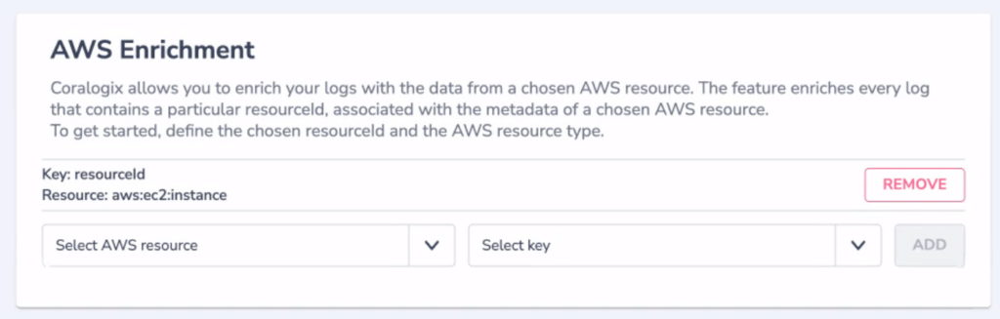

To get started, visit our documentation for setup and configuration.

[View Documentation >](https://coralogixstg.wpengine.com/docs/aws-resource-enrichment/)

**Lucene Query Auto-Complete**

Auto-complete for Lucene queries is now available across the platform. Suggestions are provided for operators (including field range hints) and data type hints!

[Try It Now >](https://dashboard.coralogixstg.wpengine.com/#/login)

**Extensions Improvements**

The Coralogix Extensions lobby has been improved with search, label, and status filters.

In addition, individual extensions can now be deployed to specific applications and subsystems as part of their configuration.

Note that selecting “all applications” or “all subsystems” will apply the extension to all existing **and future** applications and subsystems created in the Coralogix platform.

[View Documentation >](https://coralogixstg.wpengine.com/docs/extension-packages/)

**Integrations**

#### AWS Lambda Telemetry Exporter

Our new _Coralogix AWS Lambda Telemetry Exporter_ is now available in the **[AWS Serverless Application Repository](https://serverlessrepo.aws.amazon.com/applications/eu-central-1/597078901540/Coralogix-AWS-Lambda-Telemetry-Exporter)** as an open beta. We encourage you to try it out and welcome any feedback.

[View Documentation >](https://coralogixstg.wpengine.com/docs/coralogix-aws-lambda-telemetry-exporter/)

#### Telegraf Operator

Use our new integration with Telegraf Operator to simplify metric collection in Kubernetes. With Telegraf Operator, you only need to define the input plugin configuration for Telegraf when creating the pod annotations. Telegraf Operator then sets the configuration for the entire cluster, avoiding the need to configure a metrics destination when deploying applications.

[View Documentation >](https://coralogixstg.wpengine.com/docs/telegraf-operator/)

#### Google Cloud Pub/Sub

We’ve updated our integration with Google Cloud Pub/Sub to use a push subscription to send logs to Coralogix.

We recommend to use the updated integration with push subscription as it avoids running any additional software (i.e. functions) in your GCP account which can contribute to operational overhead and costs.

[View Documentation >](https://coralogixstg.wpengine.com/docs/google-cloud-pub-sub/)

## October 2022

**Dashboard Updates**

**Logs Graph Grouped by Severity**

Previously, each column would display a single combined amount for Warning/Error/Critical logs. Now, each severity is stacked and a tooltip displays the breakdown of the severity count.

Clicking a section will navigate to the Explore tab with the relevant severity and timeframe filters applied.

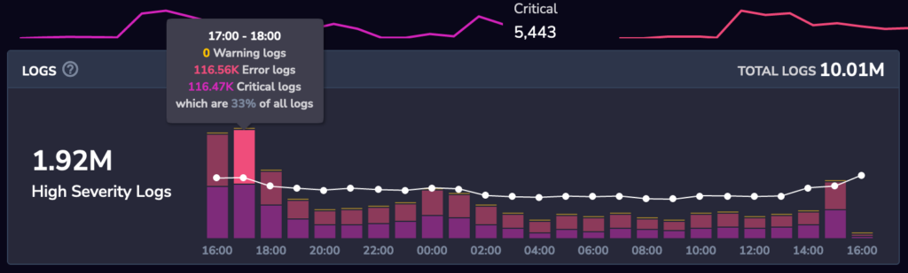

[View Dashboard >](https://dashboard.coralogixstg.wpengine.com/#/login)

**Help Tooltips on Dashboard Widgets**

New tooltips have been added to the dashboard widgets with an explanation of the information being displayed.

**Top 3 Abnormal Errors - Above Normal / Newly Introduced**

The Top 3 Abnormal Errors widget now differentiates between ‘Above Normal’ and ‘Newly Introduced’ errors. ‘Above Normal’ shows the amount above normal that is being seen (e.g. 3.2X normal levels), and ‘Newly Introduced’ shows the number of occurrences of the new errors.

[View Dashboard >](https://dashboard.coralogixstg.wpengine.com/#/login)

**Explore Updates**

**TCO Priority Added as Metadata**

A Metadata field is added to each field indicating TCO Level. This can be seen in tooltips within the dashboard.

[Explore Now >](https://dashboard.coralogixstg.wpengine.com/#/login)

**Tracking Logical Data Types**

Logical data types (i.e. IP Addresses, URLs, Emails) are now being detected in addition to raw data types (i.e. String, Number, etc).

This data is also displayed in the column tooltip. If more than one data type has been detected in a field (e.g. IP and String), they will all be displayed in the tooltip.

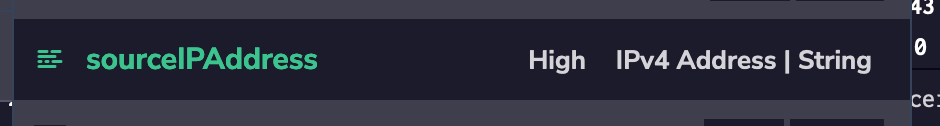

**Content Type Icons added to Column Headers**

New icons indicating content type have been added to column headers.

[Explore Now >](https://dashboard.coralogixstg.wpengine.com/#/login)

**Archive Query Improvements**

**DataFusion Query Engine Enhancements**

The most recent round of improvements to the DataFusion query engine are supporting a conservative 5X increase in query speeds over AWS Athena.

With DataFusion there is no longer a hard limit to the number of partitions that can be scanned, it is restricted only by the resources assigned to it.

[Try It Now >](https://dashboard.coralogixstg.wpengine.com/#/login)

**22 New Scalar Functions in DataPrime**

22 new Scalar functions have been added to DataPrime, including:

- New String functions

- IP functions

- UUID functions

- URL functions

- Number functions

**Lucene Query Improvements**

Autocomplete for Lucene queries has been added within the DataPrime archive query UI, and will soon be added to the standard log query fields across the platform.

[Try It Now >](https://dashboard.coralogixstg.wpengine.com/#/login)

## September 2022

**Tracing Alert**

Create Tracing alerts for high latency on specified Tags and Services. Tracing alerts can be grouped by different Tags and specified for a specific threshold of Latency and Spans.

[Learn More >](/docs/tracing-alert/)

**'Group By' for 'Less Than' Alerts**

Enhance your ‘Less Than‘ alerts using the ‘Group By’ option. Values under the ‘Group By’ fields are aggregated into a histogram, and an alert will trigger whenever the condition threshold is met for an aggregated value within the specified timeframe.

[Learn More >](/docs/coralogix-user-defined-alerts/)

**Enhancements to Logs Screen UI**

#### Mapping Exception indicator

A new warning icon in the Logs Screen indicates if there are any mapping exceptions in the selected time frame.

#### New Row Formats in Logs Screen

To streamline analysis and reduce the screen space each log takes, we added new Row Formats so you can choose how your logs are displayed.

Choose from the following options:

- 1-Line – logs are condensed into one line

- 2-Line – logs are condensed into two lines

- Condensed (default) – the whole log is visible but without breaking into lines

- JSON – the default view where JSON objects are parsed

[Learn More >](https://coralogixstg.wpengine.com/docs/logs-screen/)

**Organization and Admin Console**

Some companies prefer separate teams to isolate data based on the environment it originates from like Dev, QA, and Production. While others prefer to isolate the data based on organizational units like Infrastructure, Security, and Application.

Coralogix supports multi-tenancy, allowing a single organization to contain multiple teams. The Org Admin can then manage quota, settings, users, and more at the organization level from a single interface.

Organizations can be created upon request. Please contact us through our in-app chat or via email at [support@coralogixstg.wpengine.com](mailto:support@coralogixstg.wpengine.com).

**New Integrations**

- [Zabbix](/docs/zabbix/)

## August 2022

**New & Improved Dashboard!**

Our dashboard just got a refresh! 

Get an overview of your system health – informed by all of your observability data – with more in-depth widgets showing a summary of your anomalies, alerts, and more.

Plus, use the new sidebar filters to seamlessly drill down and investigate further with a single click to the Explore UI.

[Open Dashboard >](https://dashboard.coralogixstg.wpengine.com/#/login)

**DataPrime Archive Query Syntax**

DataPrime is now officially GA!

Use DataPrime to parse and query unstructured data fields on the fly. Plus, generate synthetic fields and run calculations from your archived data. From the query UI, view your query history and access a complete cheat sheet with documentation of the query format and operators.

[Learn More >](https://coralogixstg.wpengine.com/docs/dataprime-query-language/)

**Explore UI Improvements**

**Log Screen**

Improvements to the Top Graph in the Logs screen enable you to view and investigate your data more efficiently:

- Sort tooltips by ascending or descending order

- Compact large numbers for easier visualization

- Legend container is now resizable and customizable 

_The state of columns in the Log Screen are persistent in the URL and custom views can be easily shared with additional team members._

**Avg, Max, Min, and Sum aggregations can now be used to visualize log fields that contain numeric values!**

**Tracing Screen**

Hovering over graphs in tracing will now show a crosshair for faster analysis.

**DataMap Filtering & Actions**

You can now filter hexagons in the DataMap using multiple Field Operators and Regex.

Create and access Actions from DataMap using metric labels ($l.<labelName>) to seamlessly connect DataMaps to external resources using metric variables and labels.

[Learn More >](https://coralogixstg.wpengine.com/docs/datamap/)

**General UI Improvements**

**Insights UI**

New 'Go To Explore' functionality allows you to jump from the Insights UI directly to the relevant query in the Explore tab.

**Alerts Menu**

You can now Clone and Delete alerts directly from the main alerts menu!

**Webhooks**

Added fields that can be shipped in the body of the payload.

**Session Timeout & Force Logout**

Admins can now configure a session length on the Setting page after which users will be forced to log back in with no dependency on activity.

**New Integrations**

- [StatsD Metrics](https://coralogixstg.wpengine.com/docs/statsd/)
    - Send StatsD metrics directly to Coralogix using our plugin with the StatsD daemon.

- [Cloudflare LogPush](https://coralogixstg.wpengine.com/docs/cloudflare/)
    - Deploy [LogPush with Terraform](https://coralogixstg.wpengine.com/docs/terraform-module-for-cloudflare-logpush/), and push logs of any log type directly from Cloudflare.

- [Open Commerce API](https://coralogixstg.wpengine.com/docs/open-commerce-api/)

- [Amazon EKS (Fargate) Logs](https://coralogixstg.wpengine.com/docs/aws-eks-fargate/)

- [Telegraf](https://coralogixstg.wpengine.com/docs/telegraf/)

- [Amazon EventBridge](https://coralogixstg.wpengine.com/docs/amazon-eventbridge/)

- [Nagios](https://coralogixstg.wpengine.com/docs/nagios/)

## July 2022

**Flow Alert**

Define a sequence of alerts in our Drag & Drop Flow Builder UI that **combines Logs, Metrics, Tracing, and Security information to create a single alert flow** that will trigger based on multiple conditions within defined timeframes.

Use Flow Alerts to generate actionable insights from your observability data:

- **Combine multiple alerts into a single, comprehensive flow** to cover your security, infra, and business events with reduced noise and false positives.

- **Create alerts with the Root Cause built-in** (e.g. Error elevation due to CPU, causing SLO breach) to track the entire chain of events leading to an error.

- **Identify potential security incidents and proactively remediate them** with alert occurrences over time.

[Learn More >](https://coralogixstg.wpengine.com/docs/flow-alert/)

**New Integrations**

- [Amazon Kinesis Data Firehose - Metrics](https://coralogixstg.wpengine.com/docs/aws-firehose/)

- [Custom Metrics](https://coralogixstg.wpengine.com/docs/custom-metrics/)

- [Terraform Module for Cloudflare Logpush](https://coralogixstg.wpengine.com/docs/terraform-module-for-cloudflare-logpush/)

## June 2022

**New Parsing Rules**

This month we are introducing 2 new parsing rules to bring more value to customers who have many fields and nested fields in their log data.

The new **Stringify JSON Field** and **Parse JSON Field** rules enable you to parse escaped JSON values within a field to a valid JSON object and vice versa – stringify a JSON object to an escaped string.

[Learn More >](https://coralogixstg.wpengine.com/docs/log-parsing-rules/)

**DataMap Updates**

The DataMap allows you to build custom mappings of your infrastructure using metric data for monitoring system health and quickly identifying issues.

In the Group Editor, you’ll find new options to:

- **Sort the display by attributes** (e.g. sort by severity for defined thresholds)

- **Scale threshold values** to make metric graphs more readable

- **Limit the number of hexagons** shown per group

In the DataMap display, use new **'Compare to others'** functionality to compare an element with 10 others in the same group. Plus, expand and collapse specific groups to minimize the number of displayed elements.

[Learn More >](https://coralogixstg.wpengine.com/docs/datamap/)

**Tracing Updates**

New dynamic graphs and saved views in the Tracing UI enable it to serve as SLA dashboards for any application or service.

In addition to the original default graph for **Max duration by Action**, there are now two additional default graphs for **Count by Service** and **Error Count by Service**.

All three graphs can be customized, and **aggregation operators have been added for 99, 95, and 50th percentiles** to help deepen your ability to monitor business SLOs.

When investigating traces in the explore section, you can now **save your current view and load saved views** just like you do in the Logs UI.

[Learn More >](https://coralogixstg.wpengine.com/docs/distributed-tracing/)

_\*Note that the aggregation operators, as well as the Duration filter in the sidebar, are run over the Spans._

**Archive Query Updates**

Improvements to the archive query now allow **timeframes up to 3 days** for added accessibility to data in your remote bucket.

Additional updates to the [Archive Query in Explore Screen](https://coralogixstg.wpengine.com/docs/archive-query-from-logs-screen/) include:

- New Execute Archive Query function allows you to **review active filters before clicking 'Run Query'**. _To prevent unexpected wait times, queries will no longer run automatically when switching from Logs to Archive._ 

- Non-optimal archive queries (e.g. “hello”) will trigger a warning pop up recommending to improve the query conditions.

[Learn More >](https://coralogixstg.wpengine.com/docs/archive-query/)

**New Integrations**

- [Amazon Kinesis Data Firehose - Logs](https://coralogixstg.wpengine.com/docs/aws-firehose/)

- Terraform Modules for:
    - [Azure EventHub](https://coralogixstg.wpengine.com/docs/terraform-modules-for-azure-eventhub/)
    
    - [AWS Cloudtrail](https://coralogixstg.wpengine.com/docs/terraform-modules-for-aws-cloudtrail/)
    
    - [AWS Cloudwatch](https://coralogixstg.wpengine.com/docs/terraform-modules/)
    
    - [AWS S3 Logs Collection](https://coralogixstg.wpengine.com/docs/terraform-modules-aws-s3-logs/)

- [Google Cloud Pub/Sub](https://coralogixstg.wpengine.com/docs/google-cloud-pub-sub/)

- [GitHub Version Tags](https://coralogixstg.wpengine.com/docs/github-version-tags/)

- [Coralogix RabbitMQ Agent](https://coralogixstg.wpengine.com/docs/coralogix-rabbitmq-agent/)

- [Salesforce Cloud Commerce](https://coralogixstg.wpengine.com/docs/salesforce-commerce-cloud/)

## May 2022

**DataMap**

Build custom mappings of your infrastructure, log-based, and business metrics to visualize and monitor your system health.

- Choose your base metric (ex. load\_time)

- Create a hierarchy of metric labels (ex. region>instance>pod)

- Set thresholds and preview visualization

- Save and load views for each unique use case

**Pro-tip!** Use tooltips to view additional information about the area of your system that you are looking at in the mapping visualization.

[Learn More >](https://coralogixstg.wpengine.com/docs/datamap/)

**Tracing UI**

Use our powerful Tracing UI to explore your data and streamline investigations and troubleshooting.

- Collect tracing data using the [Coralogix Exporter in OpenTelemetry](https://coralogixstg.wpengine.com/docs/opentelemetry-tracing/)

- Pinpoint issues with familiar filtering and aggregation capabilities

- Drill down into spans and visualize data flows with dependency view

- View related logs and jump directly to the Logs Tab for streamlined investigation

- Define user permissions with RBAC Control for tracing data

- Alerting for Tracing _(coming soon!)_

[Learn more >](https://coralogixstg.wpengine.com/docs/distributed-tracing/)

**CX-DATA Archive Format**

We’ve launched a new archive format based on Parquet that improves archive query performance by 5X!

In addition to the CSV format, supported today, this new CX-DATA format can be configured in your S3 Buckets Settings and selected in the Archive Query screen in the platform.

[Learn More >](https://coralogixstg.wpengine.com/docs/archive-query-from-logs-screen/)

**Snooze Alerts in Alerts Tab**

The option to snooze an alert, which was previously only available from the Insights screen, will now be available from within the main Alerts screen. This allows for centralized management of alert statuses across your team.

[Learn More >](https://coralogixstg.wpengine.com/docs/coralogix-user-defined-alerts/)

**Session Timeout Management**

A new option on the Settings page gives users the ability to choose how much idle time will trigger a force logout from the system. In case of inactivity, a pop-up will appear to alert the user, prior to logout.

[Learn More >](http://coralogixstg.wpengine.com/docs/user-team-management)

**New Integrations**

- Terraform Modules for:
    - [AWS CloudWatch](https://coralogixstg.wpengine.com/docs/terraform-modules/)
    
    - [AWS S3 Logs Collection](https://coralogixstg.wpengine.com/docs/terraform-modules-aws-s3-logs/)

- [Google Cloud Pub/Sub](https://coralogixstg.wpengine.com/docs/google-cloud-pub-sub/)
