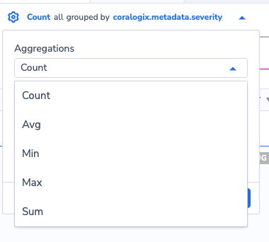
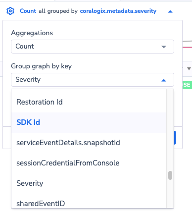
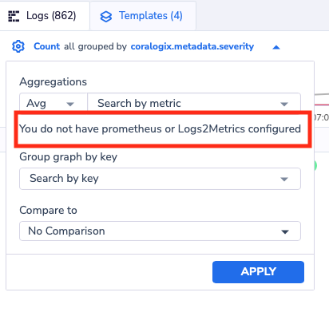
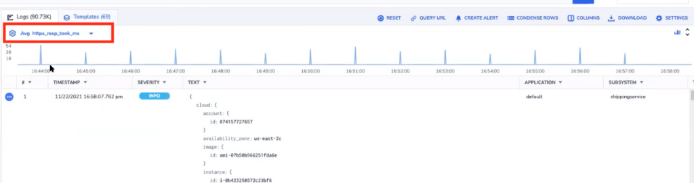
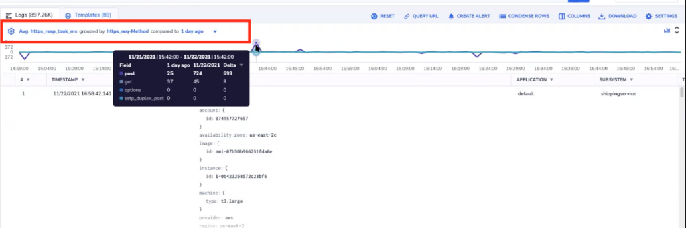

In the past, you were only able to aggregate and group by a certain field. Today, in the log screen graph, we have added a new feature that allows you to aggregate on metrics data, AVG, MIN, SUM and MAX.

To do so, under the log screen on top you will see a graph, click on the blue Gear Icon.

You will get the different options we support so far.

The option **Count** applies to the logs you are seeing in your screen. You can count them and/or group them by any field that is in the drop down menu.

If you chose any of the options **AVG, MIN, MAX, and SUM**, you will need to have Log2Metrics configured, Prometheus logs, or both.

In case you chose any of these options and you do not have Log2Metrics or Prometheus logs you will get the screen below:

If you have configured Log2Metrics or you have Prometheus logs, the **AVG, MIN, MAX,** and **SUM** would work like the example below. We aggregate on the **AVG** of a metric field called _https\_resp\_took\_ms_:

As before, you can also add a **Group By** to this graph and also **Compare To**.

Remember that **Group By** fields are supposed to come from L2M or Prometheus.
