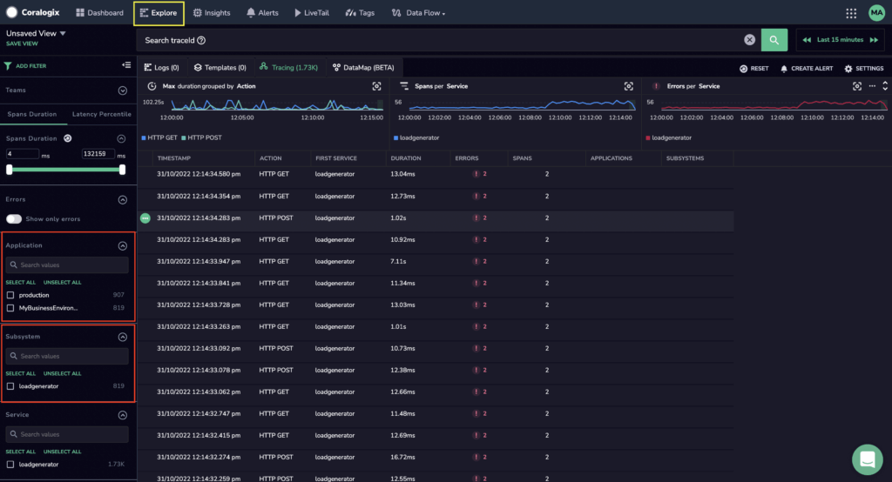

In order for us to help you make sense of your logs, metrics, and traces, we require that you organize your data using two metadata fields: `application` and `subsystem` name.

These values will ultimately give value to your data in a manner that is most meaningful for you on your Coralogix Dashboard.

Completely customizable, you can use them to **catalogue and filter** your logs and metrics, **grant different user permissions and access** to different employees, **create log templates and template branches**, and **track anomalies** in your data most efficiently.

## Application Name

We recommend that your `application` name refer to the environment that produces and sends data to Coralogix. For instance, you may have an `application` name for production, development and / or staging environments. You can also use `application` name to refer to a certain namespace. Of course, you can map the `application` name differently based on your custom setup or if you have many Kubernetes clusters.

## Subsystem Name

We recommend that your `subsystem` name refer to the service or applications that send your logs, metrics, and traces.

## Example

Input your chosen `application` and `subsystem` names into any of the [integrations](https://coralogixstg.wpengine.com/integrations/) supported by Coralogix.

The following example shows mapping `application` name to `production-$NAMESPACE` for [Telegraf Operator](https://coralogixstg.wpengine.com/docs/telegraf-operator/) deployed in the production Kubernetes cluster.

```
    infra: |
      [[outputs.opentelemetry]]
        [outputs.opentelemetry.coralogix]
          private_key = "<Send-Your-Data API key>"
          application = "production-$NAMESPACE"
          subsystem = "$HOSTNAME"
        
```

The following example shows mapping `application` name to `kubernetes.namespace_name` and `subsystem` to `kubernetes.container_name` for [Fluent Bit](https://coralogixstg.wpengine.com/docs/fluentbit-helm-chart-for-kubernetes/).

```
---
#fluentbit-override.yaml:
fluent-bit:
  endpoint: api.coralogixstg.wpengine.com
  app_name: kubernetes.namespace_name
  sub_system: kubernetes.container_name
  logLevel: error

```

## Application and Subsystem on your Coralogix Dashboard

Use the `application` and `subsystem` fields on your Coralogix dashboard to create alerts specific to these filters, filter across the UI, visualize in dashboard widgets, and more.

When viewing your logs, metrics, and traces, you will see that `application` and `subsystem` fields act as filters, enabling the selection of values to be queried per filter.



## Support

**Need help?**

Our world-class customer success team is available 24/7 to answer any questions that may come up.

Feel free to reach out to us **via our in-app chat** or by sending us an email at [support@coralogixstg.wpengine.com](mailto:support@coralogixstg.wpengine.com).
