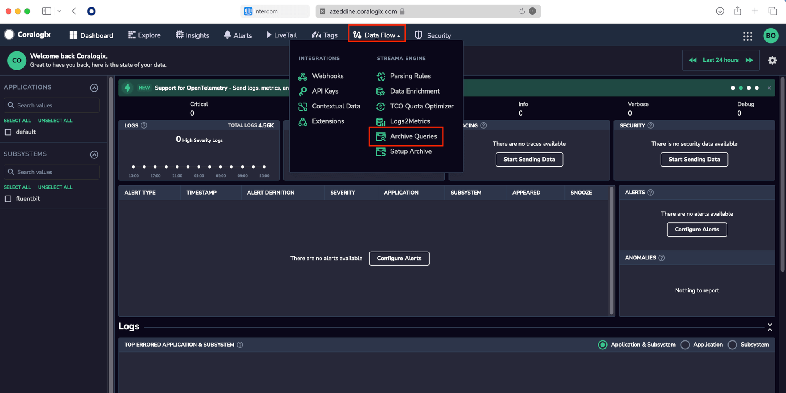
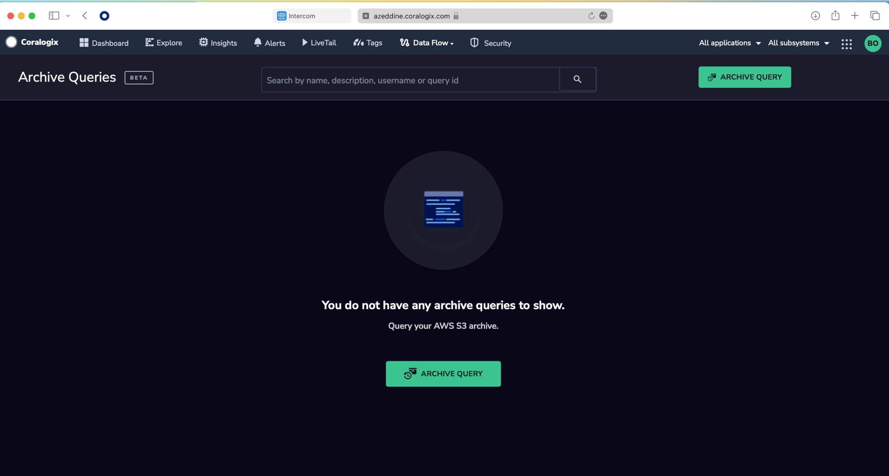
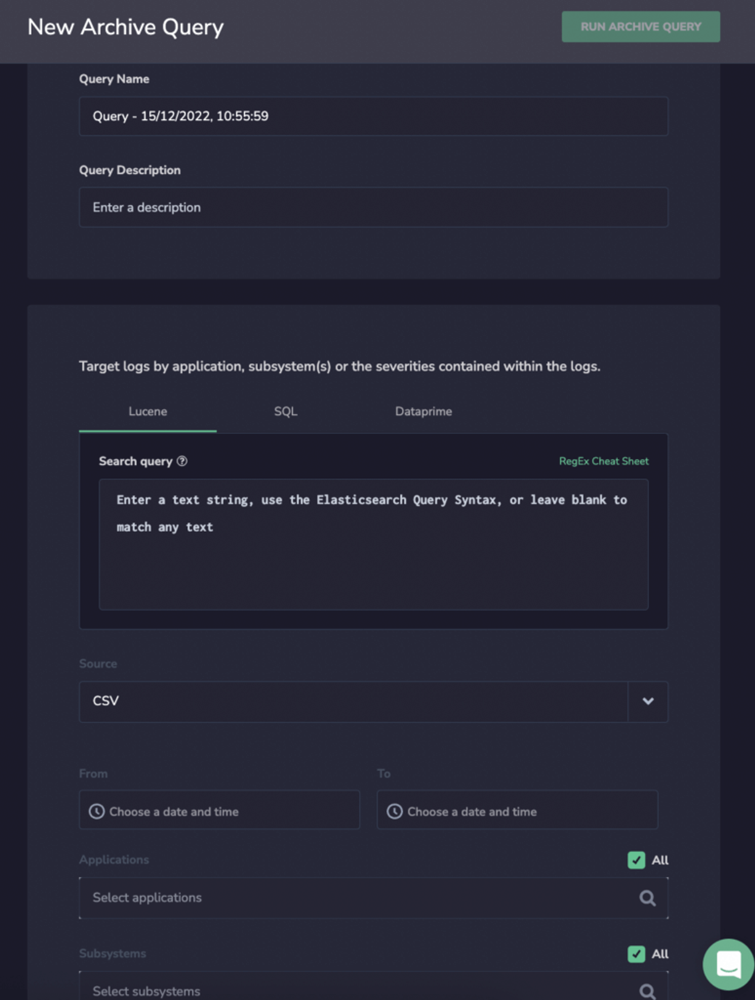
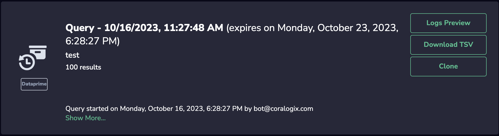
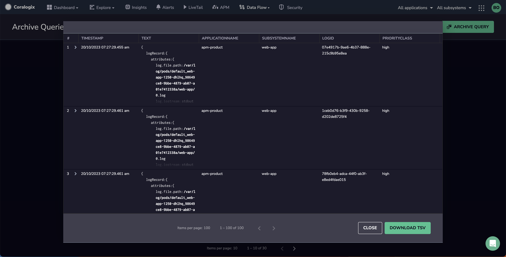
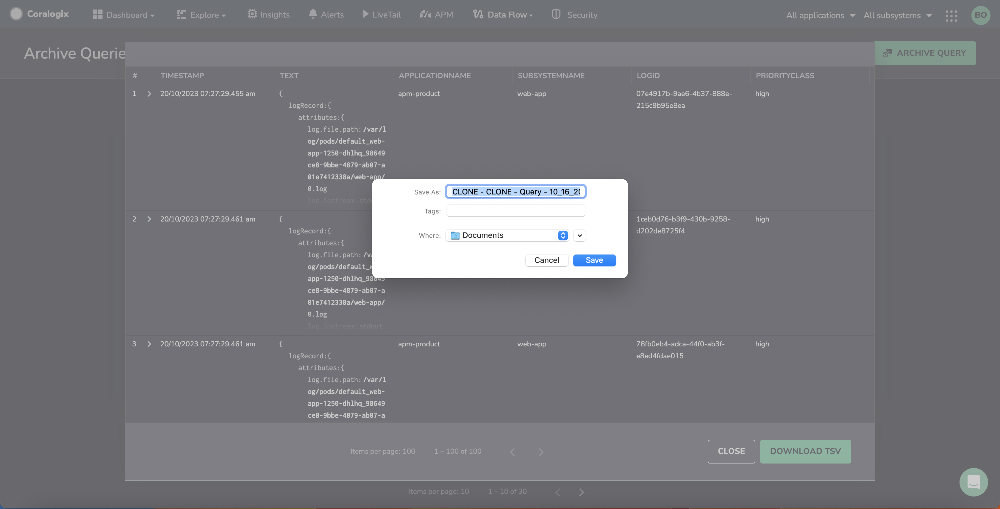
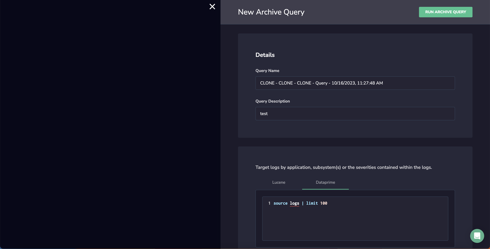
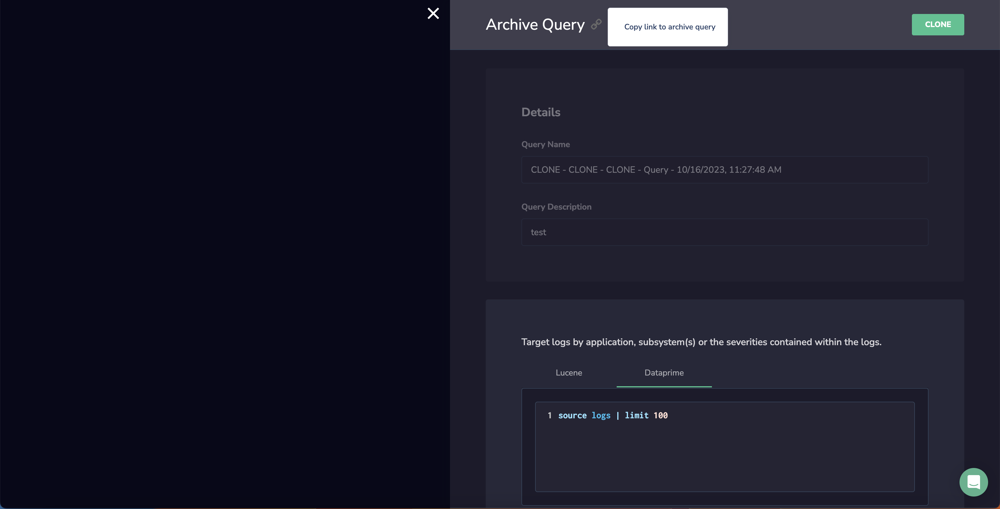

**Archive Query** enables you to directly query your logs and spans from your S3 archive using any text or a wide range of syntax queries. Query data irrespective of priority, daily quota, or its time frame.

## Overview

Archive Query enables you to directly query your **logs and spans** from your S3 archive.

Use this feature to:

- **Take advantage of various querying options**. This includes [text-based](https://coralogixstg.wpengine.com/docs/log-query-simply-retrieve-data/#free-text-search) queries or specific query languages such as [Lucene](https://coralogixstg.wpengine.com/docs/log-query-simply-retrieve-data/#lucene-query-syntax-reference) or [DataPrime](https://coralogixstg.wpengine.com/docs/dataprime-cheat-sheet/).

- **Enjoy multiple data sources**. Using our innovative [DataPrime](https://coralogixstg.wpengine.com/docs/dataprime-cheat-sheet/) syntax language, query both logs and spans.

- **Query data irrespective of priority and daily quota**. Only blocked logs are not sent to the archive.

- **Query data with unlimited time frames**. There are no restrictions on how far back in time your data can go.

- **Save on costs while maintaining interactive query times**. Store more of your data in our [Monitoring](https://coralogixstg.wpengine.com/docs/optimize-log-management-costs/#monitoring-data-medium-priority) and [Compliance](https://coralogixstg.wpengine.com/docs/optimize-log-management-costs/#compliance-data-low-priority) priority levels. By prioritizing logs at the [Monitoring](https://coralogixstg.wpengine.com/docs/optimize-log-management-costs/#monitoring-data-medium-priority) priority level, for example, you can view and query them in [LiveTail](https://coralogixstg.wpengine.com/docs/coralogix-live-tail/), receive real-time [alerts](https://coralogixstg.wpengine.com/docs/getting-started-with-coralogix-alerts/), utilize [parsing rules](https://coralogixstg.wpengine.com/docs/log-parsing-rules/), [Loggregation](https://coralogixstg.wpengine.com/docs/what-is-coralogix-loggregation/) and [Events2Metrics](https://coralogixstg.wpengine.com/docs/events2metrics/), and query them without indexing your data. All of this is available at 40% of the cost.

## Prerequisites

- Read/ Write permissions enabled in your [AWS S3 bucket](https://coralogixstg.wpengine.com/tutorials/archive-s3-bucket-forever/)

## Archive Query Setup

**STEP 1**. In your Coralogix toolbar, navigate to **Data Flow** > **Archive Queries**.

**STEP 2**. Click **ARCHIVE QUERY**.

**STEP 3**. Define a **New Archive Query**.

- Enter a **Query Name** and **Description**.

- **Search Query**. Enter a text search query, [Lucene](https://coralogixstg.wpengine.com/docs/log-query-simply-retrieve-data/#lucene-query-syntax-reference), or [DataPrime](https://coralogixstg.wpengine.com/docs/dataprime-cheat-sheet/) syntax query to match a subset of logs from your S3 bucket.

**Notes**:

- Only the data matching the query will be presented.

- Using our innovative [DataPrime](https://coralogixstg.wpengine.com/docs/dataprime-cheat-sheet/) syntax language, query both **logs and spans**.

**Query Examples**

  
1\. A query to find logs with the field ClientIP\_geoip.continent\_name:”Europe” and the field ClientIP\_geoip.country\_name with values other than: Czechia, United Kingdom or Germany:ClientIP\_geoip.continent\_name:”Europe” NOT (ClientIP\_geoip.country\_name:”Czechia” OR ClientIP\_geoip.country\_name:”United Kingdom” OR ClientIP\_geoip.country\_name:”Germany”)  

2\. A query to find logs with words status and get:status get  

3\. A query to find only logs with HTTP method post:“http\_method”:”post” </aside>

- **Source**. Select CX-Data.

- Select the **Timeframe**, **Applications**, **Subsystems**, and **Severity** for the query.

**STEP 4**. Click **RUN ARCHIVE QUERY**. Once you have set up and run your query, a test will be run to validate your setup.

## View Archive Query Results

View your query results in one of three formats: **Logs Preview**, **Download TSV**, or **Clone**.

### Logs Preview

This option allows you to view your logs without ever indexing your data.

### **Download TSV**

Download a TSV file to view query results.

### Clone

Duplicate your current query by clicking on the **Clone** button.  In the new duplicated query, click **RUN ARCHIVE QUERY**.

If you wish to share an archive query with another teammate, click on the chain-link icon in the query of choice. This will copy to your clipboard the link to that same archive query.

After some time, the archive query you created will expire so you can no longer view or download the data. Click **Clone** and duplicate the same query with the same criteria instead of recreating the query from scratch.

## Limitations

The limitations placed on queries are described below.

| Limitation | Description |
| --- | --- |
| Bytes processed | Up to 30% of daily ingested bytes |
| Parquet files scanned | Up to 500k files |
| Clone results | Up to results 1M results while running Archive Query |
| Time out | Up to 5 min of query execution |

### Warnings

Once a limit is reached, a warning message is displayed. Refine your query results to avoid reaching a limit.

## Refine Your Query Results

Refine your query results using any of the following methods:

- Apply more selective filters to your queries (for example, on application or subsystem).

- If using the Dataprime extract operator and subsequently filtering its results, create a parsing rule and filter on the parsed field instead.

- Avoid regular expressions or wildcards in filters.

- In Dataprime, switch from using the contains operator on strings to the free text search operator (~).

## Additional Resources

<table><tbody><tr><td>Documentation</td><td><a href="https://coralogixstg.wpengine.com/docs/archive-query-from-logs-screen/"><strong>Archive Query from the Explore Screen</strong></a></td></tr></tbody></table>

## Support

**Need help?**

Our world-class customer success team is available 24/7 to walk you through your setup and answer any questions that may come up.

Feel free to reach out to us **via our in-app chat** or by sending us an email at [support@coralogixstg.wpengine.com](mailto:support@coralogixstg.wpengine.com)
