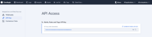

_Coralogix_ provides seamless integration with `Argo CD` so you can push tags to Coralogix automatically from your Argo CD pipelines.

## Prerequisites

- Have `Argo CD` installed, for more information on how to install: [https://argo-cd.readthedocs.io/en/stable/getting\_started/](https://argo-cd.readthedocs.io/en/stable/getting_started/)
- Have `Argo CD Notifications` and `Triggers and templates` installed, for more information on how to install: [https://argocd-notifications.readthedocs.io/en/stable/](https://argocd-notifications.readthedocs.io/en/stable/)
- API Token - should be obtained from  _`Data Flow --> API Keys --> Alerts, Rules and Tags API Key`_



## [](https://github.com/coralogix/integrations-docs/blob/master/integrations/argocd/README.rst#configuration)Configuration

Add _Coralogix_ API Token to **argocd-notifications-secret** Secret:

```
apiVersion: v1
kind: Secret
metadata:
  name: argocd-notifications-secret
type: Opaque
stringData:
  coralogix-api-token: <YOUR-API-TOKEN>
```

Add `webhook`, `template` and `trigger` to **argocd-notifications-cm** ConfigMap:

```
apiVersion: v1
kind: ConfigMap
metadata:
  name: argocd-notifications-cm
data:
  service.webhook.coralogix: |
    url: https://webapi.coralogixstg.wpengine.com/api/v1/external/tags
    headers:
    - name: Authorization
      value: Bearer $coralogix-api-token
    - name: Content-Type
      value: application/json
  template.coralogix: |
    webhook:
      coralogix:
        method: POST
        body: |
          {
            "name": "{{.app.status.sync.revision}}",
            "application": ["{{.app.spec.project}}"],
            "subsystem": ["{{.app.metadata.name}}"],
            "iconUrl": "https://raw.githubusercontent.com/coralogix/integrations-docs/master/integrations/argocd/images/argocd.png"
          }
  trigger.coralogix-on-success: |
    - when: app.status.operationState.phase in ['Succeeded']
      send: [coralogix]
```

There are 2 ways to publish a patch with the added annotation, the first by creating a yml and preforming the patch by specifing the patch file. **Or** by using a command with the patch written into it.

- The yml file:

```
apiVersion: argoproj.io/v1alpha1
kind: Application
metadata:
  name: <deployed-app-name>
  annotations:
    notifications.argoproj.io/subscribe.coralogix-on-success.coralogix: ""
```

- The command:

```
kubectl patch app <deployed-app-name> -n argocd -p '{"metadata": {"annotations": {"notifications.argoproj.io/subscribe.coralogix-on-success.coralogix": ""}}}' --type merge
```

To check if the patch was successfully been created, in Argocd enter the deployed app in which the notifications were added under the annotations field you will find the Coralogix notification.  
Each time the application syncs in Argocd it'll automaticly send a tag to Coralogix dashboard.
