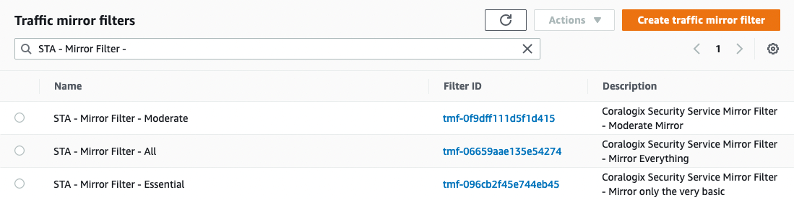

After installing Coralogix Security Traffic Analyzer (STA) and [choosing a mirroring strategy](https://coralogixstg.wpengine.com/tutorials/aws-traffic-mirroring/) suitable for your organization’s needs, the next step would be to set the mirroring configuration in AWS. However, the configuration of VPC Traffic Mirroring in AWS is tedious and cumbersome – it requires you to create a mirror session per network interface of every mirrored instance, and just to add an insult to injury, if that instance terminates for some reason and a new one replaces it, you’ll have to re-create the mirroring configuration from scratch.

## AWS Configuration

Each deployed STA instance holds a mirroring filter indicator tag.

**Important Notes:**

1. Not all instances can mirror traffic.  
    AWS's supported instances for mirroring:
    - C4, D2, G3, G3s, H1, I3, M4, P2, P3, R4, X1, X1e, A1, C5, C5d, C5n, I3en, M5, M5a, M5ad, M5d, p3dn.24xlarge, R5, R5a, R5ad, R5d, T3, T3a, and z1d
    
    - References:
        - https://aws.amazon.com/about-aws/whats-new/2021/02/amazon-vpc-traffic-mirroring-supported-select-non-nitro-instance-types/
        
        - https://aws.amazon.com/blogs/aws/new-vpc-traffic-mirroring/
    
    - In case you are not using one of those instance types, we strongly advise you to read our article about [Virtual Tap](https://coralogixstg.wpengine.com/docs/coralogix-sta-virtual-tap/)  
        

3. Mirror filtering is not acting as a firewall or any traffic blocking tool, It's not dropping or excluding any original traffic. Mirror filtering only filters what traffic is mirrored to the STA.

  
To configure the mirroring strategy, follow these steps:

1. Head to the deployed STA and search for tag:  
    `sta.coralogixstg.wpengine.com:mirror-filter-indicator-tagname`, and copy the value.  
    (template: `sta.<BUCKET_NAME>.coralogixstg.wpengine.com:mirror-filter-id`)  
    note: to use a different tag, please read the "Advanced Configuration" section  
      
      
    

3. To find the relevant `tmf` (Traffic mirror filter), head to the `VPC -> Mirror filters`, and locate the following name: `STA - Mirror Filter - <MIRROR_TYPE>`  
      
      
    

5. Select the desired mirror filter depending on the selected strategy: `All/Moderate/Essential`, and copy the `Filter ID` value  
    

7. Add tag to the mirrored instance:  
    Key: `sta.<bucket-name>.coralogixstg.wpengine.com:mirror-filter-id` - see section (1) above  
    Value: `<SELECTED_FILTER_ID>`  
      
    

Now your instance is configured for mirroring to STA.

## Advanced Configuration

1. You can create your own filtering rules, to fit your organization’s desired strategy. If you decide to do so, add this `tmf` as a tag.

3. You also can edit/add rules to our provided `tmfs`

5. Each tag can be renamed to whatever you prefer. The tag names are specified inside the `sta.conf` file, can be configured inside the STA and in the AWS S3 bucket - we suggest to do so using the bucket.

### Additional Information

When several STA instances are paralleling their work, they need to handle the communication between mirrored instances. Using balancing algorithms the STAs scan the mirroring instances, and split the load between them.

**Pro Tip**: You can use AWS “Resource Groups & Tag Editor” to quickly assign tags to multiple instances based on arbitrary criteria.

## Mirroring Cost Optimization

By default, STA mirrors all cloud traffic relevant to the selected strategy.   
By mirroring all traffic you benefit from observability over the cloud’s traffic, which helps to monitor, investigate, and detect every suspicious activity. However, it is not free.   
Cloud providers, such as AWS, bill you for every mirror, and by mirroring all traffic, the cost can be extremely high.

It’s important on one hand to reduce costs as much as possible, but on the other hand to not damage observability and STA’s abilities.  
To do so, and stay with sufficient and productive observability, STA offers additional optimization to reduce cost while keeping the monitoring value.  
In addition to strategy selection, STA has an inner handling configuration for mirroring mode:

1. `dynamic mirroring`

3. `manual mirroring`

### Dynamic Mirroring

Behind the scenes, the STA calculates the availability of each session, counts the traffic, and categorizes it by best practice principles and tight security measurements. On the fly, the STA decides if some session is currently not providing relevant visibility and if so, stops the mirroring for a period of time and this process is repeated.

This is achieved due to understanding the concept of any malicious attack - it’s never a one-action attack and is always spread over some timeframe.

The mode can be defined via `sta.conf` file that can be changed locally in the STA or using the AWS S3 bucket's `sta.conf` file.

### Configuration schema

```
{
    "automations": {
        "vpc-mirroring-auto-handler": {
            "mirror_handling_mode": "DYNAMIC" | "MANUAL"
        }
    }
}

```
