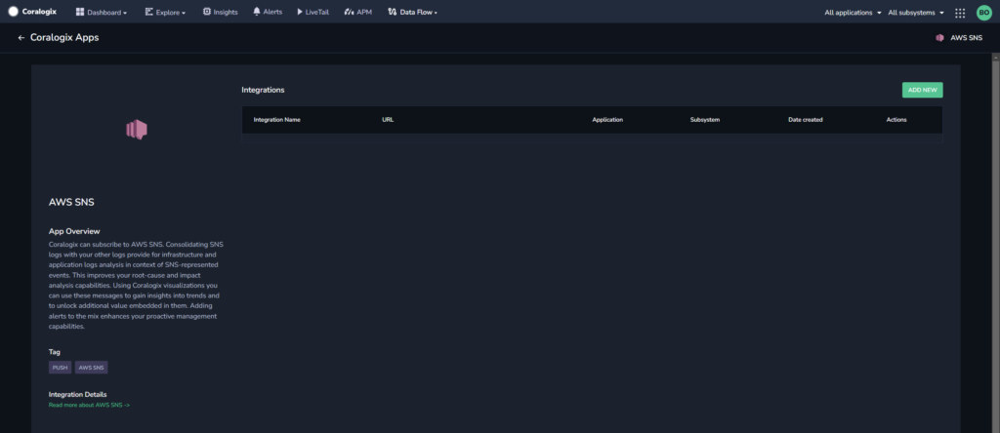
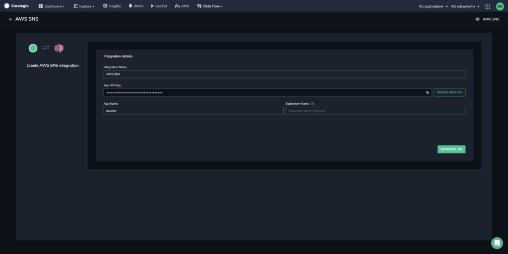
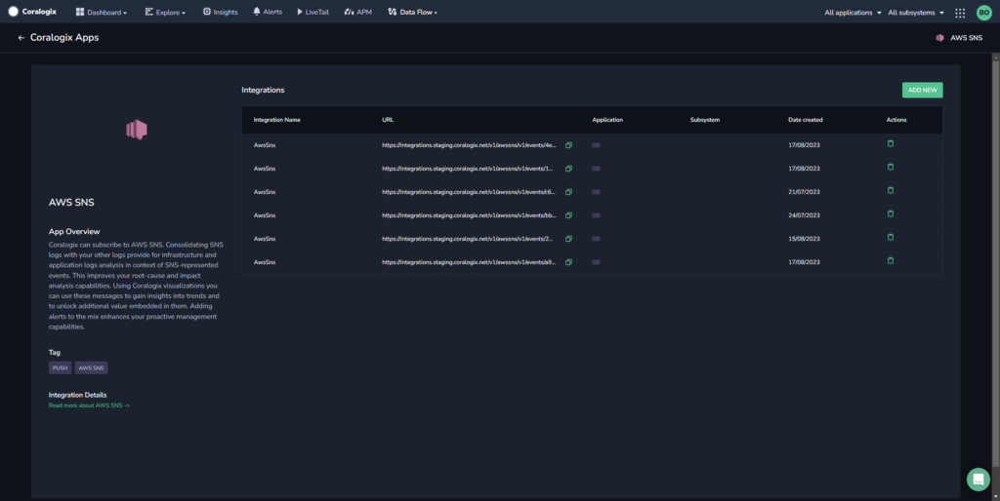
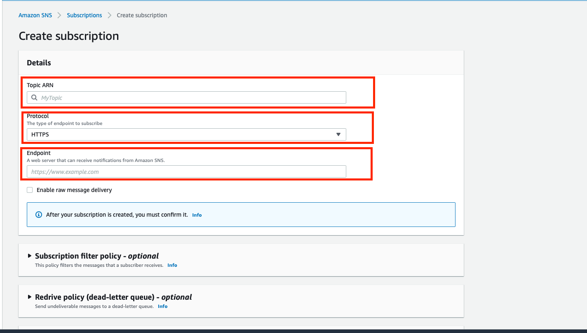

Collect your AWS SNS messages in the Coralogix platform using our automatic **Contextual Data Integration Package**. The package automatically generates a URL to be used when creating an SNS subscription.

## Overview

AWS SNS (Simple Notification Service) is a fully managed messaging service provided by Amazon Web Services (AWS). It enables you to send messages or notifications to distributed systems and application components. SNS supports multiple message formats, such as SMS, email, HTTP endpoints, mobile push notifications, and more, making it a versatile service for broadcasting messages to a large number of subscribers.

Forwarding AWS SNS logs to Coralogix simplifies log aggregation, enriches monitoring capabilities, and streamlines issue diagnosis. By channeling AWS SNS logs into Coralogix, organizations gain a unified view of their notification events, enabling rapid detection of anomalies, proactive troubleshooting, and data-driven decision-making. This integration empowers teams to optimize message delivery, bolster system reliability, and ensure operational efficiency, utilizing Coralogix's analysis and visualization features to extract actionable insights from AWS SNS logs and maintain a resilient communication framework.

## Get Started

**STEP 1.** In your navigation pane, click **Data Flow** > **Contextual Data**.

**STEP 2.** In the **Contextual Data** section, select **AWS SNS** and click **+** **ADD**.



**STEP 4.** Click **ADD NEW**.

**STEP 5.** Fill in the **Integration Details**:

- **Name.** Name your integration.

- **Your API Key**. Click **CREATE NEW KEY** to generate an API Key and name it.

- **Application Name and Subsystem Name**. Enter an [application and subsystem name](https://coralogixstg.wpengine.com/docs/application-and-subsystem-names/).



**STEP 6.** Click **GENERATE URL**. The URL for the integration will be automatically created. Use this when creating an SNS subscription.



## Create an SNS Subscription

**STEP 1**. Log in into your AWS account and create a subscription for the topic from which you would like to send messages.



**STEP 2.** Fill in the **Details**:

- **Topic ARN.** This is the ARN of the topic you created.

- **Protocol**. Input HTTPS.

- **Endpoint**. Input the URL created by the Coralogix Integration Package.

**STEP 3**. Click **Save**.

**Notes**:

- Read more about SNS subscriptions [here](https://docs.aws.amazon.com/sns/latest/dg/sns-getting-started.html#step-send-message).

## Example Log

```json
{
  "source_system": "awssns",
  "awssns": {
    "MessageId": "ab11a2b6-2b53-53b3-af61-fa1b95c7a52a",
    "TopicArn": "arn:aws:sns:eu-central-1:1234567890:coralogix-integration",
    "Subject": "Backend error",
    "Message": {
      "customeAlert": "Too many connections!"
    },
    "Timestamp": "2021-02-22T14:14:44.582Z",
    "SignatureVersion": "1",
    "Signature": "ioQos7NF5tDSLvUBKOBJjsi8VyMA4RWksfNV4K++mr5sOqv/4jUGSo8RRpCgE+du2NX07oq5j5tOHV/E02YDklOSZTzPHiR9fSNdV3wip4kZIEh+/CJfQIuHpLkJpFysw/Gkwxd4LDhDax+Fi1YmiFd2FaYKwgk9c2MJEarnUtAr5j7Nj/H32K4qU3F8Er+8efJ+nh+3EEAM9JnMPHCd7ryMtxoOQGv73pyROkMI+F28cx5v7lOxHQb0AqlO8uzCSksa2HByRgeTVS2akHO6tIBMJ5LoqaoBCwWmjhT8XWYODyMGGcdXiIFZdRA/mKrjZfcsCwqaVKjSnDpFZC1Rgw==",
    "SigningCertURL": "https://sns.eu-central-1.amazonaws.com/SimpleNotificationService-010a507c1833636cd94bdb98bd911111.pem",
    "UnsubscribeURL": "https://sns.eu-central-1.amazonaws.com/?Action=Unsubscribe&amp;SubscriptionArn=arn:aws:sns:eu-central-1:1234567890:coralogix-integration:12345678990"
  }
}
```
