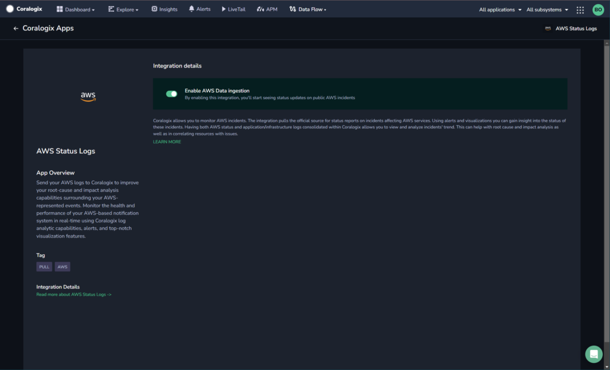

Collect your AWS Status log messages in the Coralogix platform using our automatic **Contextual Data Integration Package**. The package lets you enable AWS Status log data ingestion to allow you to see status updates on public AWS incidents.

## Overview

Amazon Web Services (AWS), offered by Amazon, is a comprehensive and widely used cloud computing platform that provides a vast array of on-demand cloud services, including computing power, storage, databases, machine learning, analytics, networking, and more. AWS allows organizations to rapidly scale resources and deploy applications across a global network of data centers, helping businesses innovate quickly, reduce costs, and achieve greater flexibility. With a rich ecosystem of services, tools, and solutions, AWS empowers businesses to build, test, and deploy applications with ease, accelerating their digital transformation and enabling them to drive innovation and growth in a highly scalable and reliable environment.

Routing your AWS status logs to Coralogix streamlines log aggregation, augments monitoring efficiency, and expedites problem resolution. By funneling your AWS status logs into Coralogix's log management platform, you attain a consolidated view of your AWS infrastructure's condition, enabling rapid anomaly detection, proactive troubleshooting, and informed decision-making. This integration empowers teams to fine-tune resource allocation, fortify system reliability, and sustain operational effectiveness, leveraging Coralogix's analytics, alerts, and visualization tools to extract valuable insights from AWS status logs and ensure a robust and resilient cloud environment.

## Get Started

**STEP 1.** In your navigation pane, click **Data Flow** > **Contextual Data**.

**STEP 2.** In the **Contextual Data** section, select **AWS** and click **ADD**.



**STEP 3.** Click **Enable AWS Data Ingestion**.

## Example Log

```
{
    "source_system": "aws"
        "aws":{
            "title": "Informational message: エラー率およびレイテンシーの上昇 | Increased Error rates and Latencies"
            "description": "We are deploying a second mitigation strategy to resolve elevated latency and the remaining level of errors for CloudWatch Logs APIs in the AP-NORTHEAST-1 Region. We continue working towards recovery."
    }
}

```

## Support

**Need help?**

Our world-class customer success team is available 24/7 to walk you through your setup and answer any questions that may come up.

Feel free to reach out to us **via our in-app chat** or by sending us an email at [support@coralogixstg.wpengine.com](mailto:support@coralogixstg.wpengine.com).
