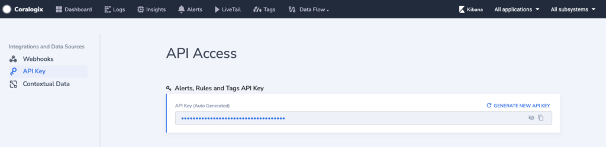
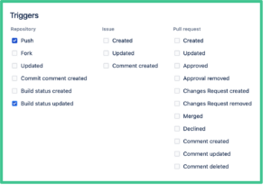

Coralogix supports integration with [`Bitbucket`](https://confluence.atlassian.com/bitbucketserver/manage-webhooks-938025878.html) webhooks, which can be used to inform Coralogix when a new build has been issued.

**Note:** This document includes cluster dependent URL’s. Please refer to the following table to select the correct Coralogix Bitbucket Version Tags API endpoint for your Coralogix Portal domain’s extension (.com/.us/.in):

\[table id=91 /\]

## Configuration

1. Log into Bitbucket using your user credentials.

3. Click your desired Repository to select it.

5. Click "Repository settings" on the left.

7. Under General \\ Repository details, click "Webhooks".

9. Click "Add webhook".

11. Add a Title (for example: “Coralogix builds”).

13. In the URL box, you will enter the link corresponding to the Coralogix Bitbucket Version Tags endpoint for your cluster _(as described in the note above)._

**URL Parameters**

- API Endpoint.

- Alerts, Rules, and Tags API Key.
    - _You can get this key from: "`https://<YourCoralogixPortalHere>/#/integration/apikey`"_
    
    - _or by navigating to:_ _`Data Flow --> API Keys --> Alerts, Rules and Tags API Key`)_

- Application Name:
    - Enter your desired Application name. Please use a name corresponding to your logs "Application" name.

- Subsystem Name:
    - Enter your desired Subsystem name. Please use a name corresponding to your logs "Subsystem" name.
    
    - You can specify more than 1 Subsystem name, separated by a commas.

- Tag Name

**URL Example**

https://webapi.coralogixstg.wpengine.com/api/v1/external/bitbucket/xxxxxxxx-xxxx-xxxx-xxxx-xxxxxxxxxxxx?application=bitbucket&subsystem=build-tag-test&name=bitbucket-tag-test

_(Please note the question mark **‘?’** immediately after the API key. You could copy and paste this example,_  
_and replace the API Endpoint, Alerts and Tags API Key, and additional parameters with your own values)._

8. Under "Triggers", please select Build status updated".

9. On the right bottom, please click "Save".
