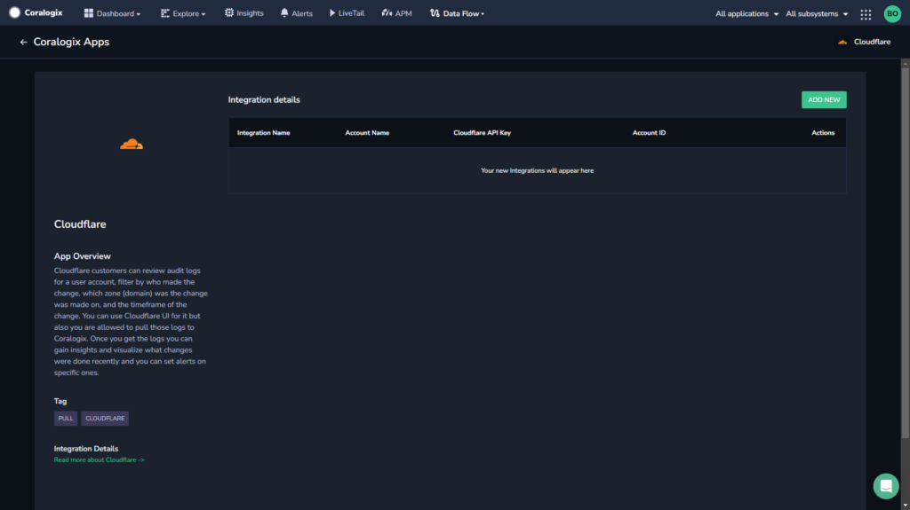
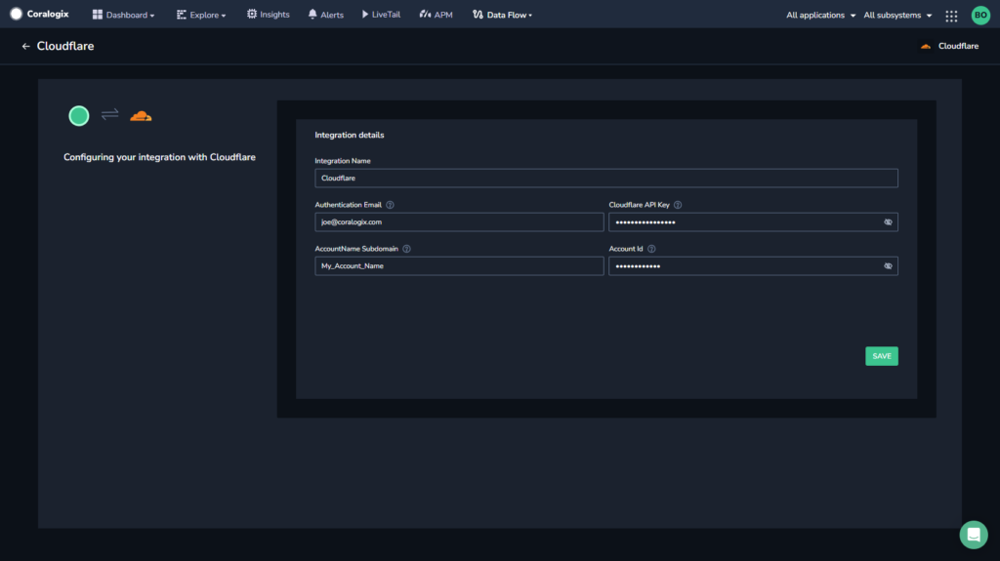
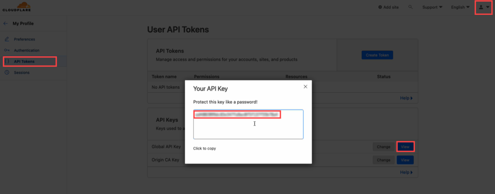
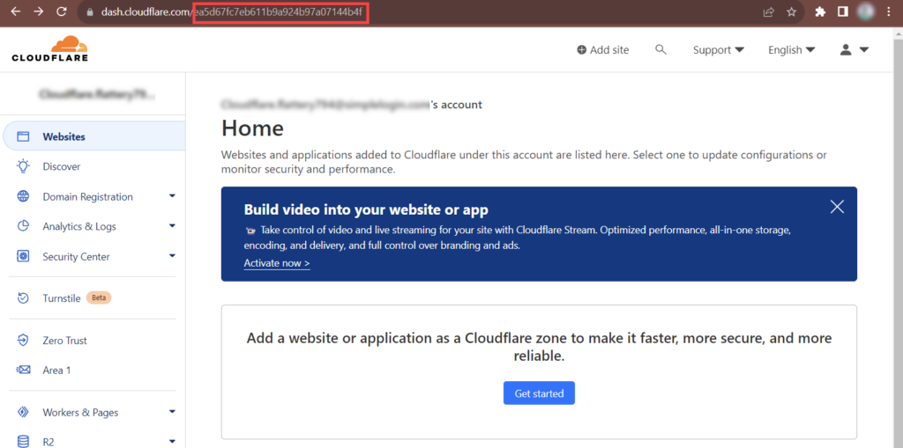
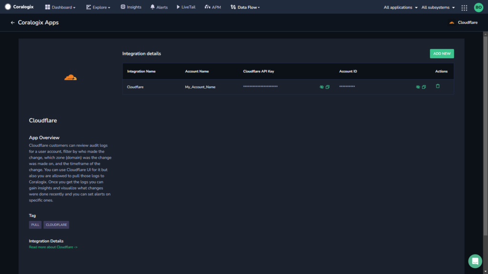

Collect your Cloudflare events in the Coralogix platform using our automatic **Contextual Data Integration Package**.

## Overview

Cloudflare is a prominent technology company that offers a range of internet services aimed at enhancing security, performance, and reliability for websites and online applications. By operating as a content delivery network (CDN), Cloudflare optimizes the delivery of web content and mitigates cyber threats like DDoS attacks by distributing traffic across its global network of servers. Additionally, Cloudflare provides services such as DNS management, load balancing, and firewall protection, enabling businesses to improve their online presence and user experience while safeguarding against various online threats.

Sending your Cloudflare events to Coralogix enables centralized log management, proactive monitoring, security analysis, and performance optimization. This integration empowers you to consolidate event data, set up custom alerts, detect security threats, identify performance bottlenecks, and maintain compliance, ultimately enhancing application security, reliability, and user experience through data-driven insights and actionable intelligence.

## Get Started

**STEP 1.** In your navigation pane, click **Data Flow** > **Contextual Data**.

**STEP 2.** In the **Contextual Data** section, select **Cloudflare** and click **+** **ADD**.

**STEP 4.** Click **ADD NEW**.

**STEP 5.** Fill in the **Integration Details**:

- **Integration Name.** Name your integration.

- **Authentication Email.** The e-mail address you use to login to Cloudflare.

- **Cloudflare** **API Key**. Go to your Cloudflare account, click on **My Profile** -> **API Tokens** -> **Global API Key** -> **View** and copy the Global API key.

- **AccountName Subdomain**. Either your Cloudflare Account Name or you can provide another name which will be your subsystem name in Coralogix.

- **Account ID.** In your Cloudflare account home page, go to the URL and copy the **Account ID** from the URL.

**STEP 6.** In the Coralogix integration page, click **SAVE**.

## Support

**Need help?**

Our world-class customer success team is available 24/7 to walk you through your setup and answer any questions that may come up.

Feel free to reach out to us **via our in-app chat** or by sending us an email at [support@coralogixstg.wpengine.com](mailto:support@coralogixstg.wpengine.com).
