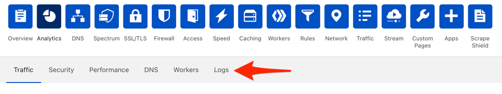
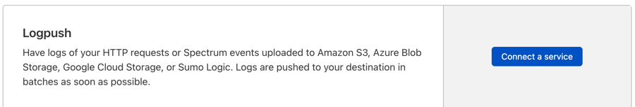
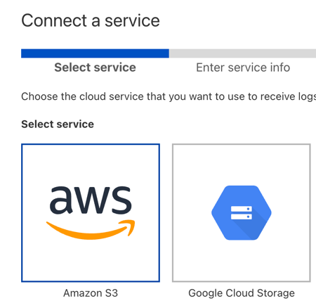
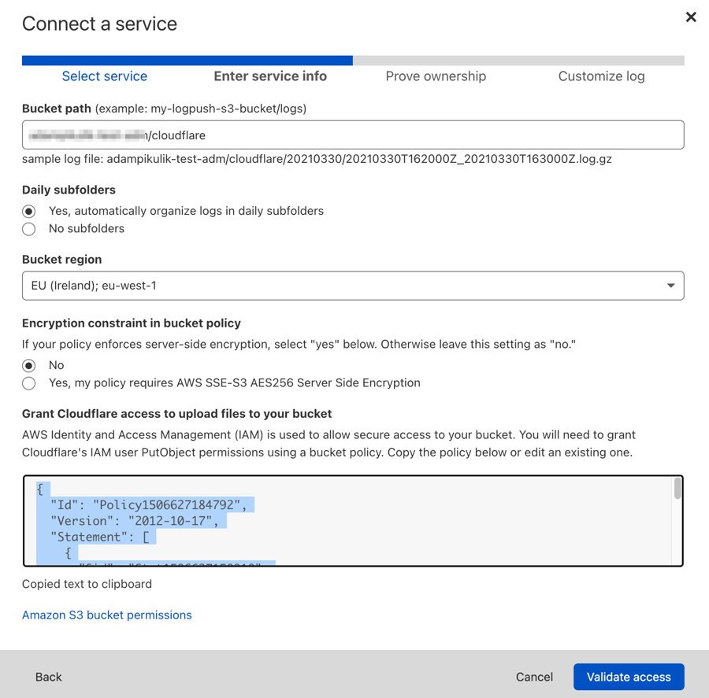
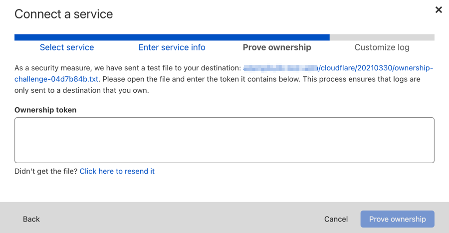
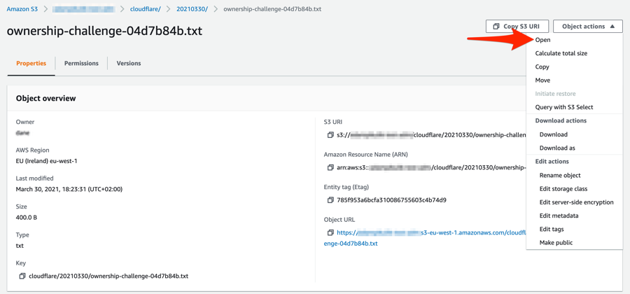
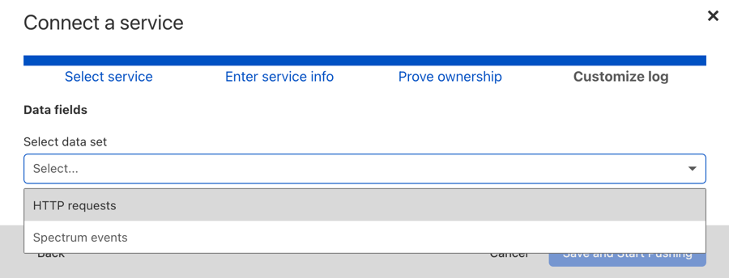
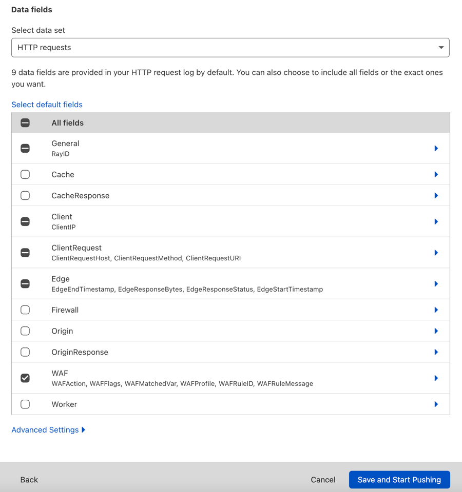
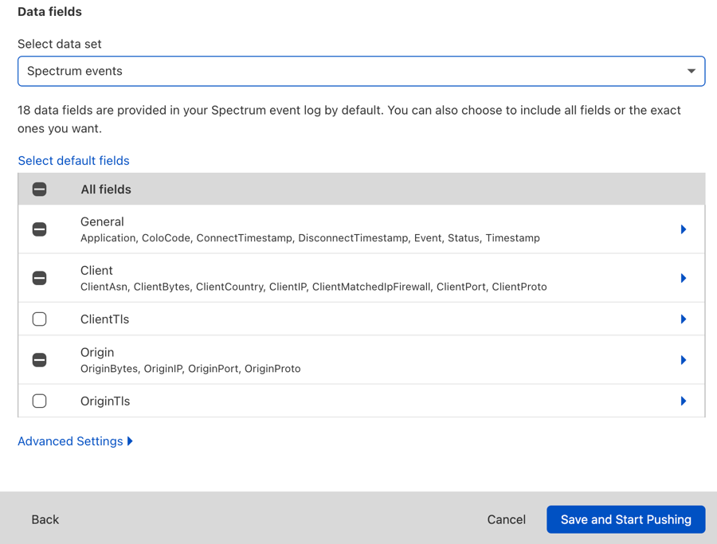
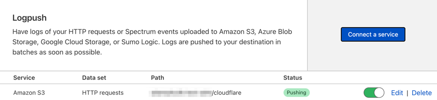

[Cloudflare](https://www.cloudflare.com/) Enterprise customers have access to Logpush service, which allows you to forward logs to cloud service providers like AWS. This tutorial demonstrates how to send your logs to Coralogix.

## Send Logs Directly

### Prerequisites

- Coralogix [](https://coralogixstg.wpengine.com/docs/private-key/)[](https://coralogixstg.wpengine.com/docs/private-key/)[Send-Your-Data API key](https://coralogixstg.wpengine.com/docs/send-your-data-api-key/)

- Cloudflare ZoneID / AccountID - Find the relevant id in the cloudflare dashboard under ‘Websites’ -> ‘<Your-site>’ -> ‘API (scroll down)’.

### Configuration

To start sending data directly to Coralogix, select the type of logs (data-sets) and fields that will be sent [here](https://developers.cloudflare.com/logs/reference/log-fields/).

To create the logpush job, call the API using the terminal. Input your Coralogix [domain](https://coralogixstg.wpengine.com/docs/coralogix-domain/) to create your endpoint URL: `https://ingress.**<cx_domain>**/cloudflare/v1/logs`.  

```bash
curl -s https://api.cloudflare.com/client/v4/zones/<zone_id>/logpush/jobs -X POST \
-H "Content-Type:application/json" \
-d '{
  "name": "logpush-to-coralogix",
  "logpull_options": "fields=BotScoreCloudflare,BotScoreSrc,BotTags,CacheCacheStatus,CacheResponseBytes,CacheResponseStatus,CacheTieredFill,ClientASN,ClientCountry,ClientDeviceType,ClientIP,ClientIPClass,ClientMTLSAuthCertFingerprint,ClientMTLSAuthStatus,ClientRequestBytes,ClientRequestHost,ClientRequestMethod,ClientRequestPath,ClientRequestProtocol,ClientRequestReferer,ClientRequestScheme,ClientRequestSource,ClientRequestURI,ClientRequestUserAgent,ClientSSLCipher,ClientSSLProtocol,ClientSrcPort,ClientTCPRTTMs,ClientXRequestedWith,EdgeCFConnectingO2O,EdgeColoCode,EdgeColoID,EdgeEndTimestamp,EdgePathingOp,EdgePathingSrc,EdgePathingStatus,EdgeRateLimitAction,EdgeRateLimitID,EdgeRequestHost,EdgeResponseBodyBytes,EdgeResponseBytes,EdgeResponseCompressionRatio,EdgeResponseContentType,EdgeResponseStatus,EdgeServerIP,EdgeTimeToFirstByteMs,FirewallMatchesActions,FirewallMatchesRuleIDs,FirewallMatchesSources,JA3Hash,OriginDNSResponseTimeMs,OriginIP,OriginRequestHeaderSendDurationMs,OriginResponseBytes,OriginResponseDurationMs,OriginResponseHTTPExpires,OriginResponseHTTPLastModified,OriginResponseHeaderReceiveDurationMs,OriginResponseStatus,OriginResponseTime,OriginSSLProtocol,OriginTCPHandshakeDurationMs,OriginTLSHandshakeDurationMs,ParentRayID,RayID,RequestHeaders,ResponseHeaders,SecurityLevel,SmartRouteColoID,UpperTierColoID,WAFAction,WAFFlags,WAFMatchedVar,WAFProfile,WAFRuleID,WAFRuleMessage,WorkerCPUTime,WorkerStatus,WorkerSubrequest,WorkerSubrequestCount,ZoneID,ZoneName&timestamps=unixnano",
  "destination_conf": "<https://ingress.<coralogix_domain>/cloudflare/v1/logs>?header_Authorization=Bearer%20<Send_your_data_key>&header_timestamp-format=UnixNano&header_dataset=HTTPRequests",
  "max_upload_bytes": 5000000,
  "max_upload_records": 1000,
  "dataset": "http_requests",
  "enabled": true,
  "frequency": "low"
}' \
-H "X-Auth-Email: <Your_Auth_Email>" \
-H "X-Auth-Key: <Your_API_Key>"
```

**Notes**:

- Replace <zone\_id> with your site zone id, <Send\_your\_data\_key> with your coralogix [](https://coralogixstg.wpengine.com/docs/private-key/)[](https://coralogixstg.wpengine.com/docs/private-key/)[Send-Your-Data API key](https://coralogixstg.wpengine.com/docs/send-your-data-api-key/) and 'X-Auth-Email' 'X-Auth-Key' with your cloudflare credentials.

- To change the dataset sent change the 'dataset' field and \`header\_dataset\` inside the 'destination\_conf' field using the table below.

- To change the fields sent change the 'logpull\_options' field, each dataset has different fields.

- Each dataset has a different 'timestamp' key, providing it in the 'logpull\_options' field is required, also using the unixnano format for the timestamp is also required. Find out more about log fields [here](https://developers.cloudflare.com/logs/reference/log-fields/).

- To configure Account-scoped datasets use 'https://api.cloudflare.com/client/v4/accounts/<Account\_ID>/logpush/jobs'.

- By default, the integration will set `application_name` as `Cloudflare`, and `subsystem_name` as the data set name. To overwrite these parameters, add the following:
    - `header_CX-Application-Name` - application name override
    
    - `header_CX-Subsystem-Name` - subsystem name override

<table><tbody><tr><td><strong>Dataset name</strong></td><td><strong>Header name</strong></td><td><strong>'Timestamp' key</strong></td><td><strong>Scope</strong></td></tr><tr><td>dns_logs</td><td>DNSLogs</td><td>Timestamp</td><td>Zone</td></tr><tr><td>firewall_events</td><td>FirewallEvents</td><td>Datetime</td><td>Zone</td></tr><tr><td>http_requests</td><td>HTTPRequests</td><td>EdgeStartTimestamp</td><td>Zone</td></tr><tr><td>nel_reports</td><td>NELReports</td><td>Timestamp</td><td>Zone</td></tr><tr><td>spectrum_events</td><td>SpectrumEvents</td><td>Timestamp</td><td>Zone</td></tr><tr><td>audit_logs</td><td>AuditLogs</td><td>When</td><td>Account</td></tr><tr><td>gateway_dns</td><td>GatewayDNS</td><td>Datetime</td><td>Account</td></tr><tr><td>gateway_http</td><td>GatewayHTTP</td><td>Datetime</td><td>Account</td></tr><tr><td>gateway_network</td><td>GatewayNetwork</td><td>Datetime</td><td>Account</td></tr><tr><td>network_analytics_logs</td><td>NetworkAnalyticsLogs</td><td>Datetime</td><td>Account</td></tr><tr><td>access_requests</td><td>AccessRequests</td><td>CreatedAt</td><td>Account</td></tr><tr><td>casb_findings</td><td>CASBFindings</td><td>DetectedTimestamp</td><td>Account</td></tr><tr><td>dns_firewall_logs</td><td>DNSFirewallLogs</td><td>Timestamp</td><td>Account</td></tr><tr><td>magic_ids_detections</td><td>MagicIDSDetections</td><td>Timestamp</td><td>Account</td></tr><tr><td>workers_trace_events</td><td>WorkersTraceEvents</td><td>EventTimestampMs</td><td>Account</td></tr></tbody></table>

After creating the logpush, view it in the terminal.

```bash
curl -s https://api.cloudflare.com/client/v4/zones/<Zone_ID>/logpush/jobs -X GET \
-H "X-Auth-Email: <Your_Auth_Email>" \
-H "X-Auth-Key: <Your_Auth-Key>"
```

Or in the dashboard itself under ‘Websites’ -> ‘<Your-site>’ -> ‘Analytics’ -> ‘Logs’.

## Send Logs via S3 Bucket

### Prerequisites

AWS S3 bucket - Follow the tutorial to send logs from the S3 bucket to Coralogix: [https://coralogixstg.wpengine.com/integrations/data-collection-s3/](https://coralogixstg.wpengine.com/integrations/data-collection-s3/)

### Configuration

To enable the Clouflare Logpush service:

1. Log in to the Cloudflare dashboard

3. Ensure the Enterprise domain you want to use with Logpush is selected

5. Select the Analytics app in the top menu

7. Select the Logs section in the secondary menu  
    

9. Select Connect a service. A modal window opens where you will need to complete several steps.  
    

11. Under Select service, pick your Amazon S3 and click Next.  
    

13. Enter or select the following:
    - Bucket path
    
    - Daily subfolders
    
    - Bucket region  
        

15. Copy the policy from the field below "Grant Cloudflare access to upload files to your bucket"

17. In new window go to S3 > your bucket name > Permissions > Bucket Policy

19. Click on the Edit button at the Bucket Policy.

21. Paste the copied policy and save changes.

23. In the Cloudflare dashboard, click Validate access.

25. Follow the on-screen instructions to enter the Ownership token (included in a file Cloudflare sends to your Amazon S3 bucket).  
      
    Open a file with token on your Amazon S3 bucket and paste the token into Ownership token field:  
    

27. Click the "Prove ownership" button.

29. Next in the Customize log screen, select the data set in which you're interested (currently HTTP requests or Spectrum events).  
      
    You can keep the default fields to include in your log or make changes. You can add or remove fields at a later time by modifying your settings in Logs > Logpush (select the wrench icon).  
    

31. To finish enabling Logpush, click Save and Start Pushing

Once connected, Cloudflare lists the provider you just configured under Logs > Logpush. This is where you can make changes or remove the provider.  


If all steps were executed properly, you should see files in your S3 bucket and also in Coralogix.

## Support

**Need help?**

Our world-class customer success team is available 24/7 to walk you through your setup and answer any questions that may come up.

Feel free to reach out to us **via our in-app chat** or by sending us an email at [support@coralogixstg.wpengine.com](mailto:support@coralogixstg.wpengine.com).
