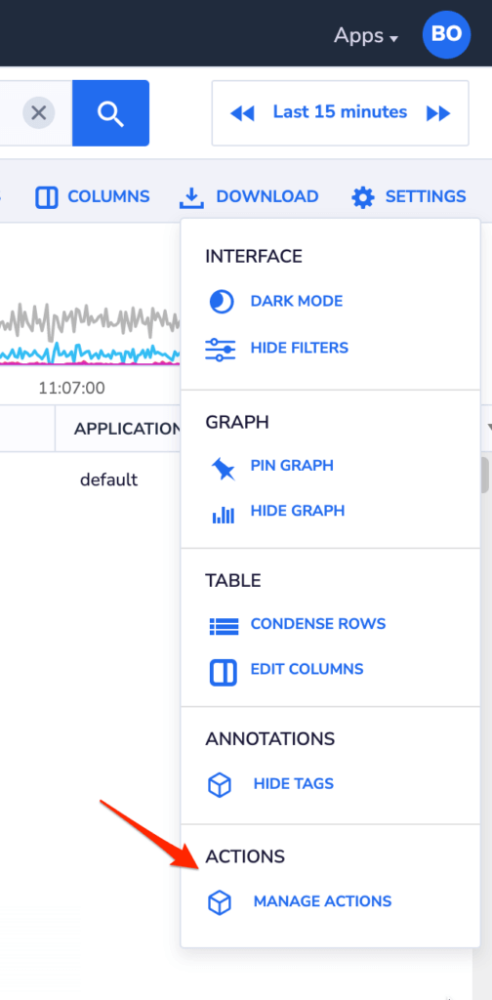
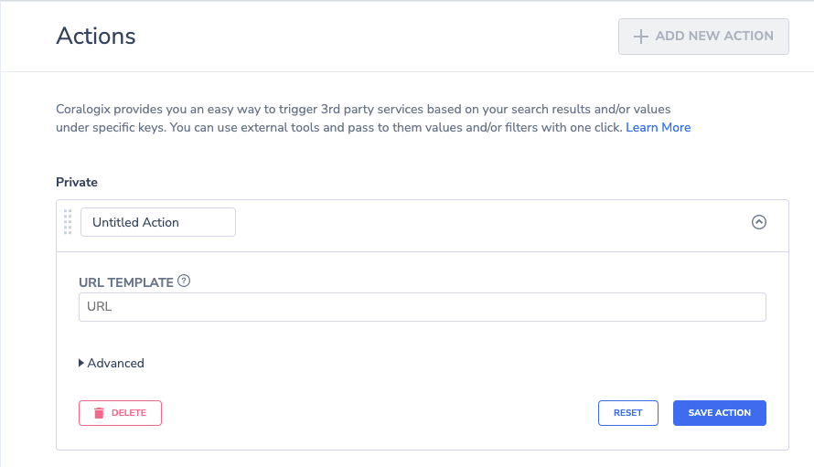
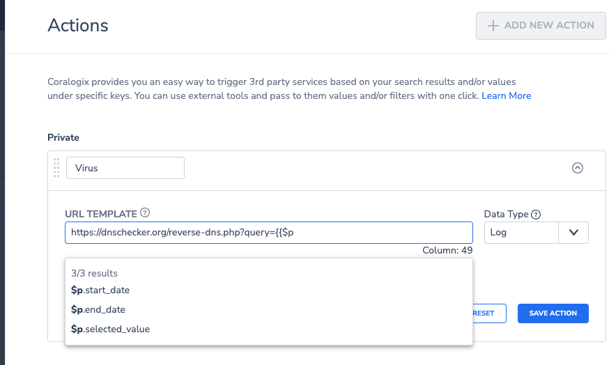
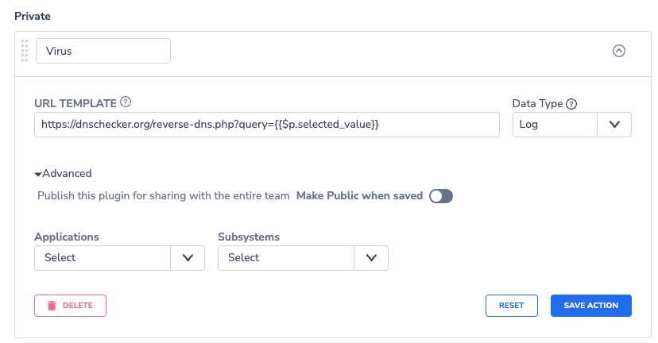
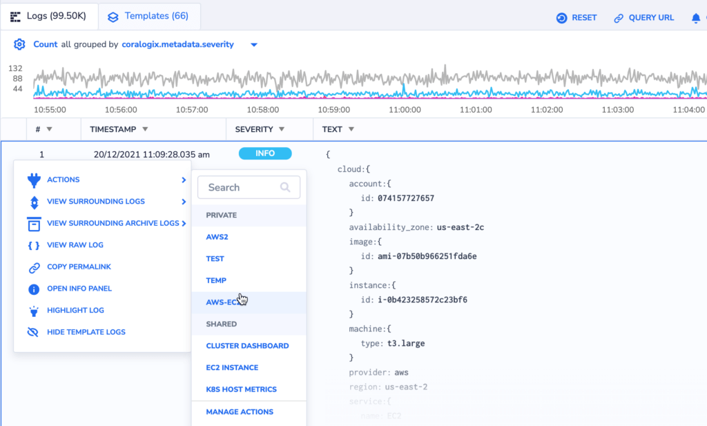

Coralogix simplifies the triggering of third-party services based on specific search results and values under designated keys.

## Creating an Action

**STEP 1.** Navigate to the Coralogix **Explore > Logs** screen.

**STEP 2.** Click on **Settings** in the upper right-hand corner. Select **MANAGE ACTIONS** from the drop-down menu.



**STEP 3**. A pop-up window displaying a list of defined Actions will appear. If the list is empty, a new Untitled Action will be opened.



**STEP 4.** If this isn't your first **Action**, click **\+ ADD NEW ACTION** to create a new one.

**STEP 5.** Name the new **Action** in the **Untitled Action** pop-up.

**STEP 6.** In the URL field, add the external tool's URL. For example: `https://test-my-url.com?type={{ $m.subsystemName === "frontend" ? "Front" : "Back" }}`.



When using curly brackets {{}}, a dropdown menu with three variable types will appear: $p, $m, $d.

<table><tbody><tr><td><strong>Variable</strong></td><td><strong>Description</strong></td></tr><tr><td>$p</td><td>Variables which can be used with any log (START_DATE, END_DATE, SELECTED_VALUE)</td></tr><tr><td>$m</td><td>Coralogix metadata fields (applicationName, subsystemName, severity, etc.)</td></tr><tr><td>$d</td><td>Selected log</td></tr></tbody></table>

**Notes**:

- URLs must begin with 'http://' or 'https://'. Other URL structures trigger an instructional message.

- JavaScript syntax is supported for "Actions," allowing for conditions like `{{ condition ? "true value" : "false value" }}`.

- Nearly all JavaScript functions are supported.

**STEP 7**. \[Optional\] **Advanced:** Restrict the **Action** to specific applications and/or subsystems. Share it with teammates by activating the **Make public when saved** toggle.



**STEP 8**. Click **RESET** to clear the entered data. To save, click **SAVE ACTION**.

## Manage Custom Actions

**STEP 1.** In your Coralogix navigation pane, click on **Explore** > Logs screen page.

**STEP 2**. Click on **Settings** in upper right-hand corner. In the drop-down menu, select MANAGE ACTIONS.

**STEP 3**. A pop-up window, containing a list of defined **Actions**, will be displayed.

**STEP 4.** Take various actions:

- Click on the rectangle icon to clone an **Action** for easy editing and saving under a new name.

- Use the eye icon to disable/enable an **Action**.

- Click the arrow button to edit or delete an **Action**.

- Click **\+ ADD NEW ACTION** to define a new **Action**.

- Use the group of small gray rectangles on the left side of an **Action** name to move and set the order within Private/Shared sections.

## Custom Action Usage

**STEP 1.** Access Coralogix **Explore > Logs** screen.

**STEP 2.** Define a query.

**STEP 3.** Trigger the action by:

- Clicking on (…) next to a specific log or JSON key. Only **Actions** without "$p.SELECTED\_VALUE" in the URL are visible.

- Clicking on a value lists all defined **Actions**, including those with "$p.SELECTED\_VALUE" in the URL. If defined with "$p.SELECTED\_VALUE," the value from that JSON key is passed.




Once an **Action** is chosen, the defined URL opens in a new tab.

## Usage Examples

### Common Usage

**Jira bug action**

```
http://<company_name>.atlassian.net//secure/CreateIssueDetails!init.jspa?pid=<Jira_PID>&issuetype=<Jira_issueType>&description={{$d.logRecord.body}}&summary={{$d.msg}}
```

**Query logs based on a key in the logs**

```
https://<team_name>.app.coralogix.us/#/query-new/logs?query=<key>%3A%22{{$d.<key>}}%22&time=from:{{$p.start_date}},to:{{$p.end_date}}
```

**Query spans based on a key in the logs**

```
https://<team_name>.app.coralogix.us/#/query-new/tracing?query=<spans_key>:%22{{$d.<logs_key>}}%22&time=from:{{$p.start_date}},to:{{$p.end_date}}&page=0&onlyRootSpans=false&tracingTableView=spans
```

**Jump to Grafana dashboard with filter from a key in the log**

```
https://<team_name>.app.coralogix.us/#/grafana/d/WhANBmU4k/<grafana_dashboard_name>?orgId=342&var-<grafana_filter_name>={{$d.<log_key>}}
```

## Support

**Need help?**

Our world-class customer success team is available 24/7 to answer any questions that may come up.

Feel free to reach out to us **via our in-app chat** or by sending us an email at [support@coralogixstg.wpengine.com](mailto:support@coralogixstg.wpengine.com).
