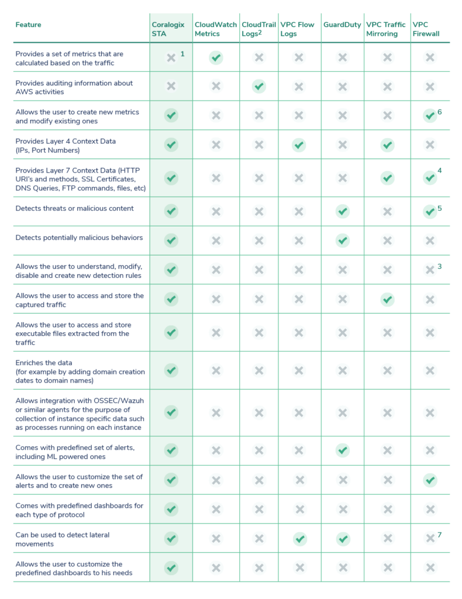

A successful cloud and container-native security posture is the goal that organizations are striving towards but achieving it can seem lofty when faced with mounting complexities and a lack of expert security resources.  
Setting up a proactive monitoring solution is daunting in and of itself and creating one without causing analyst fatigue and avoiding prohibitive data costs can make it seem nearly impossible.

  
Security logs like Cloudtrail, VPC Flow logs, GuardDuty, and Auditbeat without network packet data, are not enough to paint the full picture of what’s being transmitted, and by whom, allowing attackers to circumvent safeguards, as well as not having the information needed to perform deep enough investigations. However, setting up, processing, and storing packet data can be laborious and cost-prohibitive.

  
The Coralogix Cloud Security solution brings visibility and threat insights to SOC and DevOps teams within minutes, instead of months. In order to deliver reliable alerts with actionable context, Coralogix uniquely correlates  
contextual log data and combines it with network packet data.

Here’s a full comparison between the STA and all the other methods in AWS:

(1) Will be added soon in upcoming versions  
(2) Since CloudTrail logs are basically an auditing mechanism for AWS, they provide a different type of context data that is also very valuable for forensic investigations  
(3) Allows the user to create new rules  
(4) The VPC Firewall contains some protocol analyzers for analyzing the packets passed through it but they are not as extensive and extensible as the Zeek platform embedded in the STA. The Zeek platform contains protocol analyzers for hundreds of different protocols  
(5) Can detect threats at the perimeter only and only based on its suricata’s signatures list  
(6) The offered metrics are very basic like dropped/passed packets. The user can add one dimension to the metrics called “CustomAction”. See more here: https://docs.aws.amazon.com/network-firewall/latest/developerguide/  
monitoring-cloudwatch.html  
(7) The VPC firewall can only be installed at the perimeter level, as an inline device, which prevents it from being exposed to the inter-vpc traffic
