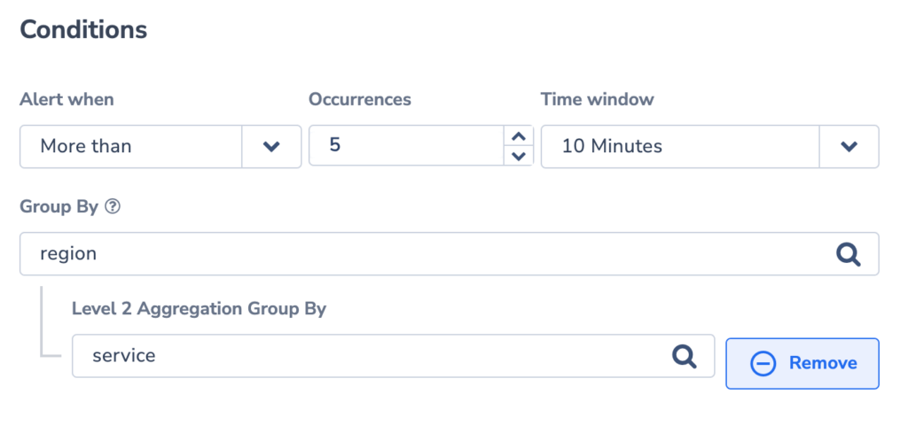
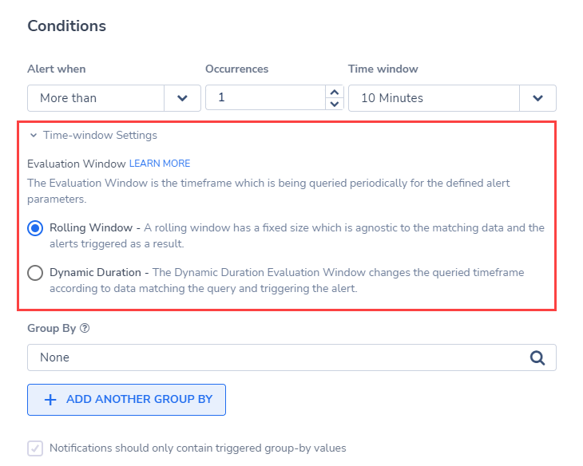
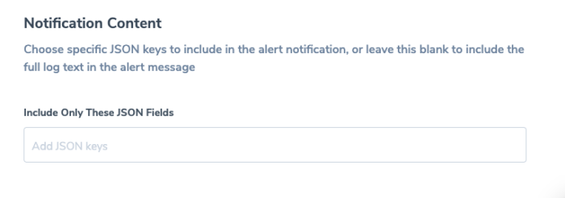
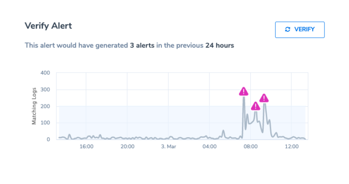

Use the Coralogix **Standard Alerts** feature to monitor system performance, get notified when there are changes to your logs, and instantly pinpoint potential causes.

## Feature

Standard alerts are alerts that are triggered by changes to your logs. These alerts are useful when trying to measure the number of occurrences of a particular incident - when a user arrives at your website, for example, or when an error occurs.

With the **Standard Alerts** feature, you can do the following:

- **Monitor system performance in real-time**. Obtain real-time insights based on the criteria of your choice.

- **Construct the perfect query for your specific needs**. Define a query that will capture the logs you wish to inspect, and make it more specific when you filter by application, subsystem, and severity. Then, select the range of conditions to trigger an alert. For example, you may set that more than 10 logs over minutes will trigger your alert.

- **Enjoy a machine learning-based approach**. Using this setting, the Coralogix platform profiles your data and automatically detects abnormal behavior.

- **Receive personalized notifications**. Receive real-time push notifications to your preferred communication channel.

Standard alerts are the simplest alerts that Coralogix offers. Their simplicity is their strength. We **strongly recommend** that you cover your most obvious use cases with standard alerting to build a strong foundation in your observability system.

## Create an Alert

**STEP 1**. Perform a query to filter the logs that will be returned as part of the alert.

- Click on **Logs** in the navigation pane.

- Perform a [query](https://coralogixstg.wpengine.com/tutorials/log-query-simply-retrieve-data/) to filter the logs that will be returned as part of the alert. Use a combination of the query input or the filters on the left-hand panel.

- Click **CREATE ALERT** in the upper right-hand corner.

To create an alert **without** a predefined query, click on **Alerts** > **Alert Management** in the Coralogix toolbar. Click **NEW ALERT** on the upper right-hand corner of your dashboard.

## Alert Details

**STEP 2**. Define **Alert Details**.

- Define:
    - **Alert Name.**
    
    - **Description**.
    
    - **Severity**. Choose from one of four options: **info**, **warning**, **error**, **critical**.
    
    - **Labels**. Define a new label or choose from an existing one. Nest a label using `key:value`.

## Alert Type

**STEP 3.** Select **STANDARD** **Alert Type**.

## Query

**STEP 4**. Define **Query**.

- If you created an alert from your **Logs** screen, your query will appear. Click **EDIT** to modify.

- If you created an alert from your **Alerts** screen, input a new query. Using the available RegEx cheat sheet for support.

- Filter by **Application**, **Subsystem** and **Severity**.

## Conditions

**STEP 5**. Set the **Conditions** for triggering an alert.

### Alert When

Select whether to trigger the alert immediately, or define a rule based on the number of occurrences within a specified time window or using our **Dynamic Alerts** anomaly detecting option.

- **Notify** **Immediately:** Immediate notification followed by silence for 1 minute. Hit count will present 1 in immediate alert, as we notify you of the first log that matches.

- **More/Less Than:** Alert will trigger when the count of the entries matching the alert definition will be more/less than the chosen threshold. Hit count will present the actual number of entries that matched within the selected time window.

- **More Than Usual.** This **[Dynamic Alerts](https://coralogixstg.wpengine.com/docs/dynamic-alerts/)** setting enables you to detect abnormal behavior automatically – without setting fixed threshold values. Set minimum threshold only. **Note**: It takes one week for algorithms to learn the traffic pattern

### Evaluation Window

The Evaluation Window is the period of time that is periodically queried for the alert query and parameters. When the alert is set to **More than** for a Standard Alert, you can select the Evaluation Window type from the following options:

- **Rolling Window**. This is the default setting for new alerts. The Rolling Window is a fixed period of time (i.e. 10 minutes) and does not change, regardless of matching data and any alerts triggered as a result of the query.

- **Dynamic Duration**. The Dynamic Duration evaluation window changes the queried period when data matching the query triggers an alert.

### Group By

Group your alerts using one or more aggregated values into a histogram.

- An alert is triggered whenever the condition threshold is met for a specific aggregated value within the specified timeframe.

- **New**! If using 2 values for **Group By**, matching logs will first be aggregated by the parent field (ie. **region**), then by the child field (ie. **pod\_name**). An alert will fire when the threshold meets the unique combination of both parent and child. Only logs that include the **Group By** fields will be included in the count.

## Notifications

**STEP 6**. Define **Notification** settings.

In the notification settings, you have different options, depending on whether or not you are using the **Group By** condition.

### With Group By

When using **Group By** conditions, you will see the following options:

- **Trigger a single alert when at least one combination of** the group by values meets the condition. A single notification, aggregating all values matching an alert query and conditions, will be sent to your Coralogix Incidents screen.

- **Trigger a separate alert for each combination that meets the condition**. Multiple individual notifications for each Group By field value may be sent to your Coralogix Incidents screen when query conditions are met. Select one or more Keys - consisting of a subset of the fields selected in the alert conditions - in the drop-down menu. A separate notification will be sent for each Key selected.

- The number of **Group By** permutations is limited to 1000. If there are more permutations, then only the first 1000 are tracked.

### Without Group By

When not using the **Group By** condition, **a single alert will be triggered** and sent to your [Incidents Screen](https://coralogixstg.wpengine.com/docs/incidents/) when the query meets the condition.

You can define additional alert recipient(s) and notification channels in both cases by clicking **\+ ADD WEBHOOK**. Once you add a webhook, you can choose the parameters of your notification:

- **Notify Every**. Sets the alert cadence. After an alert is triggered and a notification is sent, the alert will continue to work, but notifications will be suppressed for the duration of the suppression period.

- **Notify when resolved**. Activate to receive an automatic update once an alert has ceased.

### Advanced Notifications

Once you add a webhook to the notification group, a toggle appears which enables you to move to **Advanced Mode**. Advanced mode enables you to set the **notify every** & **notify when resolved** settings for each webhook individually. Note that the toggle affects all notification groups, and when you turn the toggle on in one notification group, it will be turned on in all notification groups.

## Schedule

**STEP 7**. Set a **Schedule.**

Limit triggering to specific days and times.

## Notification Content

**STEP 8**. Define **Notification Content**.

- Choose a specific JSON key or keys to include in the alert notification.

- Leave blank to view the full log text.

## Verify Alert

**STEP 9**. **Verify** your alert.

Click **VERIFY** to view how many times the alert matched the criteria in the last 24 hours.

**STEP 10**. View your **History.**

View which user performed a change in the alert and when.

**STEP 11**. **Create** your alert.

Click **CREATE ALERT** on the upper-right side of the screen.

## View Alerts

Navigate to **Alerts** > **Incidents** from you Coralogix toolbar.

Bundled as incidents, triggered alert events are presented in your **Incidents Screen** according to the Group By tags and notification settings set in your alert definition.

Manage, edit, and snooze alerts. Find out more [here](https://coralogixstg.wpengine.com/docs/incidents/).

## Limitations

**Standard Alerts** do **not** support arrays in queries.

## Support

**Need help?**

Our world-class customer success team is available 24/7 to walk you through your setup and answer any questions that may come up.

Contact us via our in-app chat or by emailing [support@coralogixstg.wpengine.com](mailto:support@coralogixstg.wpengine.com).
