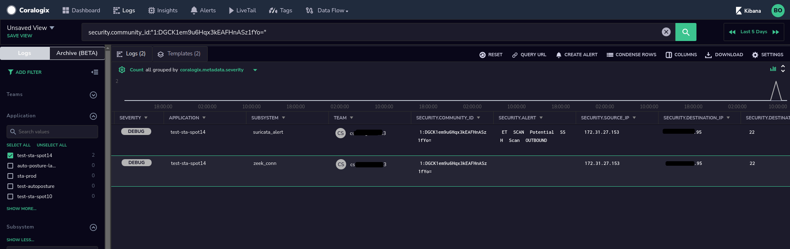

The Coralogix STA is a tool built by Coralogix that can analyze raw traffic packets seen by it by using traffic mirroring (in AWS it's called VPC Traffic Mirroring), collect information about hosts from the hosts themselves by using a Wazuh agent. In addition, Wazuh can collect information from the cloud provider such as AWS from services such as AWS Inspector, AWS CloudTrail and others.

As such a broad solution, it produces a variety of different event types, each one with it's own set of fields. In this article I will go over the most common data types that the STA produces, their meaning and important fields by the Subsystem Name they use. If you come across an event type that is not mentioned here please let us know and we'll add it:

1. **zeek\_conn** - These events provide information about every connection that the Zeek engine of the STA has seen. It will include information about the source and destination IP addresses and ports, MAC addresses, protocol used, bytes sent and received, if the connection was tunnelled, it will contain a linking ID that allows the user to cross reference several logs. This is the list of fields that are included in each such event (fields written in red are core fields and therefore will appear in most of the other events too):
    1. security.event\_type - A string that indicates the type of data that is included in the event. Used to create the subsystem name value.
    2. **security.uid** - A unique identifier of the connection. Generated by Zeek automatically.
    3. **security.source\_ip** - The IP address of the connection initiator.
    4. **security.source\_geo** - The geographical information (both lat/lon coordinates and textual information about the relevant country, city, etc.
    5. **security.source\_port** \- The source port used by this connection.
    6. **security.destination\_ip** - The IP address of the connection responder.
    7. **security.destination\_geo** - The geographical information (both lat/lon coordinates and textual information about the relevant country, city, etc.
    8. **security.destination\_port** - The destination port used by this connection.
    9. **security.protocol** - The protocol used (e.g. tcp, udp, icmp)
    10. **security.hostname** \- A string that indicates the STA instance itself.
    11. **security.source\_filename** - The name of the file on the STA that contained the raw information in this event.
    12. **security.source\_filename\_pos** - The position in the file security.source\_filename which this event was read from
    13. **security.logshipper\_before\_filters\_timestamp** - This field is used by Coralogix to help detect and investigate logs shipping issues in the STA.
    14. **security.\_write\_ts** \- This field is used by Coralogix to help detect and investigate logs shipping issues in the STA.
    15. **security.logshipper\_before\_output\_timestamp** - This field is used by Coralogix to help detect and investigate logs shipping issues in the STA.
    16. **security.community\_id** - This field contains a hash of the source IP, source port, destination IP and destination port. You can use this field to pivot to other logs (such as from a zeek\_conn log to a suricata\_flow or suricata\_alert) about the same connection, for example - see this screenshot:  
        
    17. security.security.local\_orig - A boolean indicating whether the source IP address is a private IP.
    18. security.local\_resp - A boolean indicating whether the destination IP address is a private IP.
    19. security.duration - The duration of the connection in seconds
    20. security.connection\_state - The state of the connection according to the following list:
        1. S0: Connection attempt seen, no reply.
        2. S1: Connection established, not terminated.
        3. SF: Normal establishment and termination. Note that this is the same symbol as for state S1. You can tell the two apart because for S1 there will not be any byte counts in the summary, while for SF there will be.
        4. REJ: Connection attempt rejected.
        5. S2: Connection established and close attempt by originator seen (but no reply from responder).
        6. S3: Connection established and close attempt by responder seen (but no reply from originator).
        7. RSTO: Connection established, originator aborted (sent a RST).
        8. RSTR: Responder sent a RST.
        9. RSTOS0: Originator sent a SYN followed by a RST, we never saw a SYN-ACK from the responder.
        10. RSTRH: Responder sent a SYN ACK followed by a RST, we never saw a SYN from the (purported) originator.
        11. SH: Originator sent a SYN followed by a FIN, we never saw a SYN ACK from the responder (hence the connection was “half” open).
        12. SHR: Responder sent a SYN ACK followed by a FIN, we never saw a SYN from the originator.
        13. OTH: No SYN seen, just midstream traffic (one example of this is a “partial connection” that was not later closed).
    21. security.history - A combination of the following letters and signs indicating the connection flow between the connected parties:
        1. s - a SYN w/o the ACK bit set
        2. h - a SYN+ACK (“handshake”)
        3. a - a pure ACK
        4. d - packet with payload (“data”)
        5. f - packet with FIN bit set
        6. r - packet with RST bit set
        7. c - packet with a bad checksum (applies to UDP too)
        8. g - a content gap
        9. t - packet with retransmitted payload
        10. w - packet with a zero window advertisement
        11. i - inconsistent packet (e.g. FIN+RST bits set)
        12. q - multi-flag packet (SYN+FIN or SYN+RST bits set)
        13. ^ - connection direction was flipped by Zeek’s heuristic
    22. security.tunnel\_parents - If this connection was tunnelled, this list will contain the value of the security.uid field of the events related to the tunnel connection.
    23. security.orig\_ip\_bytes - The bytes sent during this connection by the originator
    24. security.resp\_ip\_bytes - The bytes sent during this connection by the responder
    25. security.orig\_l2\_addr - The MAC address of the connection originator
    26. security.resp\_l2\_addr - The MAC address of the responder
2. **suricata\_flow** - These events provide information about every connection that the Suricata engine of the STA has seen. It will include information about the source and destination IP addresses and ports, MAC addresses, protocol used, bytes sent and received, if the connection was tunnelled, it will contain a linking ID that allows the user to cross reference several logs. This is the list of fields that are included in each such event (fields written in red are core fields and therefore will appear in most of the other events too):
    1. security.connection\_state - The connection state
    2. security.connection\_started - The timestamp at which the connection has started
    3. security.connection\_ended - The timestamp at which the connection has ended.
    4. security.flow\_id - The flow id of the connection. Can be used to locate other Suricata logs related to this connection.
    5. security.connection\_state\_description - The description for the current connection state. E.g. "timeout"
    6. security.nids\_alerted - Whether Suricata has generated an alert about this connection.
    7. security.icmp\_type - In ICMP connections, this field will indicate the exact type of ICMP request that has been sent.
    8. security.app\_proto - The application level protocol used in this connection if Suricata could detect it (e.g. http, dns, ssh etc.)
    9. security.tcp\_flags - TCP flags
    10. security.tcp\_flags\_tc - TCP flags sent to the client
    11. security.tcp\_flags\_ts - TCP flags sent to the server
    12. security.tcp\_syn - Whether a TCP SYN flag was seen in this connection.
    13. security.tcp\_ack - Whether a TCP ACK flag was seen in this connection.
    14. security.tcp\_psh - Whether a TCP PUSH flag was seen in this connection.
    15. security.tcp\_fin - Whether a TCP FIN flag was seen in this connection.
3. **zeek\_dns** - These events provide information about DNS requests observed by the Zeek engine of the STA. It will include information about DNS queries performed and the answers provided by the DNS server. In addition, such events may also include some additional fields which contain the results of some enrichment services in the STA (marked in blue). The following fields are included in the event (fields that are also included in previously mentioned event types are not listed here):
    1. security.query - The string that was sent to the DNS server as a query.
    2. security.query\_class - The query class (numeric)
    3. security.query\_class\_name - The query class name (e.g. C\_Internet)
    4. security.query\_type - The requested record type (numeric)
    5. security.query\_type\_name - The requested record type name (e.g. A, PTR, AAAA, TXT, etc.)
    6. security.AA - Authoritative answer. Is the response came from a name server that is an authority for the queried domain name.
    7. security.TC - Truncated. Has the message been truncated.
    8. security.RD - Recursion Desired. Whether the client indicated that the server will handle the DNS recursion for it.
    9. security.Z - Reserved flag bit in the DNS request. Usually set to zero.
    10. security.RA - Recursion Available. Whether the server allows clients to run recursive queries.
    11. security.rtt - Round trip time. The time from the request was sent to the time the response was seen. Can be used to detect delays in the DNS traffic.
    12. security.rejected - Whether the query was rejected by the DNS server.
    13. security.rcode - The response code (numeric)
    14. security.rcode\_name - The response code (e.g. NOERROR, NXDOMAIN)
    15. security.highest\_registered\_domain - Domain name parsing enrichment. The STA will attempt to parse the domain name to a TLD, a parent domain name, and subdomains. This part will contain the parent domain name with the TLD - e.g. amazon.com. (from the query tp.47cf2c8c9-frontier.amazon.com)
    16. security.parent\_domain - Domain name parsing enrichment. See security.highest\_registered\_domain for more details. This field will contain the parent domain name - e.g. amazon (from the query tp.47cf2c8c9-frontier.amazon.com)
    17. security.subdomain - Domain name parsing enrichment. See security.highest\_registered\_domain for more details. This field will contain the subdomain as parsed from the query - e.g. tp.47cf2c8c9-frontier (from the query tp.47cf2c8c9-frontier.amazon.com)
    18. security.top\_level\_domain - Domain name parsing enrichment. See security.highest\_registered\_domain for more details. This field will contain the top level domain name as parsed from the query - e.g. com (from the query tp.47cf2c8c9-frontier.amazon.com)
    19. security.query\_length - Domain name parsing enrichment. See security.highest\_registered\_domain for more details. This field contains the characters length of the entire query.
    20. security.parent\_domain\_length - Domain name parsing enrichment. See security.highest\_registered\_domain for more details. This field contains the characters length of the parent domain. This value is very useful in detecting malicious domain names which tend to be quite long.
    21. security.subdomain\_length - Domain name parsing enrichment. See security.highest\_registered\_domain for more details. This field contains the characters length of the subdomain.
    22. security.info\_type - Domain name parsing enrichment. This field contain a value indicating the type of data that was sent in the query - IPv4, IPv6, Domain or Malformed.
    23. security.creation\_date - Domain stats enrichment. The creation date of the queried domain name. This field can be quite useful in detecting connections (even encrypted ones!!!) to "baby domains" i.e. domains that were registered in the past three months or less and therefore are often associated with malicious activities.
    24. security.expiration\_date - Domain stats enrichment. The expiration date of the queried domain name.
    25. security.domain\_frequency\_score - Frequency score enrichment. This is an NLP score calculated over the queried domain and can assist in determining whether the queried domain name is human generated (value above five) or machine generated (value below five).
    26. security.parent\_domain\_frequency\_score - Frequency score enrichment. This is an NLP score calculated over the parent domain queried and can assist in determining whether the queried domain name is human generated (value above five) or machine generated (value below five).
    27. security.subdomain\_frequency\_score - Frequency score enrichment. This is an NLP score calculated over the subdomain queried and can assist in determining whether the queried domain name is human generated (value above five) or machine generated (value below five).
    28. security.transaction\_id - A random 16 bit ID given to the DNS query by the program that has initiated the DNS request. This value is also returned by the server to help in matching the DNS response to the appropriate request.
    29. security.answers - The answers given by the DNS server in the order they were provided by the DNS server.
    30. security.TTLs - The TTL (Time To Live) for every record returned by the DNS server.
4. **suricata\_dns** - These events provide information about DNS requests observed by the Suricata engine of the STA. It will include information about DNS queries performed and the answers provided by the DNS server. In addition, such events may also include some additional fields which contain the results of some enrichment services in the STA (marked in blue). The following fields are included in the event (fields that are also included in previously mentioned event types are not listed here):
    1. security.flags - DNS flags as a number.
    2. security.qr - An indication if this event represents a DNS query.
    3. security.flow\_id - An ID used by Suricata to identify the connection. Can be used to pivot to other Suricata logs related to this connection.
    4. security.type - Whether that event represents a DNS request or a DNS answer.
5. **zeek\_tunnel** - These events provide information about tunnels as observed by the Zeek engine in the STA. Note that in AWS VPC traffic mirroring all the mirrored traffic is being wrapped in a VXLAN tunnel on port 4789 by AWS design. The following fields are included in the event (fields that are also included in previously mentioned event types are not listed here):
    1. security.action - The action performed on the tunnel.
    2. security.tunnel\_type - The type of tunnel used (e.g. Tunnel::VXLAN)
6. **suricata\_alert** - These events are sent whenever the Suricata engine in the STA detects a traffic that matches one of its signatures. The following fields are included in the event (fields that are also included in previously mentioned event types are not listed here):
    1. security.payload - The binary payload that matched the signature, encoded as a Base64 string.
    2. security.packet - The raw packet that matched the signature, encoded as a Base64 string.
    3. security.classification - The signature's classification (e.g. privilege escalation, data leakage)
    4. security.alert - The textual description of the alert
    5. security.signature\_id - The Suricata's signature ID. If the number is higher than 9,000,000, the signature is a custom signature.
    6. security.gid - The Suricata's signature group ID.
    7. security.rev - The Suricata's signature revision number.
    8. security.priority - The Suricata's signature priority.
    9. security.payload\_printable - The printable strings found in the payload that matched the signature. This field can be used to create more sophisticated alerts based on the raw Suricata signature.
7. **zeek\_notice** - These events are sent whenever the Zeek engine in the STA detects a traffic pattern that matches a known traffic pattern or behavior that is known to be malicious or one that should not be permitted in a work environment. The following fields are included in the event (fields that are also included in previously mentioned event types are not listed here):
    1. security.msg - The notice message. e.g. "Unique queries (55q, < 1.0 hr) to domain: compute.internal exceeded threshold."
    2. security.sub\_msg - The notice type. e.g. AnomalousDNS::Domain\_Query\_Limit
    3. security.suppress\_for - The number of seconds this event will be suppressed for.
8. **zeek\_weird** - These events are similar to zeek\_notice but are alerting you about things that might be a problem for your organization but might also be benign. The following fields are included in the event (fields that are also included in previously mentioned event types are not listed here):
    1. security.name - The name of the anomaly found. E.g "empty\_http\_request"
    2. security.notice - Whether this event also generated a zeek\_notice event.
    3. security.source - What type of data this event is about.
9. **zeek\_software** - The Zeek engine in the STA continuously attempts to detect the software packages on the servers based on the traffic signatures that they generate. These events contain all the details about all the software packages that have been detected. The following fields are included in the event (fields that are also included in previously mentioned event types are not listed here):
    1. security.unparsed\_version - The software package name as it has been detected before parsing.
    2. security.name - The software package name.
    3. security.version\_major - The major version of the software package.
    4. security.version\_minor - The minor version of the software package.
    5. security.version\_additional - Additional version information found in the software name.
    6. security.software\_type - The type/category of the software that has been detected. E.g. HTTP::BROWSER
    7. security.nist\_info.CPEs \- NIST enrichment. Based on the detected software information, the STA will automatically attempt to correlate that data to data from the NIST NVD. When such a match is found this field will contain the matching CPEs (Common Product Enumerations)
    8. security.nist\_info.CVEs - NIST enrichment. Based on the detected software information, the STA will automatically attempt to correlate that data to data from the NIST NVD. When such a match is found this field will contain the matching CVEs (Common Vulnerabilities Enumerations) and links to the NIST website about them.
10. **zeek\_ntp** - These events contain information about NTP (Network Time Protocol) sessions seen in the traffic. The following fields are included in the event (fields that are also included in previously mentioned event types are not listed here):
    1. security.mode - The NTP mode being used. Possible values are:
        1. symmetric active
        2. symmetric passive
        3. client
        4. server
        5. broadcast
        6. NTP control message
        7. reserved for private use
    2. security.ref\_time - Reference timestamp. Time when the system clock was last set or correct.
    3. security.root\_delay - The total round-trip delay to the reference clock.
    4. security.root\_disp - Root Dispersion. The total dispersion to the reference clock.
    5. security.poll - The maximum interval between successive messages.
    6. security.rec\_time - Reference timestamp. Time when the system clock was last set or correct.
    7. security.precision - The precision of the system clock.
    8. security.version - The NTP version number (1, 2, 3, 4).
    9. security.num\_exts - Number of extension fields (which are not currently parsed).
    10. security.xmt\_time - Transmit timestamp. Time at the server when the response departed
    11. security.ref\_id - Reference ID. For stratum 1, this is the ID assigned to the reference clock by IANA. For example: GOES, GPS, GAL, etc. (see RFC 5905)
    12. security.stratum - This value mainly identifies the type of server (primary server, secondary server, etc.). Possible values, as in RFC 5905, are:
        - 0 -> unspecified or invalid
        - 1 -> primary server (e.g., equipped with a GPS receiver)
        - 2-15 -> secondary server (via NTP)
        - 16 -> unsynchronized
        - 17-255 -> reserved
    13. security.org\_time - Origin timestamp. Time at the client when the request departed for the NTP server.
    14. security.kiss\_code - For stratum 0, four-character ASCII string used for debugging and monitoring. Values are defined in RFC 1345.
    15. security.ref\_addr - Above stratum 1, when using IPv4, the IP address of the reference clock. Note that the NTP protocol did not originally specify a large enough field to represent IPv6 addresses, so they use the first four bytes of the MD5 hash of the reference clock’s IPv6 address (i.e. an IPv4 address here is not necessarily IPv4).
    16. security.key\_id - Key used to designate a secret MD5 key.
    17. security.digest - MD5 hash computed over the key followed by the NTP packet header and extension fields.
11. **suricata\_ssh** - These events include information about SSH sessions that were detected in the traffic. The following fields are included in the event (fields that are also included in previously mentioned event types are not listed here):
    1. security.ssh.server.hassh.string - SSH server fingerprinting string. You can read more about it here: [https://github.com/salesforce/hassh](https://github.com/salesforce/hassh).
    2. security.ssh.server.hassh.hash - A hash of the SSH server fingerprint string.
    3. security.ssh.server.proto\_version - SSH protocol version on the server.
    4. security.ssh.server.software\_version - The server's SSH application
    5. security.ssh.client.hassh.string - SSH client fingerprinting string. You can read more about it here: [https://github.com/salesforce/hassh](https://github.com/salesforce/hassh).
    6. security.ssh.client.hassh.hash - A hash of the SSH client fingerprint string.
    7. security.ssh.client.proto\_version - SSH protocol version on the client.
    8. security.ssh.client.software\_version - The client's SSH application.
12. **zeek\_ssh** - These events include information about SSH sessions that were detected in the traffic. The following fields are included in the event (fields that are also included in previously mentioned event types are not listed here):
    1. security.mac\_alg - The signing (MAC) algorithm in use
    2. security.kex\_alg - The key exchange algorithm in use
    3. security.auth\_attempts - The number of authentication attemps we observed. There’s always at least one, since some servers might support no authentication at all. It’s important to note that not all of these are failures, since some servers require two-factor auth (e.g. password AND pubkey)
    4. security.version - SSH major version (1, 2, or unset). The version can be unset if the client and server version strings are unset, malformed or incompatible so no common version can be extracted. If no version can be extracted even though both client and server versions are set a weird will be generated.
    5. security.client - The client’s version string
    6. security.server - The server’s version string
    7. security.host\_key\_alg - The server host key’s algorithm
    8. security.cshka - Client host key algorithms
    9. security.host\_key - The server’s key fingerprint
    10. security.sshka - Server host key algorithms
    11. security.direction - Direction of the connection. If the client was a local host logging into an external host, this would be OUTBOUND. INBOUND would be set for the opposite situation.
    12. security.compression\_alg - Compression algorithm preferences
    13. security.hasshAlgorithms - SSH client fingerprinting string. You can read more about it here: [https://github.com/salesforce/hassh](https://github.com/salesforce/hassh).
    14. security.hasshServerAlgorithms - SSH server fingerprinting string. You can read more about it here: [https://github.com/salesforce/hassh](https://github.com/salesforce/hassh).
    15. security.hasshVersion - The version of the HASSH algorithm used to fingerprint the server and client.
    16. security.cipher\_alg - The encryption algorithm in use
    17. security.hasshServer - A hash of the SSH server fingerprint string.
    18. security.hassh - A hash of the SSH client fingerprint string.
13. **suricata\_http** - These events contain information about HTTP sessions (and HTTPS if decrypted in the STA) as detected by Suricata. Note that many fields here appear also under the DNS information because the STA enriches the HTTP virtualhost field in a very similar way to the enrichment performed on the DNS query. The following fields are included in the event (fields that are also included in previously mentioned event types are not listed here):
    1. security.virtualhost - The host name specified in URL on the client side.
    2. security.virtualhost\_length - The length of the virtual host name. Can be used to detect very long domain names which are often used in attack campaigns. Also can be used to help reduce false positives caused by the NLP based score.
    3. security.response\_body\_length - The length of the HTTP response. Very long response body can be an indication of a data leak.
    4. security.http\_http\_user\_agent - The user-agent used. Unusual values here can indicate an on going attack campaign.
    5. security.uri - The HTTP URI used by the client.
    6. security.method - The HTTP method used by the client. (e.g. GET, POST, PUT, DELETE, etc.)
    7. security.tx\_id - A per-flow incrementing “tx\_id” value.
14. **zeek\_http** - These events contain information about HTTP sessions (and HTTPS if decrypted in the STA) as detected by Zeek. Note that many fields here appear also under the DNS information because the STA enriches the HTTP virtualhost field in a very similar way to the enrichment performed on the DNS query. The following fields are included in the event (fields that are also included in previously mentioned event types are not listed here):
    1. security.status\_code - The numeric status code returned from the server for that HTTP request. E.g. 400, 500, 301, 200, etc.
    2. security.status\_message - The textual status message returned from the server for that HTTP request. E.g. "Not Modified"
    3. security.tags\_list - A set of indicators of various attributes discovered and related to a particular request/response pair.
    4. security.trans\_depth - Represents the pipelined depth into the connection of this request/response transaction.
    5. security.version - The HTTP version used.
15. **zeek\_ssl** - These events contain information about TLS and SSL sessions as detected by Zeek. Note that many fields here appear also under the DNS information because the STA enriches the TLS/SSL server\_name field in a very similar way to the enrichment performed on the DNS query. The following fields are included in the event (fields that are also included in previously mentioned event types are not listed here):
    1. security.curve - Elliptic curve the server chose when using ECDH/ECDHE.
    2. security.ja3s - A hash that is used as a fingerprint of the server's SSL/TLS protocol stack. See more here: [https://github.com/salesforce/ja3](https://github.com/salesforce/ja3).
    3. security.ja3 - A hash that is used as a fingerprint of the client's SSL/TLS protocol stack. See more here: [https://github.com/salesforce/ja3](https://github.com/salesforce/ja3).
    4. security.ssl\_history - SSL history showing which types of packets we received in which order. Letters have the following meaning with client-sent letters being capitalized:
        - H hello\_request
        - C client\_hello
        - S server\_hello
        - V hello\_verify\_request
        - T NewSessionTicket
        - X certificate
        - K server\_key\_exchange
        - R certificate\_request
        - N server\_hello\_done
        - Y certificate\_verify
        - G client\_key\_exchange
        - F finished
        - W certificate\_url
        - U certificate\_status
        - A supplemental\_data
        - Z unassigned\_handshake\_type
        - I change\_cipher\_spec
        - B heartbeat
        - D application\_data
        - E end\_of\_early\_data
        - O encrypted\_extensions
        - P key\_update
        - M message\_hash
        - J hello\_retry\_request
        - L alert
        - Q unknown\_content\_type
    5. security.version - SSL/TLS version that the server chose.
    6. security.server\_version - Numeric version of the server in the server hello
    7. security.client\_version - Numeric version of the client in the client hello
    8. security.cipher - SSL/TLS cipher suite that the server chose.
    9. security.resumed - Flag to indicate if the session was resumed reusing the key material exchanged in an earlier connection.
    10. security.established - Flag to indicate if this ssl session has been established successfully, or if it was aborted during the handshake.
    11. security.server\_name - Value of the Server Name Indicator SSL/TLS extension. It indicates the server name that the client was requesting.
    12. security.validation\_status - Result of certificate validation for this connection.
    13. security.valid\_ct\_logs - Number of different Logs for which valid SCTs were encountered in the connection.
    14. security.valid\_ct\_operators - Number of different Log operators of which valid SCTs were encountered in the connection.
    15. security.cert\_chain\_fps - Chain of certificates (file IDs that can be searched in zeek\_files logs) offered by the server to validate its complete signing chain.
    16. security.client\_cert\_chain\_fps - Chain of certificates (file IDs that can be searched in zeek\_files logs) offered by the client to validate its complete signing chain.
    17. security.sni\_matches\_cert - Set to true if the hostname sent in the SNI matches the certificate. Set to false if they do not match. Unset if the client did not send an SNI.
    18. security.subject - Subject of the X.509 certificate offered by the server.
    19. security.issuer - Issuer of the signer of the X.509 certificate offered by the server.
    20. security.client\_subject - Subject of the X.509 certificate offered by the client.
    21. security.client\_issuer - Subject of the signer of the X.509 certificate offered by the client.
    22. security.server\_depth - Current number of certificates seen from either side. Used to create file handles.
    23. security.oscp\_status - Result of ocsp validation for this connection.
16. **suricata\_tls** - These events contain information about TLS and SSL sessions as detected by Suricata. Note that many fields here appear also under the DNS information because the STA enriches the TLS/SSL server\_name field in a very similar way to the enrichment performed on the DNS query. The following fields are included in the event (fields that are also included in previously mentioned event types are not listed here):
    1. security.tls\_notbefore - The NotBefore field from the TLS certificate
    2. security.tls\_notafter - The NotAfter field from the TLS certificate
    3. security.tls\_fingerprint - The (SHA1) fingerprint of the TLS certificate
    4. security.tls\_serial - The serial number of the TLS certificate
    5. security.certificate\_subject\_CN - The common name from the subject of the TLS certificate
    6. security.certificate\_subject\_L - The location registered on the subject of the TLS certificate.
    7. security.certificate\_subject\_O - The organization field from the subject of the TLS certificate
    8. security.certificate\_subject - The subject field from the TLS certificate
    9. security.certificate\_issuer\_CN - The common name from the subject of the issuer's certificate
    10. security.certificate\_issuer\_O - The organization from the subject of the issuer's certificate
    11. security.certificate\_issuer\_C - The country code from the subject of the issuer's certificate
    12. security.certificate\_issuer - The issuer field from the TLS certificate
17. **zeek\_files** - These events contain information about files that have traversed the network as detected and analyzed by Zeek. The following fields are included in the event (fields that are also included in previously mentioned event types are not listed here):
    1. security.depth - A value to represent the depth of this file in relation to its source. In SMTP, it is the depth of the MIME attachment on the message. In HTTP, it is the depth of the request within the TCP connection.
    2. security.analyzers - A set of analysis types done during the file analysis.
    3. security.mime\_type - A mime type provided by the strongest file magic signature match against the _bof\_buffer_ field, or in the cases where no buffering of the beginning of file occurs, an initial guess of the mime type based on the first data seen.
    4. security.is\_orig - If the source of this file is a network connection, this field indicates if the file is being sent by the originator of the connection or the responder.
    5. security.local\_orig - If the source of this file is a network connection, this field indicates if the data originated from the local network or not
    6. security.sha1 - A SHA1 digest of the file contents.
    7. security.source - An identification of the source of the file data. E.g. it may be a network protocol over which it was transferred, or a local file path which was read, or some other input source.
    8. security.timedout - Whether the file analysis timed out at least once for the file.
    9. security.uids - Connection UIDs over which the file was transferred.
    10. security.fuid - An identifier associated with a single file.
    11. security.missing\_bytes - The number of bytes in the file stream that were completely missed during the process of analysis e.g. due to dropped packets.
    12. security.overflow\_bytes - The number of bytes in the file stream that were not delivered to stream file analyzers. This could be overlapping bytes or bytes that couldn’t be reassembled.
    13. security.md5 - An MD5 digest of the file contents.
    14. security.seen\_bytes - Number of bytes provided to the file analysis engine for the file.
    15. security.extracted - Local filename of extracted file. (will be uploaded to the S3 bucket that has been configured to hold the exported packets)
    16. security.parent\_fuid - Identifier associated with a container file from which this one was extracted as part of the file analysis.
18. **suricata\_fileinfo** - These events contain information about files that have traversed the network as detected and analyzed by Suricata. The following fields are included in the event (fields that are also included in previously mentioned event types are not listed here):
    1. security.description - A textual description of the file
    2. fileinfo\_state - The state of the file analysis
19. **zeek\_x509** - These events contain information about X.509 certificates that have traversed the network as detected and analyzed by Zeek. The following fields are included in the event (fields that are also included in previously mentioned event types are not listed here):
    1. security.certificate\_issuer - The certificate issuer string
    2. security.certificate\_issuer\_CN - The certificate issuer's common name
    3. security.certificate\_issuer\_CN\_length - The certificate issuer's common name length
    4. security.certificate\_issuer\_O - The certificate issuer's organization
    5. security.certificate.key\_type - The asymmetric key algorithm (e.g. rsa)
    6. security.certificate\_key\_length - The length of the certificate's key
    7. security.certificate.not\_valid\_after - The date which beyond it the certificate will become invalid
    8. security.certificate.not\_valid\_before - The date that before it the certificate is not yet valid
    9. security.certificate.version - The version of the X.509 standard used
    10. security.certificate.exponent - The exponent part of the certificate
    11. security.certificate\_subject - The raw subject string of the certificate
    12. security.certificate\_subject\_CN - The common name of the the certificate
    13. security.certificate\_subject\_CN\_length - The length of the common name on the certificate
    14. security.certificate\_subject\_CN\_frequency\_score - Frequency score enrichment. This is an NLP score calculated over the certificate's common name and can assist in determining whether the certificate common name is human generated (value above five) or machine generated (value below five).
    15. security.certificate\_subject\_O - The organization specified on the certificate's subject
    16. security.certificate\_subject\_C - The country code specified on the certificate's subject
    17. security.basic\_constraints.ca - Basic constraints extension of the certificate.
    18. security.certificate.serial - The certificate's serial number
    19. security.fingerprint - The fingerprint of the certificate
    20. security.certificate\_key\_algorithm - The key generation algorithm specified in the certificate.
    21. security.certificate\_signing\_algorithm - The signing algorithm specified in the certificate.
    22. security.client\_cert - Indicates if this certificate was sent from the client
    23. security.host\_cert - Indicates if this certificate was a end-host certificate, or sent as part of a chain
    24. security.san.dns - Subject alternative name extension of the certificate.
20. **zeek\_ocsp** - These events contain information about OCSP ([Online Certificate Status Protocol](https://en.wikipedia.org/wiki/Online_Certificate_Status_Protocol)) sessions as decoded and parsed by Zeek. These sessions are used by TLS clients to verify that a certificate they have received hasn't been revoked. The following fields are included in the event (fields that are also included in previously mentioned event types are not listed here):
    1. security.hashAlgorithm - Hash algorithm used to generate issuerNameHash and issuerKeyHash.
    2. security.thisUpdate - The time at which the status being shows is known to have been correct.
    3. security.nextUpdate - The latest time at which new information about the status of the certificate will be available.
    4. security.revoketime - Time at which the certificate was revoked.
    5. security.revokereason - Reason for which the certificate was revoked.
    6. security.certStatus - Status of the affected certificate.
    7. security.issuerNameHash - Hash of the issuer’s distingueshed name.
    8. security.issuerKeyHash - Hash of the issuer’s public key.
    9. security.serialNumber - Serial number of the affected certificate.
    10. security.id - File id of the OCSP reply.
21. **wazuh** - These events contain information that arrived from your Wazuh agents that you have deployed in your network. These events can contain information about the operations conducted by the Wazuh manager (where security.source\_filename == "/coralogix/sta/logs/wazuh/ossec.log") or information about the instances that have the Wazuh agent installed and configured (where security.source\_filename == "/coralogix/sta/logs/wazuh/alerts/alerts.json"). These events are very detailed so this list will contain the most commonly used fields. If you came across a field that you don't know what it is for please let us know and we'll add it here:
    1. security.wazuh\_rule - Information about the rule that has triggered this event, its level (severity), the times it has fired in the past, the security regulations it is related to (e.g. GDPR, PCI DSS, TSC, etc.), the description assigned to it and its classification group.
    2. security.location - The "part" of Wazuh that has sent this event.
    3. security.agent - Details about the agent from which the event was sent: Its name, IP address and ID.
    4. security.manager - Details about the Wazuh manager that was contacted.
    5. security.data.vulnerability - Information about a vulnerability that has been detected during a vulnerability scan. The CVE number, its name, information from common attack frameworks such as CVSS, MITRE and others, references to online information about the vulnerability detected, its severity, the date it became public and more.
    6. security.data.sca - Details about a SCA tests conducted and their results.
22. **zeek\_broker** - The Zeek engine in the STA is comprised of multiple processes that communicate internally. These logs are used by Coralogix personnel to monitor the health of the STA and to diagnose its current status in case there's a problem. The data here doesn't concern the security of your environment.
23. **zeek\_cluster** - The Zeek engine in the STA is comprised of multiple processes that communicate internally. These logs are used by Coralogix personnel to monitor the health of the STA and to diagnose its current status in case there's a problem. The data here doesn't concern the security of your environment.
24. **syslog** - These logs contain information about the overall health of the STA instance and its services. These logs are used by Coralogix personnel to monitor the health of the STA and to diagnose its current status in case there's a problem. The data here doesn't concern the security of your environment. If you see a sudden steep rise in the number of logs of this type it can indicate a problem in the STA.
