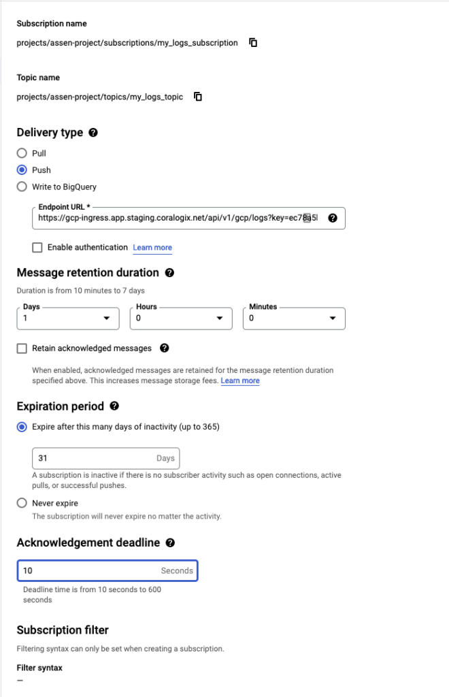

## Before proceeding

**GCP Log Explorer** is being deprecated in favor of [GCP Logs](https://coralogix.com/docs/gcp-logs/). The initial generation of the pull-based GCP Log Explorer integration exhibited performance limitations due to the nature of push-based GCP Pub/Sub subscriptions. Specifically, the lack of batching in requests caused delays in processing as log volume increased.

With the introduction of the [new integration](https://coralogix.com/docs/gcp-logs/), you can expect to receive your logs in a more reliable and timely manner.

## Migration guide

To set up a [GCP Logs](https://coralogix.com/docs/gcp-logs/) integration using the subscription name currently utilized for the push-based integration, follow these steps:

1. Navigate to the [configuration page of the GCP Pub/Sub subscription](https://console.cloud.google.com/cloudpubsub/subscription/list) responsible for sending logs to Coralogix.

3. Modify the subscription type from "Push" to "Pull".

5. Disable the "Exactly once delivery" option.

7. Adjust the "Retry policy" to "Retry after exponential backoff delay".

After completing these steps, the integration may initially appear as "Failing" with a message indicating, "This method is not supported for this subscription type." This behavior is expected, as the integration necessitates a "Pull" subscription for proper functionality.

## Overview

GCP Log Explorer is one of the first tools to use to troubleshoot issues and find a solution quickly to problems you might be facing. Coralogix came up with an easy way to help you export Log Explorer logs to help you visualize and filter them and create dashboards to see trends and issues that might arise. Following the steps below will guide you through how to set up the Log Explorer integration.

Coralogix offers a number of different approaches for collecting logs from your Google Cloud environments including using [GCP Log Explorer](https://coralogixstg.wpengine.com/docs/gcp-log-explorer/) and [Google Cloud Storage](https://coralogixstg.wpengine.com/docs/google-cloud-storage/).

The tutorial describes how to configure a Logs router to send logs to a Pub/Sub topic and deliver them to Coralogix using a push subscription on the topic.

The main advantage of using a push subscription is that it avoids running any additional software (i.e. functions) in your GCP account which can contribute to operational overhead and costs.

## Requirements

- Coralogix account

- GCP account with permissions to configure `Logging` and `Pub/Sub` services

### Query params in the endpoint URL

When you create your subscription, you will need to set the correct Endpoint URL using the following parameters:

- `**domain**`: [domain](https://coralogixstg.wpengine.com/docs/coralogix-domain/) associated with your Coralogix account

- `**key**`: Coralogix [Send-Your-Data API key](https://coralogixstg.wpengine.com/docs/send-your-data-api-key/)

- `**application**` (optional): overrides the default [application name](https://coralogixstg.wpengine.com/docs/application-and-subsystem-names/)

- `**subsystem**` (optional): overrides the default [subsystem name](https://coralogixstg.wpengine.com/docs/application-and-subsystem-names/)

- `**computer**` (optional): sets the computer name (otherwise there is no computer name)

## Configuration

To configure the ingestion of GCP log data to Coralogix, we will first create a new topic in Google Cloud Pub/Sub. Then we will configure the topic as a sink in the logs router and configure a subscription to push the data to Coralogix.

**STEP 1**. Log in to GCP console.

**STEP 2**. Go to `Pub/Sub` / `Topics` and create a Topic

**Notes**:

- Uncheck the ‘Add a default subscription’ checkbox.

- A subscription is created in a later step.

**STEP 3**. Go to `Logging` / `Logs Router` and create a Sink

- Select sink service: Cloud Pub/Sub topic

- Select the Cloud Pub/Sub topic created in the previous step

- Choose logs to include in Sink: **Leave blank**. Do not denote logs that should be included or excluded.

**STEP 4**. Go to `Pub/Sub` / `Subscriptions` and create a Subscription

- Select the topic created in step 2 and make the following adjustments:
    - Set Delivery type to 'Push'.
    
    - Set Endpoint URL to **https://ingress.<domain>/gcp/v1/logs?key=<api\_key>**.
    
    - If you like to pass additional attributes to Coralogix, set the endpoint to **https://ingress.<domain>/gcp/v1/logs?key=<api\_key>&application=<application\_name>&subsystem=<subsystem\_name>**.

- Set message retention to '1 day'.

- Set Retry policy to 'Retry after exponential backoff delay'. Keep the default backoff values.

## **Support**

**Need help?**

Our world-class customer success team is available 24/7 to walk you through your setup and answer any questions that may come up.

Feel free to reach out to us **via our in-app chat** or by sending us an email at [support@coralogixstg.wpengine.com](mailto:support@coralogixstg.wpengine.com).
