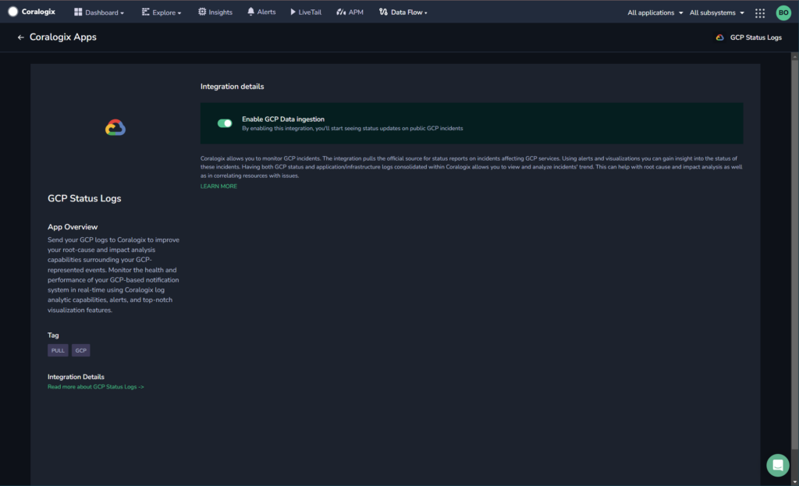

Collect your GCP status logs in the Coralogix platform using our automatic **Contextual Data Integration Package**. The package lets you enable GCP data ingestion to allow you to see status updates on public GCP incidents.

## Overview

Google Cloud Platform (GCP) is a comprehensive suite of cloud computing services offered by Google, designed to provide organizations with the tools and infrastructure necessary to build, deploy, and manage a wide range of applications and services. GCP encompasses a variety of services, including computing, storage, databases, machine learning, networking, analytics, and more, all hosted on Google's highly scalable and globally distributed infrastructure. GCP enables businesses to leverage the power of cloud computing to enhance agility, scale resources on demand, innovate with advanced technologies, and optimize operations, ultimately driving efficiency and innovation across various industries.

Sending your Google Cloud Platform (GCP) status logs to Coralogix facilitates streamlined log aggregation, real-time monitoring, and efficient troubleshooting. By channeling GCP status logs into Coralogix, you gain a comprehensive view of your cloud infrastructure's health, enabling rapid detection of anomalies, proactive issue resolution, and data-driven decision-making. This integration empowers teams to optimize resource utilization, enhance system reliability, and maintain operational excellence by leveraging Coralogix's analytics, alerts, and visualization tools to extract valuable insights from GCP status logs.

## Get Started

**STEP 1.** In your navigation pane, click **Data Flow** > **Contextual Data**.

**STEP 2.** In the **Contextual Data** section, select **GCP** and click **+** **ADD**.

**STEP 3.** Click **Enable GCP Data Ingestion**.

## Support

**Need help?**

Our world-class customer success team is available 24/7 to walk you through your setup and answer any questions that may come up.

Feel free to reach out to us **via our in-app chat** or by sending us an email at [support@coralogixstg.wpengine.com](mailto:support@coralogixstg.wpengine.com).
