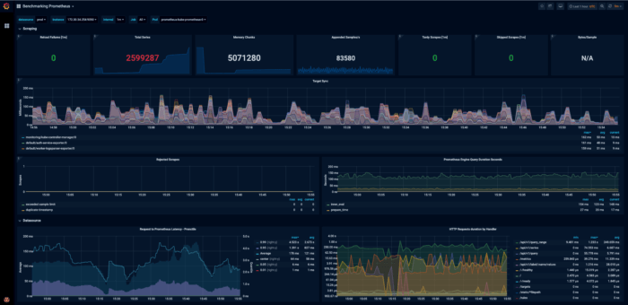
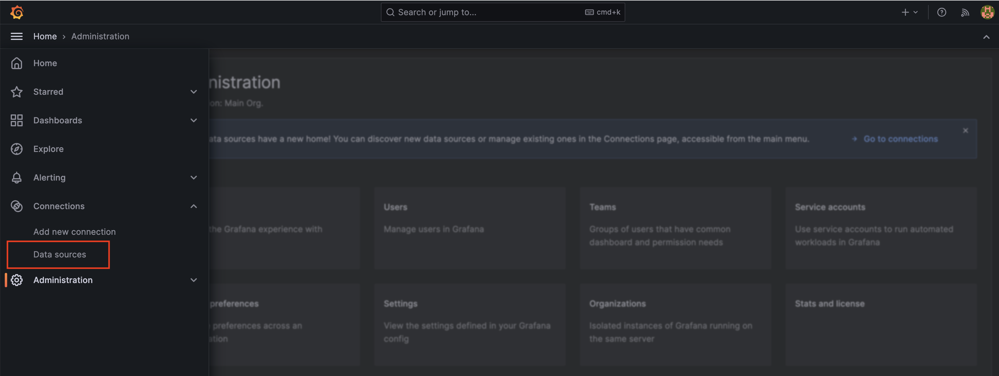
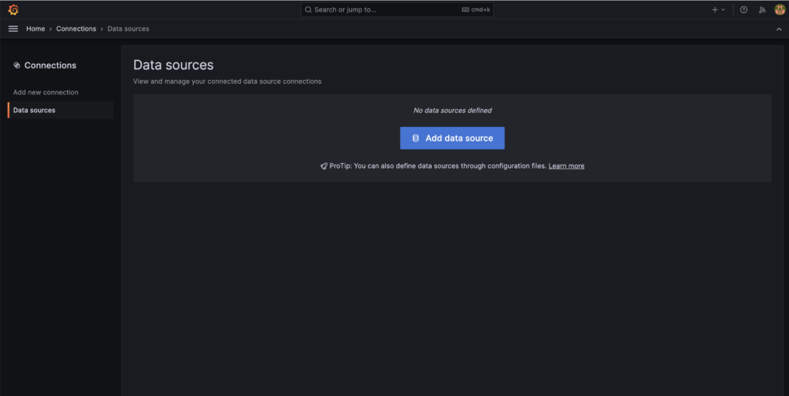
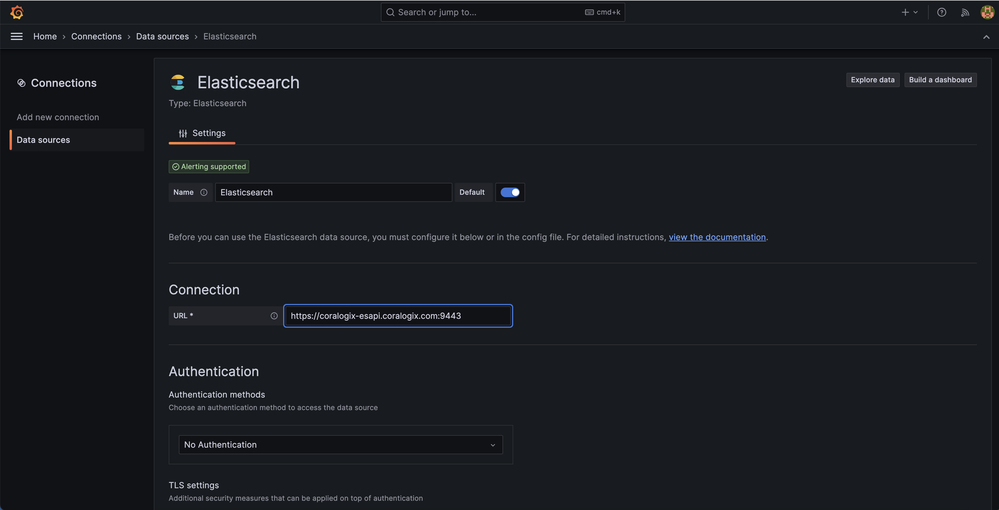
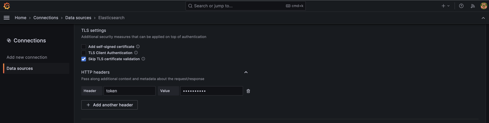
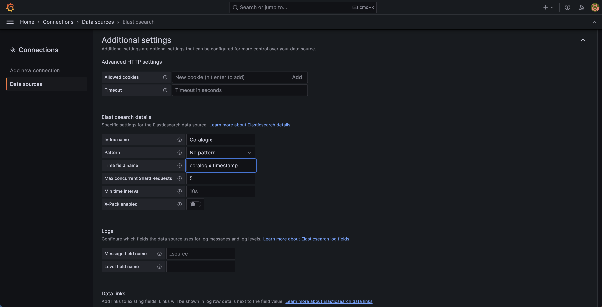
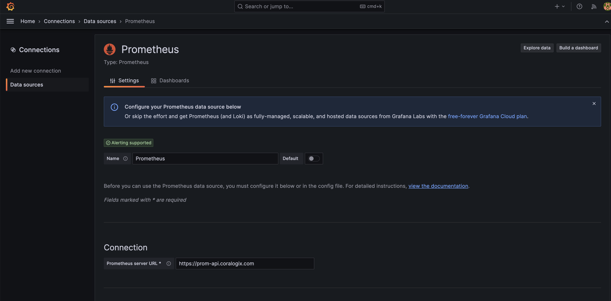
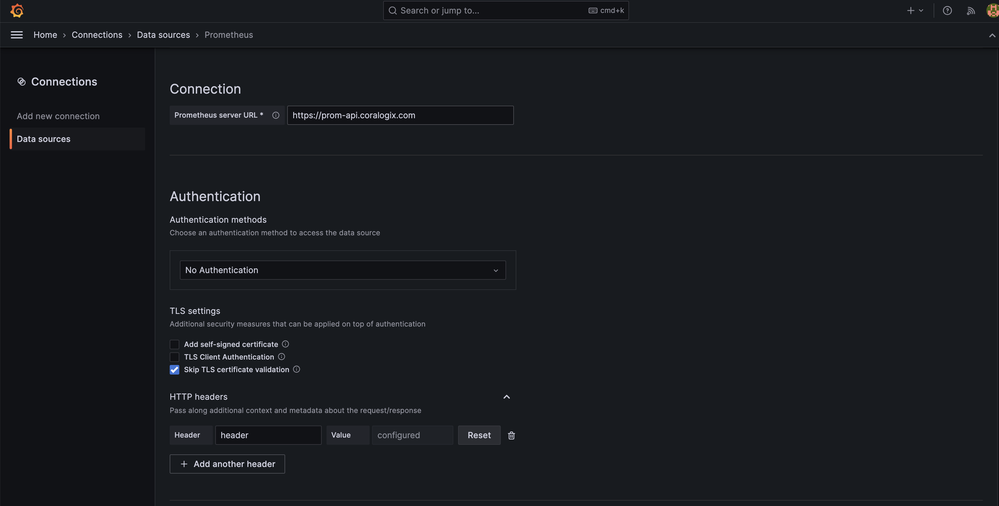
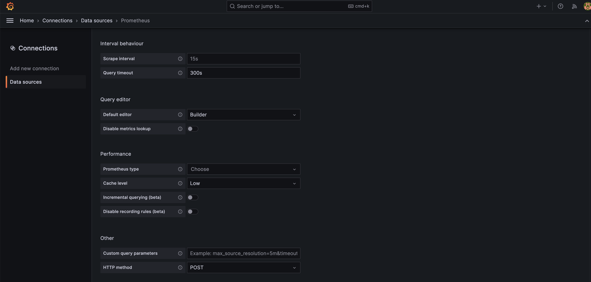

You can now visualize your data using Coralogix’s [Hosted Grafana](https://coralogixstg.wpengine.com/docs/hosted-grafana-view/) without having to integrate a personal Grafana instance with your Coralogix account. Use Grafana to visualize your logs and metrics with all the functions you are already familiar with. You will be able to access all Coralogix data sources automatically without the need for any plugins (**recommended**).

For those wishing to use the Grafana plugin, this tutorial demonstrates how to connect and view your logs and metrics in your Coralogix dashboard using **Grafana version 7+**.

## Connect Your Logs



**STEP 1**. Log in to Grafana.

**STEP 2**. Navigate to **Home** > **Connections** > **Data sources**



**STEP 3**. Click **Add data source**.



**STEP 4**. Select Elasticsearch as your data source.



**STEP 5**. Define the Settings.

- **Name**. Select a name for your data source.

- **URL**. Input the [OpenSearch endpoint](https://coralogixstg.wpengine.com/docs/coralogix-endpoints/#opensearch) associated with your [Coralogix domain](https://coralogixstg.wpengine.com/docs/coralogix-domain/).

- **Skip TLS certification verification**. Check to activate.

- **Header**. Input "token".

- **Value**. Input your Coralogix Logs Query Key. Access this by navigating to Data Flow > API Keys in your Coralogix toolbar.

- **Index name**. Input "Coralogix".

- **Pattern**. Select No pattern.

- **Time field name**: "coralogix.timestamp"





**STEP 6**. Click **Save & test**.

A popup message will inform you if you have configured your data source successfully.


## Connect Your Metrics

As part of Coralogix's metrics offering, we support the querying of metric data through the most prevalent time-series query language - PromQL. This allows you to use Coralogix as your metrics backend and add it as a Prometheus data source to your Grafana instance, as well as update existing dashboards, without any change to the queries or syntax.

### Add a Coralogix PromQL Data Source

**STEP 1**. Log in to Grafana.

**STEP 2**. Navigate to **Home** > **Connections** > **Data sources**


**STEP 3**. Click **Add data source**.


**STEP 4**. Select Prometheus as your data source.



**STEP 5**. Define the Settings.

- **Name**. Select a name for your data source.

- **URL**. Input the PromQL endpoint associated with your [Coralogix domain](https://coralogixstg.wpengine.com/docs/coralogix-domain/).

\[table id=95 /\]

- **Skip TLS certification verification**. Check to activate.

- **Header**. Input "token".

- **Value**. Input your Coralogix Logs Query Key. Access this by navigating to Data Flow > API Keys in your Coralogix toolbar.

- **Query timeout**. Set to 300s.

- **HTTP Method**. Set to POST.





**STEP 6**. Click **Save & test**.

A popup message will inform you if you have configured your data source successfully.

## Useful Docker Commands

If you have Grafana installed on a Docker container, use these useful commands to interact with Grafana:

- List all docker containers

```
docker ps -a
```

- Log in to your Grafana container

```
sudo docker exec -it "Grafana container ID" /bin/bash
```

- Restart Grafana

```
docker restart "Grafana container ID"
```

## Support

**Need help?**

Our world-class customer success team is available 24/7 to walk you through your setup and answer any questions that may come up.

Feel free to reach out to us **via our in-app chat** or by sending us an email at [support@coralogixstg.wpengine.com](mailto:support@coralogixstg.wpengine.com).
