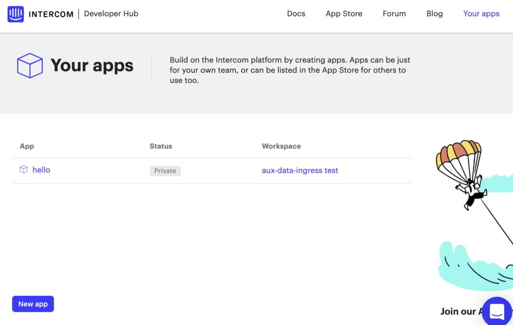
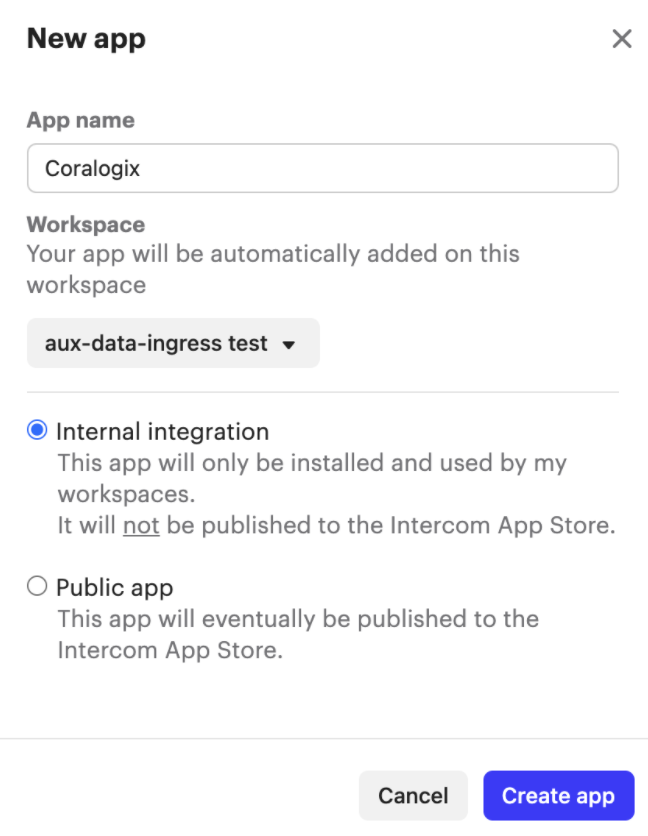
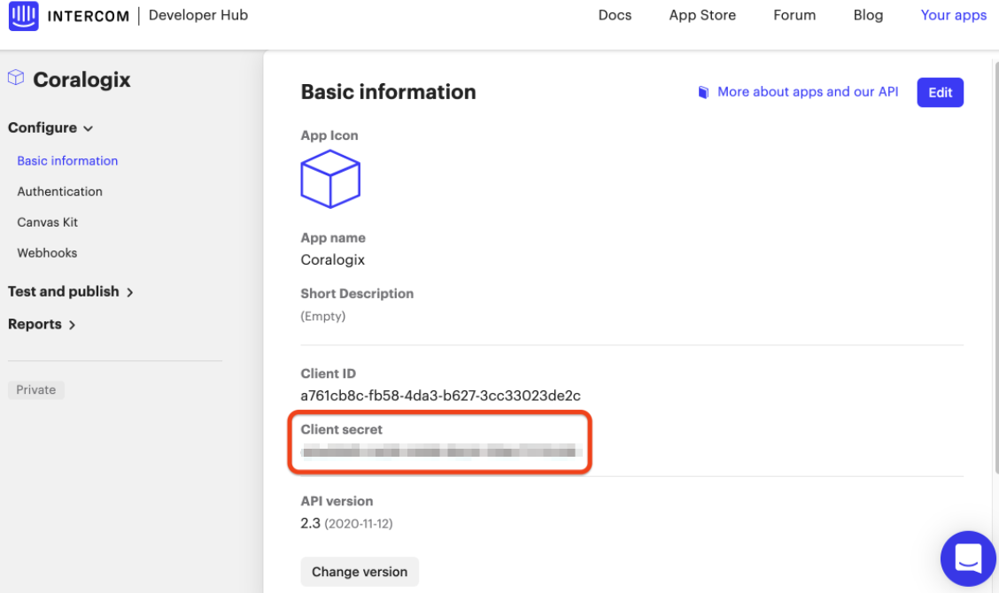
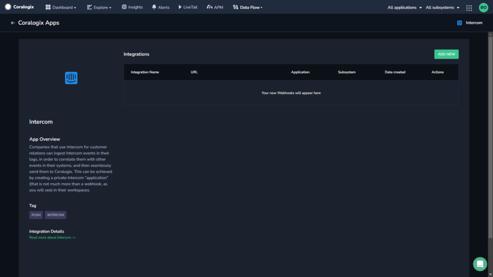
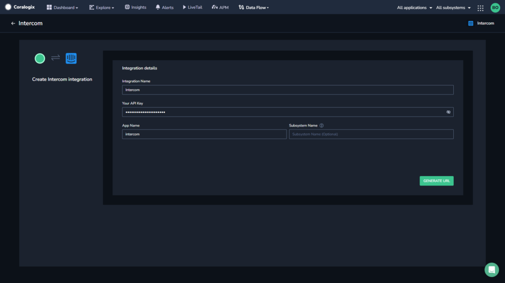
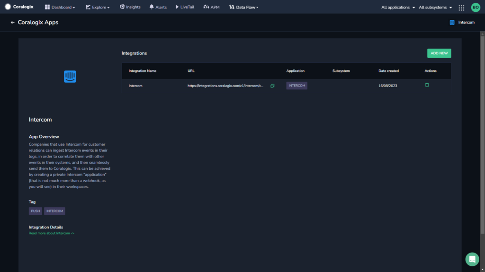
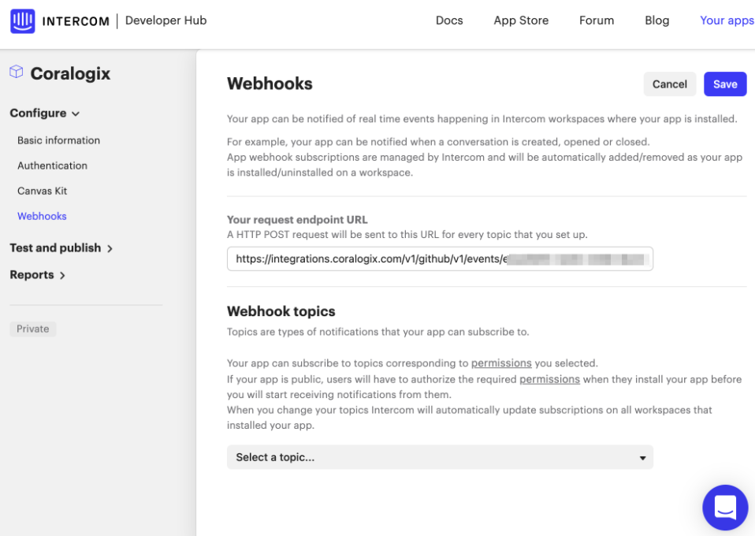
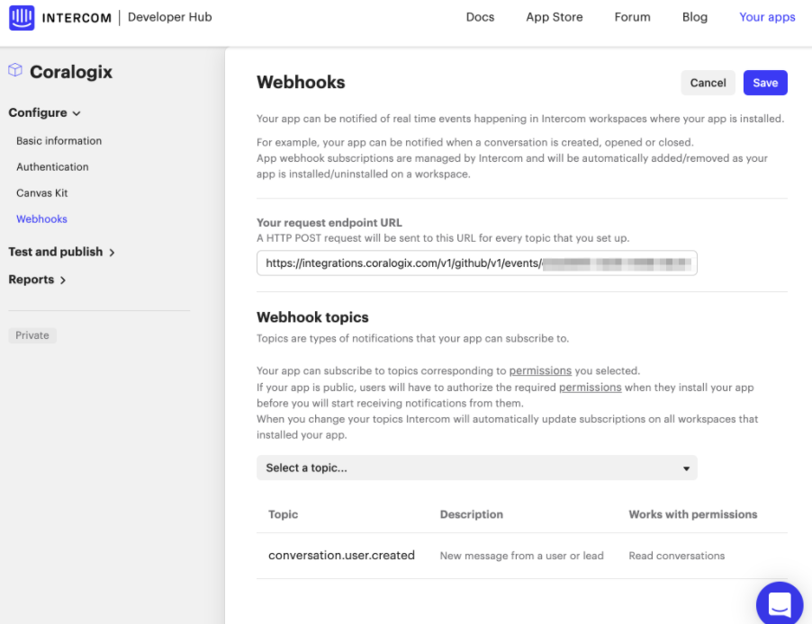

Collect your Intercom events in the Coralogix platform using our automatic **Contextual Data Integration Package**. The package automatically generates a URL to be used when creating an Intercom private application.

## Overview

Intercom is a customer messaging platform that facilitates personalized and interactive communication between businesses and their customers. Offering a suite of tools including live chat, targeted email campaigns, in-app messages, and customer support features, Intercom enables companies to engage with users at various stages of their journey, from acquisition and onboarding to retention and support. Its user-friendly interface and automation capabilities streamline customer interactions, helping businesses build stronger relationships and provide timely assistance to drive customer satisfaction and loyalty.

Companies that use Intercom for customer relations can ingest Intercom events in their logs, in order to correlate them with other events in their systems, and then seamlessly send them to Coralogix and take advantage of Coralogix log analytic capabilities, alerts, and top-notch visualization features.

## Get Started

Before adding the Intercom integration in Coralogix, you first need to create a private Intercom application which will provide you with the **Client Secret** key, which needs to be entered when creating the integration in Coralogix. Next, by using the contextual data integration flow in Coralogix, a URL will be generated for you to enter in the webhooks page in Intercom.

**STEP 1.** Sign in to Intercom and navigate to the Developer Hub.

  


**STEP 2.** Click on the **New app** button, and fill out the form as shown in the following image:

**STEP 3.** Select **Basic information** on the left-hand side menu, and copy the **Client secret** key that we will need in the next step.  


**STEP 4.** In a different tab, go to the Coralogix app, and in your Coralogix toolbar, click **Data Flow** > **Contextual Data**.

**STEP 5.** In the **Contextual Data** section, select **Intercom** and click **+** **ADD**.

**STEP 6.** Click **ADD NEW**.



**STEP 7.** Fill in the **Integration Details**:

- **Integration Name.** Name your integration.

- **Your API Key**. Enter the **Client secret** key that you copied from Intercom.

- **Application Name and Subsystem Name**. Enter an [application and subsystem name](https://coralogixstg.wpengine.com/docs/application-and-subsystem-names/).



**STEP 8.** Click **GENERATE URL**. The URL for the integration will be automatically created. Use this for the next step when creating the Intercom webhook.



**STEP 9**. Copy the generated URL.

**STEP 10.** Go back to the Intercom tab and click on **Webhooks** in the left-hand side menu.  
  

**STEP 11.** In the **Your request endpoint URL** field, enter the Coralogix generated URL that you previously copied.

**STEP 12.** Select the **Webhook topics** from the dropdown menu that you are interested in, e.g. `conversation.user.created`.

  
**STEP 13.** Click Save.

## Example Log

```
{
   "source_system"  :  "intercom" ,
   "intercom"  : {
     "type"  :  "notification_event" ,
     "app_id"  :  "pc1eeznt" ,
     "data"  : {
       "type"  :  "notification_event_data" ,
       "item"  : {
         "type"  :  "conversation" ,
         "id"  :  "4" ,
         "created_at"  :  1619423555 ,
         "updated_at"  :  1619424688 ,
         "user"  : {
           "type"  :  "lead" ,
           "id"  :  "60787e73099bb148057c1111" ,
           "user_id"  :  "12345678-0000-aaaa-1111-abcdefg12345" ,
           "name"  :  "Indigo Umbrella from Munich" ,
           "email"  :  "" ,
           "do_not_track"  :  null 
        },
         "assignee"  : {
           "type"  :  "nobody_admin" ,
           "id"  :  null 
        },
         "admin_assignee_id"  :  null ,
         "team_assignee_id"  :  null ,
         "conversation_message"  : {
           "type"  :  "conversation_message" ,
           "id"  :  "822898059" ,
           "url"  :  "http://localhost:63342/aux-data-ingress/intercom-demo.html?_ijt=615bri6jf9tqgpevlc7cc102sj" ,
           "subject"  :  "" ,
           "body"  :  "&lt;p&gt;test&lt;/p&gt;" ,
           "author"  : {
             "type"  :  "user" ,
             "id"  :  "60787e73099bb148057c1111" 
          },
           "attachments"  : []
        },
         "conversation_parts"  : {
           "type"  :  "conversation_part.list" ,
           "conversation_parts"  : [
            {
               "type"  :  "conversation_part" ,
               "id"  :  "8863805399" ,
               "part_type"  :  "comment" ,
               "body"  :  "&lt;p&gt;Hi, can you explain how this works?&lt;/p&gt;" ,
               "created_at"  :  1619424687 ,
               "updated_at"  :  1619424687 ,
               "notified_at"  :  1619424687 ,
               "assigned_to"  :  null ,
               "author"  : {
                 "type"  :  "user" ,
                 "id"  :  "60787e73099bb148057c1111" ,
                 "name"  :  null ,
                 "email"  :  "" 
              },
               "attachments"  : [],
               "external_id"  :  null 
            }
          ],
           "total_count"  :  1 
        },
         "conversation_rating"  : {},
         "open"  :  true ,
         "state"  :  "open" ,
         "snoozed_until"  :  null ,
         "read"  :  true ,
         "metadata"  : {},
         "tags"  : {
           "type"  :  "tag.list" ,
           "tags"  : []
        },
         "tags_added"  : {
           "type"  :  "tag.list" ,
           "tags"  : []
        },
         "custom_attributes"  : {},
         "links"  : {
           "conversation_web"  :  "https://app.intercom.com/a/apps/pc1eeznt/conversations/4" 
        }
      }
    },
     "links"  : {},
     "id"  :  "notif_4ef0ca4e-0974-4aef-94e8-5f60c39eb5f8" ,
     "topic"  :  "conversation.user.replied" ,
     "delivery_status"  :  "pending" ,
     "delivery_attempts"  :  1 ,
     "delivered_at"  :  0 ,
     "first_sent_at"  :  1619424689 ,
     "created_at"  :  1619424689 ,
     "self"  :  null 
  }
}

```

## Support

**Need help?**

Our world-class customer success team is available 24/7 to walk you through your setup and answer any questions that may come up.

Feel free to reach out to us **via our in-app chat** or by sending us an email at [support@coralogixstg.wpengine.com](mailto:support@coralogixstg.wpengine.com).
