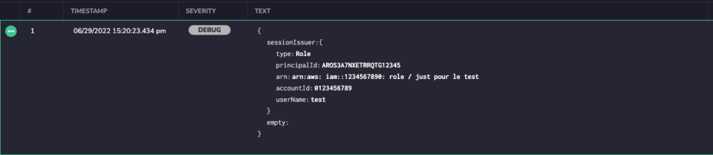

Rules help you to process, parse, and restructure log data to prepare for monitoring and analysis. Doing so can extract information of importance, structure unstructured logs, discard unnecessary parts of the logs, mask fields for compliance reasons, fix misformatted logs, block log data from being ingested based on log content, and much more.  

## Overview

At Coralogix, rules are organized inside _Rule Groups_. Each group has a name and a set of rules with a logical AND/OR relationship between them. Logs are processed according to the order of Rule Group (top to bottom) and then by the order of rules within the Rule Group and according to the logical operators between them (AND/OR).

Rules are applied only to new logs - that is, those logs ingested by Coralogix **after** the creation of a rule.

Find out more by viewing our [Rules API](https://coralogixstg.wpengine.com/tutorials/rules-api/) tutorial.

## Rules Groups

In order to create a rule group in the Coralogix UI, go to **Data Flow >Parsing Rules** and click on the ‘NEW RULE GROUP’ button or choose one of the quick rule creation options from the boxes below. The options for rules include:

- Parse

- Extract

- Extract JSON

- Replace

- Block

- Timestamp Extract

- Remove Fields

- \[New\] Stringify JSON Field

- \[New\] Parse JSON Field

A rule group definition form is divided into two sections: Description and Rule Matcher.

### Description

Each group has a name and can have an optional description.

### Rule Matcher

The _Rule Matcher_ section defines a query. Only logs that match the Rule Matcher query will be processed by the group. This is important in making sure that only intended logs go through the group rules, as well as for performance reasons. 

The rule matcher query is defined by selecting a set of applications, subsystems, and severities. Only logs that fit all components of the query will be processed by the group. All entries in this section are optional. Not selecting a field or defining a RegEx means that the Rule Group will run on all of your logs. 


## Rules

Here are the different rule types that can be created in Coralogix:

### Parse

_Parse Rule_ uses RegEx named capture groups. The groups become the parsed log fields and the value associated with each group becomes the field’s value. The RegEx doesn’t have to match the entire log, only the RegEx named capture groups (the values within the ‘< >’) and the value they capture will be part of the reconstructed log.

The following example takes a Heroku L/H type error log that is sent from Heroku as an unstructured log and converts it to JSON log.


**The original log:**

```
sock=client at=warning code=H27 desc="Client Request Interrupted" method=POST path="/submit/" host=myapp.herokuapp.com fwd=17.17.17.17 dyno=web.1 connect=1ms service=0ms status=499 bytes=0
```

**The RegEx:**

```
^(sock=)?(?P<sock>(\S*))\s*at=(?P<severity>\S*)\s*code=(?P<error_code>\S*)\s*desc="(?P<desc>[^"]*)"\s*method=(?P<method>\S*)\s*path="(?P<path>[^"]*)" host=(?P<host>\S*)\s* (request_id=)?(?P<request_id>\S*)\s*fwd="?(?P<fwd>[^"\s]*)"?\s*dyno=(?P<dyno>\S*)\s*connect=(?P<connect>\d*)(ms)?\s*service=(?P<service>\d*)(ms)?\s*status=(?P<status>\d*)\s* bytes=(?P<bytes>\S*)\s*(protocol=)?(?P<protocol>[^"\s]*)$
```

**The resulting log:**

```
{   
“sock”: “client”,   
“severity”:”warning”,   
“error_code”:”H27”,   
“desc”:”Client Request Interrupted",   
“method”:”POST”,   
“path”:”/submit/”,   
“host”:”myapp.herokuapp.com”,   
“request_id”:””,   
“fwd”:”17.17.17.17”,   
“dyno”:”web.1”,   
“connect”:”1”,   
“service”:”0”,   
“status”:”499”,   
“bytes”:”0”,   
“protocol”:”” 
}
```

### Extract

Unlike a Parse Rule, an Extract Rule will leave the original log intact and will just add fields to it at the root. The following example extracts information from the field message and creates two new fields, ‘bytes’, and ‘status’ that can be queried and visualized in Coralogix.


**The original log:**

```
{"level":"INFO", "message": "200 bytes sent status is OK"}
```

**The RegEx:**

```
message"\s*:\s*"(?P<bytes>\d+)\s*.*?status\sis\s(?P<status>[^"]+)
```

**The resulting log:**

```
{

"level":"INFO", 

"message": "200 bytes sent status is OK",

“Bytes”:”200”,

“status”:”OK”

}
```

If the original log is unstructured it will add fields based on the named capture groups and will store the original log inside a field called text. Using the previous example, it will switch the original log to be unstructured.

```
"level":"INFO", "message": "200 bytes sent status is OK",
```

**The resulting log:**

```
{

"bytes" : "200" ,

"text" : "\"level\":\"INFO\", \"message\": \"200 bytes sent status is OK\"" ,

"status" : "OK"
}
```

### JSON Extract

JSON Extract rules take the value of a key and use it to overwrite one of Coralogix metadata fields. In this example, we extract the value from a field called ‘worker’ and use it to populate the Coralogix metadata field called Category.

The source field is always text and the JSON Key field should contain the field name that you want to extract the value from. The destination field is the metadata field that will be overwritten with this value. This rule is frequently used to extract and set severity and to set metadata fields like ‘Category’ that influence the classification algorithms. 


**The original log:**

```
{

“transaction_ID”:12543,

“worker”:”A23”,

“Message”:”success”

}
```

The log will not change in the _Logs_ interface but the Coralogix metadata field ‘category’ will be populated with “A23” in the above example.

### Replace

A common use case for a _Replace_ rule is to repair misformatted JSON logs. In the following example, the JSON logs are sent with a date prefix which breaks the JSON format and turns them into unstructured logs. The following RegEx identifies the substring to replace in the log.

**Original log:**

```
2020-08-07 {“status”:”OK”, “user”:John Smith”, “ops”:”J1”}
```

**RegEx:**

```
.*{
```

**The resulting log:**

```
{“status”:”OK”, “user”:John Smith”, “ops”:”J1”}
```


#### Nested Fields

The following example shows how to use a Replace rule to rebuild a log with nested fields. Nested fields are a constraint in the Extract and Parse rules. 


**The original log is:**

```
{"ops":"G1","user":"John Smith-2125 Sierra Ventura Dr.-Sunnyvale-CA-94054","status":"305"}
```

**The** **Regex**:

```
(.*user"):"([^-]*)-([^-]*)-([^-]*)-([^-]*)-([^-]*)",([^$]*)
```

Each of the parentheses represents a capture group that can be addressed by $n n=1..7 in this case.

**The replacement string:**

```
$1:{"name":"$2","address":"$3","city":"$4","state":"$5","zip":"$6"},$7
```

**This is the resulting log:**

```
{
   "ops":"G1",
   "User":{
      "name":"John Smith",
      "address":"2125 Sierra Ventura Dr.",
      "city":"Sunnyvale",
      "state":"CA",
      "Zip":"94054"
   },
   "status":"305"
}


```

#### inner\_json

inner\_json is a special replace rule that know how to take a field value in a json log that includes a stringified (escaped) legal json, and transform it into an object.

In the following example, the original log is:

```
{ 
 "server":"opa",
 "IBC":"45ML",
 "thread":"1201",
 "message":"{\"first_name\":\"John\", \"last_name\":\"Smith\", \"userID\":\"AB12345\", \"duration\":45}"  
}
```

The field message has a string value that is an escaped legal json.

Our special replace rule will change the name of the field from the original name "message" to "inner\_json":

**The regex:**

"message"\\s\*:\\s\*"{\\s\*\\\\"

Identifies a field name message with the beginning of the escaped json.

**The replacement string is:**

"inner\_json":"{\\"

Replaces only the field name and nothing else.

**The resulting log:**

```
{
   "server":"opa",
   "inner_json":{
     "first_name":"John" ,
     "last_name":"Smith" ,
     "userID":"AB12345" ,
     "duration":45 
  }
}
```

### Block

Block rules allow you to filter out your incoming logs. Like with other rules the heart of the rule will be a RegEx, identifying the logs to be blocked (or allowed). In this example, all the logs that have the substring 'sql\_error\_code 28000' will be blocked.

**RegEx**:

```
sql_error_code=28000
```


#### Block rules have two additional options:

- **Block all matching logs:** Will block any log that matches the Rule Matcher and Block Rule

- **Block all non-matching logs:** Will block any log that does not match the Rule Matcher and Block Rule


Checking the “**View blocked logs in Livetail**” option will block the logs but archive them to S3 (if achieving is enabled under TCO > Archive) and the logs will be visible in LiveTail. This is a more refined option to give logs a low priority, as [described here](https://coralogixstg.wpengine.com/tutorials/optimize-log-management-costs/). Only 15% of low priority logs volume is counted against quota.

The block logic indicates if the rule will block all logs that _do_ match the RegEx or the inverse; all logs that _do not_ match the regex. In our example above, checking the “block all non-matching logs” option would have blocked all logs except those that include the string `sql_error_code\s*=\s*28000` 

### Timestamp Extract

The Coralogix timestamp for each log entry is assigned by our receiving endpoint when logs arrive. The **Timestamp Extract** rule allows you to override the Coralogix timestamp for the log entry with the value of your custom timestamp field from your log. When you are configuring this rule make sure you are choosing the right source field, then choose a field format standard you are most familiar with. Finally, you will need to edit the Time format text box with the format that matches your logs time field. After setting all three, you should use the Sample log tester and expect a match that is indicating the rule was able to parse your time field format to the Coralogix time format, which is Unix timestamps in nanoseconds divided by 100 (17 digits).

Let's check a few examples:

giving this log entry:

```
{ 
  "transaction_ID":12543,
  "worker":"A23",
  "Message":"success",
  "time":"2021-01-11T15:04:05.000000+0100"
}
```

I was choosing the strftime standard and set the time format to match my time field string format, which in this case is also matching to the suggested default format.


We can see it resulted in a match so we can go ahead and save this rule.

giving this log entry:

```
{ 
  "transaction_ID":12543,
  "worker":"A23",
  "Message":"success",
  "time":"2021-01-11T00:12:34+01:00"
}
```

Now, I was choosing the Go time layouts standard and set the time format to match my time field string format.


We can see it resulted in a match.

giving this log entry:

```
{ 
  "transaction_ID":12543,
  "worker":"A23",
  "Message":"success",
  "time":"03/Mar/2021:08:34:12 +0000"
}
```

Now, I was choosing the strftime standard and set the time format to match my time field string format. This use-case is a bit more challenging since my time field format has few differences than the default suggestion, %Y-%m-%dT%H:%M:%S.%f%z, e.g. 2021-01-11T15:04:05.000000+0100. One of them is the month format, which in our case is of type abbreviated month name, hence, I needed to look for [strftime reference](https://strftime.org/) and found that %b represents the abbreviated month name format. Using %b and adding the other needed changes I was able to create the matching format.


We can see it resulted in a match.

giving this log entry:

```
{ 
  "transaction_ID":12543,
  "worker":"A23",
  "Message":"success",
  "time":"2021-01-11T15:04:05.000000+0100"
}
```

I chose again strftime standard but set the wrong time format ignoring the %z (time zone part), which resulted in no match to my time field string format. We should amend the time format before saving the rule, otherwise, it will not work.


### Remove Fields

The **Remove Fields** rule allows you to easily drop specific fields from any JSON log entry that contains them on the Coralogix side, which is not always an option at Runtime. Thus, creating a cleaner structure for your logs to give better visibility into your data. 10% of the data volume that is being removed is counted against the quota, similar to blocked data (by a block rule). 

Let's check an example, first name your rule and give it a meaningful description.


open the Excluded fields dialog box, it will open a list of all available fields previously mapped to your indices, and choose the fields to drop.


Verify your rule is working using the Sample log section.


### Sample log

When creating a rule you can use the 'sample log' area of the screen to verify your rule. Simply create or paste a log into this area and it will show you the results of the rule processing the log. In this example, a Parse rule processes the log in the "Sample log" area and the result is displayed in the "Results" area:


### Stringify JSON Fields

This rule allows you to change an array or an object from JSON format to text in order to reduce the number of fields but still keep the data in  Coralogix to be searchable using free text search.

Steps to  configure:

1. Click on Data flow.

3. Click on parsing rules.

5. Select Stringify  Json field rule from the rules list.

7. Configure your group name, rule matchers, and all you see needed for your rule.


- Source Field: the field you want to convert to text.

- Keep or delete source field option.
    - Select Keep if you want to keep the original field with its content.
    
    - Select Delete if you want to delete the original field and its content.

- Destination field is the new field where you want the content of the source to be put under.

In the example below, I have a field called sessionIssuer which is an abject and I am going to change it to text and give it a new name called application.

**Original Message:**




**New message with delete source field selected:**


**New message with keep source field:**


### Parse JSON Field

With the Parse Json field rule, you can transform escaped or stringified logs to JSON with no effort.

Select the field that is escaped, select a destination field to write and you are all done.

- Select the Source field is the field you are trying to unescape.

- Select Merge into and Overwrite only if you are trying to overwrite or merge the data to an already existing field. If you are trying to create a new field these 2 options are not relevant.

- Keep source field option keeps the source field and its content.

- Delete the source field it will remove the source field and its content.

In the example below we are unescaping the log and making it in JSON format.


**Original Message:**


**Message after the rule:**


Note: If you chose a destination field that will cause a mapping exception, a message will pop up to let you know that you will be creating an exception if you apply this rule.


## Rule Group Logic

To add rules to a group following the creation of the first log you have to take two actions:

- Select the Rule type from the “ADD RULE’ dropdown list


- Select the logical relationship between the last rule and the new one (And/Or)


**Example:** Rule-1 AND Rule-2 will mean that a log will always be processed by both rules. Rule-1 OR Rule-2 means that the log will be processed by either Rule-1 or Rule-2, whichever matches first, or neither if none match the log. In other words, if Rule-1 is a match to the log, then Rule-2 will not be applied to it at all.

## Rule Groups: Order of Execution

Logs are processed by the different Rule Groups according to the order of the groups. When “entering” a group the log is matched against the “Rule matcher” query first. If it matches, it will continue into the Group Rules. Within the group, the log will be matched against the Rules according to their order and logic. It will continue to be matched down the list of rules until it is matched by a rule that is followed by an OR logical operator. The OR and AND operators in the group do not follow the mathematical order of operations. Rules are applied instantly so that the output of one rule becomes the input of the next one.

**Note:** It is clear that the order of rules and groups is important and can affect a log’s processing outcome. 

As an example look at these two rules that parse Heroku Postgres logs:

Postgres follower, [https://regex101.com/r/IyjCIj/4](https://regex101.com/r/IyjCIj/4)

Postgres leader, [https://regex101.com/r/aQJsp5/2](https://regex101.com/r/aQJsp5/2)

The follower log has an extra entry at the end, follower\_lag\_commits. This means that the Leader rule will capture both logs because it is less restrictive and all other fields match. Follower will match only the follower logs (the first test string is not captured in the follower example because it doesn’t have the extra entry). This means that the follower rule would be executed first. 

Another consideration is performance. The best practice is to put Block rules first and to use the ‘Rule Matcher’ when possible. It will prevent unnecessary processing of logs and speed up your data processing.

You can change the order of execution of rules within a group by dragging the rule into a new position relative to other rules.


The same goes for Rule Groups. You can change their order by dragging them up and down the list.


## Searching for Rule Groups

In order to quickly find a Rule Group of interest, you can use the search function to search for rules. You can use rules or group names in the free text search field.


## Editing rules and groups

In order to edit a Rule Group or a Rule within a group, click on the group, make your changes, and click on 'SAVE CHANGES'.


