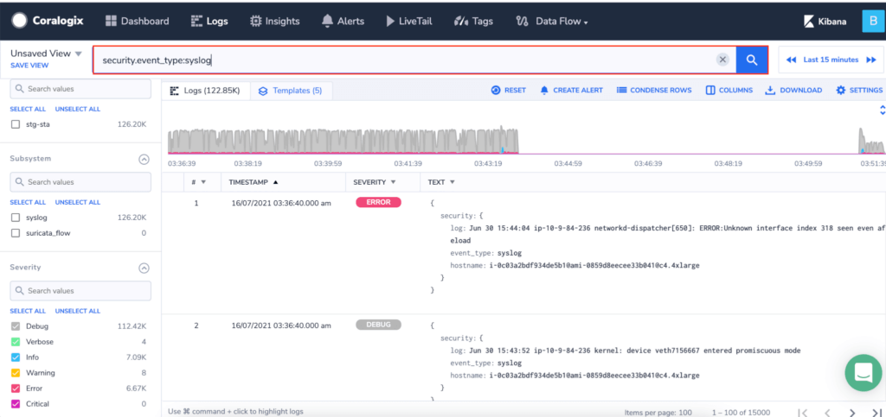
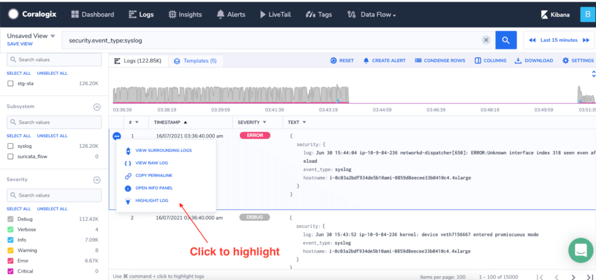
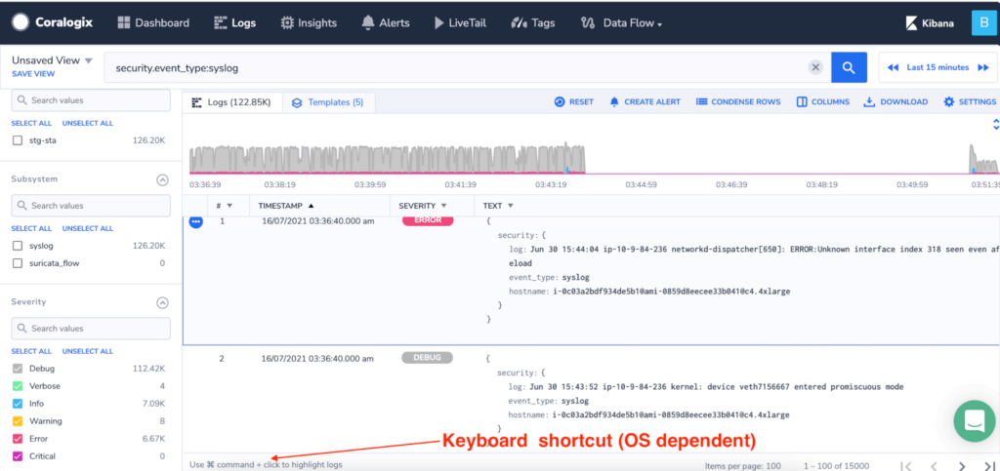
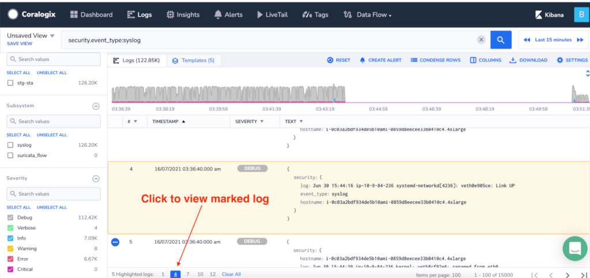
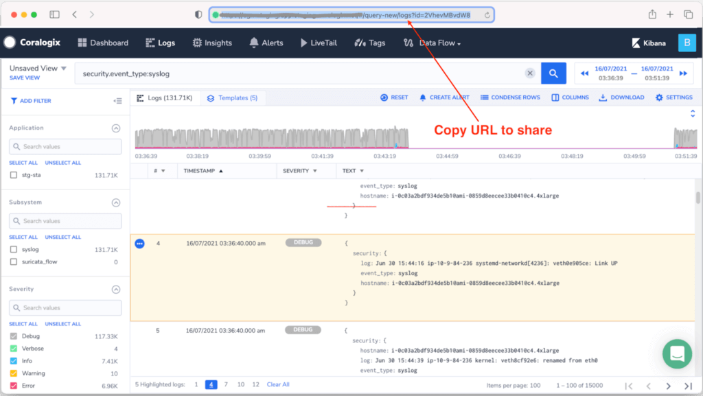
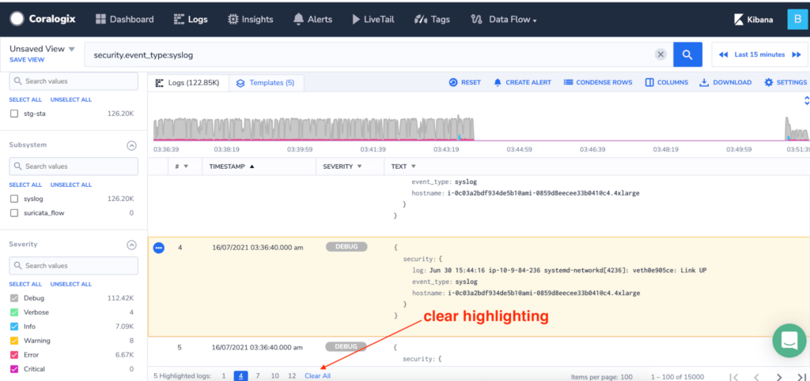

During complex investigations, it is common to come across some logs that key to the root-cause-analysis process. As part of your workflow, you might need to quickly jump to these specific logs, share or draw attention to them. 

Logs screen highlighting helps you work more efficiently by allowing you to:

- Highlight multiple logs
- Quickly navigate to the highlighted logs
- Share the highlighted logs.

**Limitations:**

1. The maximum number of logs that can be highlighted is 20.
2. Logs can only be highlighted on the logs screen. (You cannot highlight logs on the alerts screen for example)

This tutorial will guide you on how to highlight logs on the logs screen.

## **Getting started**

### **Search for logs**

Open the logs screen and perform any search.

### **Highlight a log**

There are 2 ways to mark your logs.

**Option 1:** Using the menu on each log

**Option 2:** Using keyboard shortcuts

(Mac) Press CMD + Click on a log

(PC) CTRL + Click on a log

### **Navigate to highlighted logs**

After logs are highlighted, click on a log number to bring it into focus

### **Share highlighted logs**

After logs are highlighted, copy the URL in your browser and share it with your team members. 

### **Clear highlighted logs**

To un-mark highlighted logs use any of the following steps:

1. **CMD + click** on a highlighted log (Mac users) or **CTRL + click** (for PC users)
2. Open the menu on a highlighted log. Click on **Highlight Log**
3. Click on the **Clear All** at the bottom of the browser.

