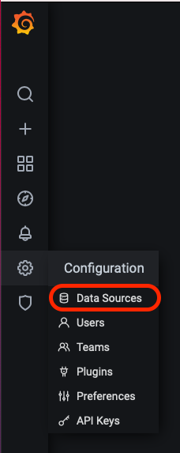
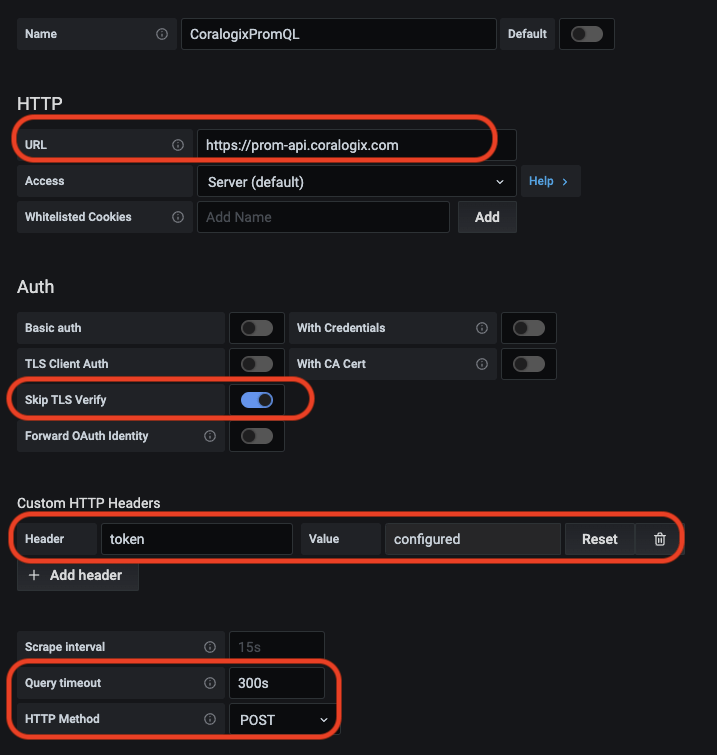

As part of Coralogix's metrics offering, we support the querying of metric data through the most prevalent time-series query language - PromQL. This allows you to use Coralogix as your metrics backend and add it as a Prometheus data source to your Grafana instance.

In this tutorial, you will learn how to do this and update existing dashboards without any change to the queries or syntax.

## Add Prometheus metrics to Grafana

**\*\* Available for Grafana version 7 and up.**

Log in to Grafana and click on the gear icon, and then click add source.



1. Click the blue button ADD a Source.
2. Search for Prometheus.
3. Click select.
4. Choose a name for your data source. You can give it any name you like.
5. In the URL, please enter your end point (Choose your endpoint from the table below).
6. Choose "Skip TLS Verify"
7. Name the header: "token" and insert to the value your Coralogix Logs Query Key
8. Set Query timeout to 300s
9. Set HTTP Method to POST



## Available endpoints:

\[table id=93 /\]

\* For the metrics index the timestamp is "timestamp" instead of "coralogix.timestamp"

### Useful commands for Grafana installed on docker container

- List all your docker containers

```
docker ps -a
```

- Log in to your Grafana container

```
sudo docker exec -it "Grafana container ID" /bin/bash
```

- Restart Grafana

```
docker restart "Grafana container ID"
```

**Have any questions or need additional help? Reach out to our support team at [support@coralogixstg.wpengine.com](mailto:support@coralogixstg.wpengine.com) or via our 24/7 in-app chat!**
