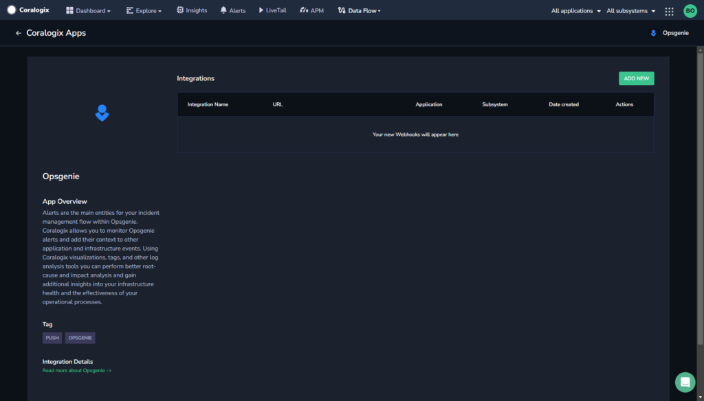
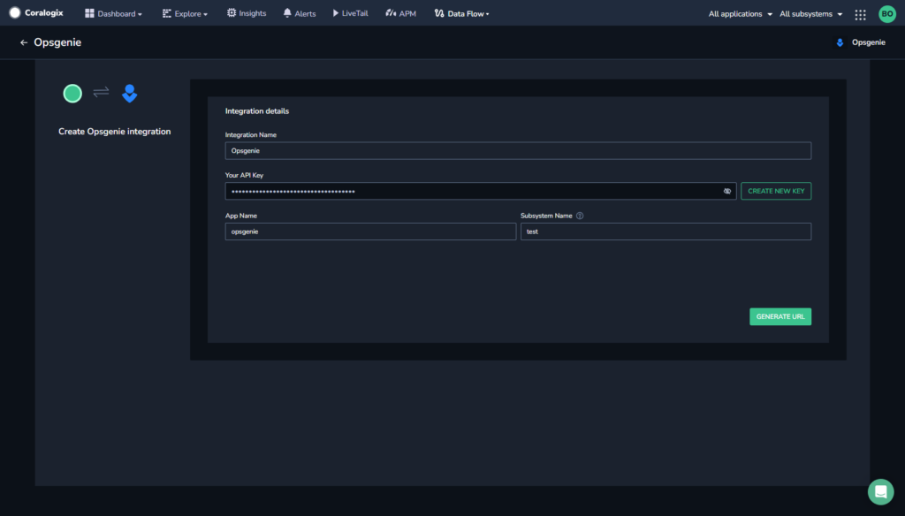
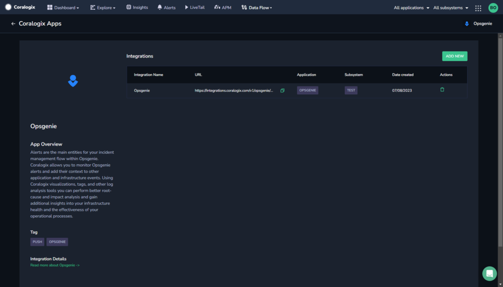
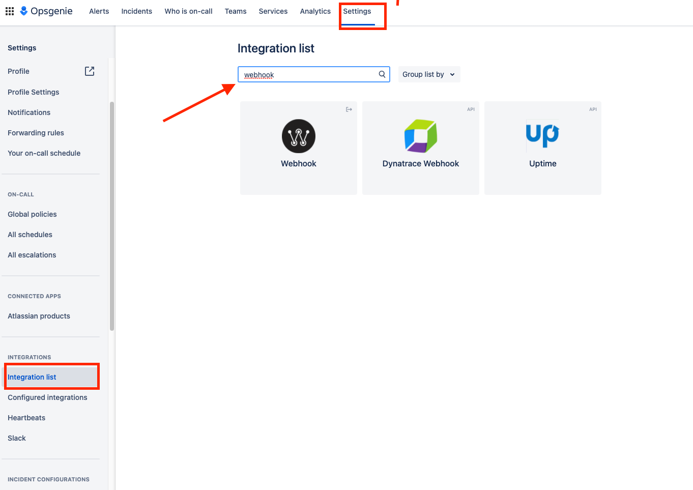
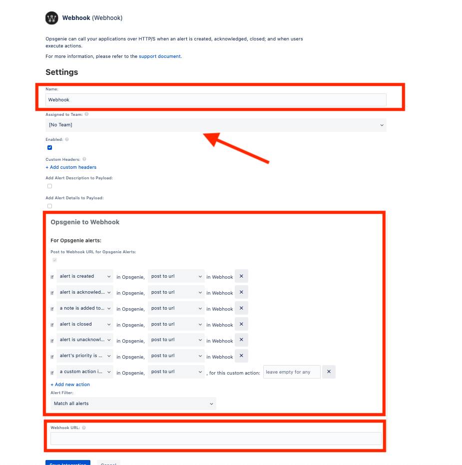

Collect your Opsgenie alerts in the Coralogix platform using our automatic **Contextual Data Integration Package**. The package automatically generates a URL to be used when creating an Opsgenie webhook.

## Overview

Opsgenie is a modern incident management and alerting platform that empowers DevOps, IT, and support teams to effectively respond to and resolve incidents in real-time. By centralizing alerts from various monitoring, ticketing, and communication tools, Opsgenie ensures that critical incidents are quickly detected, efficiently communicated, and appropriately addressed. Its comprehensive features include customizable alert routing, on-call scheduling, collaboration tools, and actionable insights, facilitating rapid incident resolution and minimizing downtime for organizations of all sizes.

Sending your Opsgenie alerts to Coralogix streamlines alert management, enhances monitoring capabilities, and facilitates comprehensive incident analysis. By directing your Opsgenie alerts into Coralogix, you gain a centralized view of your alerting activities, enabling rapid incident detection, proactive troubleshooting, and data-driven decision-making. This integration empowers teams to optimize response workflows, strengthen system reliability, and ensure operational efficiency, leveraging Coralogix's analytics, alerts, and visualization tools to extract valuable insights from Opsgenie alerts and ensure a streamlined and resilient incident response process.

## Get Started

**STEP 1.** In your navigation pane, click **Data Flow** > **Contextual Data**.

**STEP 2.** In the **Contextual Data** section, select **Opsgenie** and click **+** **ADD**.

**STEP 3.** Click **ADD NEW**.

**STEP 4.** Fill in the **Integration Details**:

- **Name.** Name your integration.

- **Your API Key**. Click **CREATE NEW KEY** to generate an API key and name it.

- **Application Name and Subsystem Name**. Enter an [application and subsystem name](https://coralogixstg.wpengine.com/docs/application-and-subsystem-names/).

**STEP 5.** Click **GENERATE URL**. The URL for the integration will be automatically created. Use this when creating a Opsgenie webhook.

## **Create an Opsgenie Webhook**

Create an Opsgenie webhook using your URL.

**STEP 1**. Log in to your OpsGenie account and click on **Settings**.

**STEP 2.** Scroll down to Integrations and click on **Webhook**. If you do not see “webhook”, click on the integration list and search for it.

Once you chose **webhook** a new screen will pop up.

**STEP 3.** Enter the URL generated by Coralogix in the **Webhook URL** field, and complete the form, then click **Save**.

To test your configuration, go under Alerts and configure a test alert.

## Support

**Need help?**

Our world-class customer success team is available 24/7 to walk you through your setup and answer any questions that may come up.

Feel free to reach out to us **via our in-app chat** or by sending us an email at [support@coralogixstg.wpengine.com](mailto:support@coralogixstg.wpengine.com).
