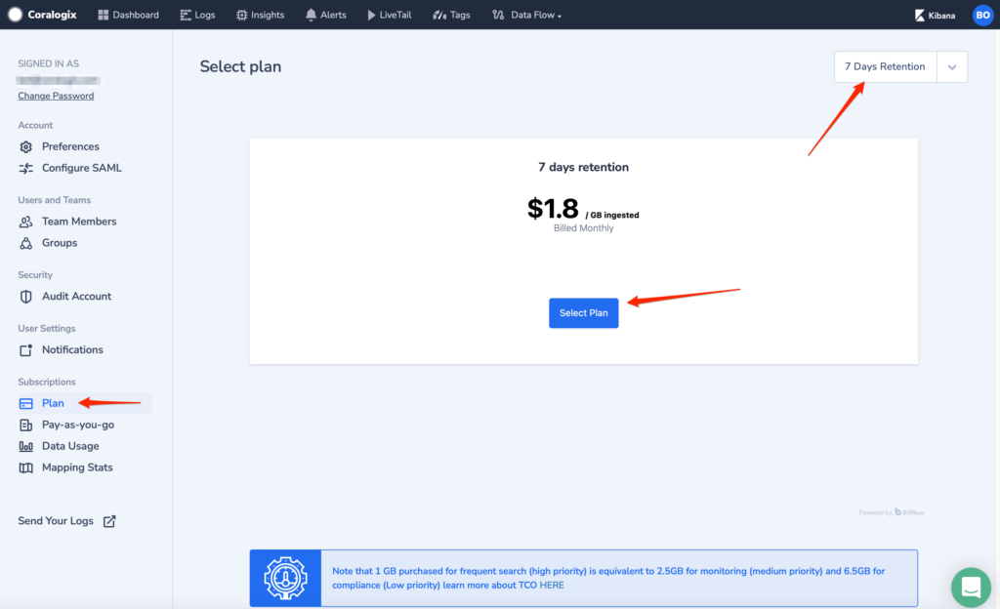
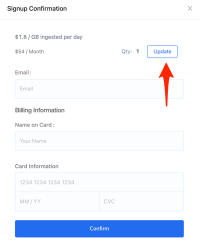
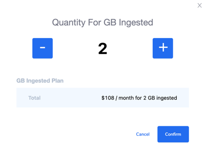
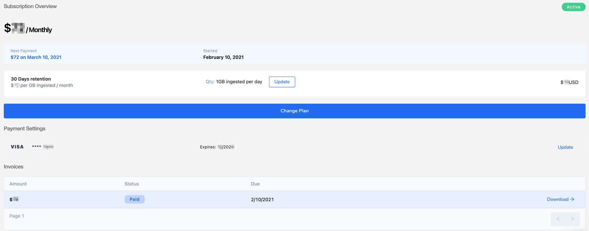

Once you create your account you will need to set up your plan based on amount of logs you are going to send to Coralogix. To calculate a needed quota you need to decide which your data are high, medium, low priority. 1 GB purchased for frequent search (high priority) is equivalent to 2.5GB for monitoring (medium priority) and 6.5GB for compliance (Low priority). To learn more about TCO click [here](https://coralogixstg.wpengine.com/tutorials/optimize-log-management-costs/).

To set your plan open Settings --> Plan. Next choose the retention time from drop-down list and then click on the **Select Plan** button.

In the pop-up window click on the **Update** button if you need more than 1GB per day:

Put the quantity for GB Ingested per day. The calculation per month is done automatically at the Total section:

Click the **Confirm** button to apply the changes. You will get back to the earlier popup window where other information should be provided. Once the form is filled, click the **Confirm** button.

You will see Account details where you can check your current plan, update your plan and your credit card details. In the Invoices section you can review and download your invoices and check the payment status.

Example:

