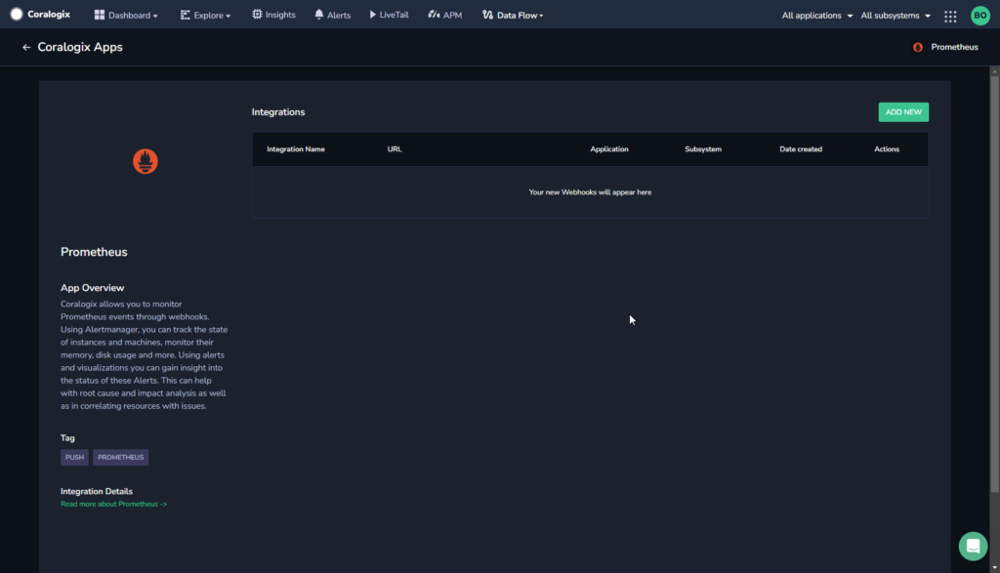
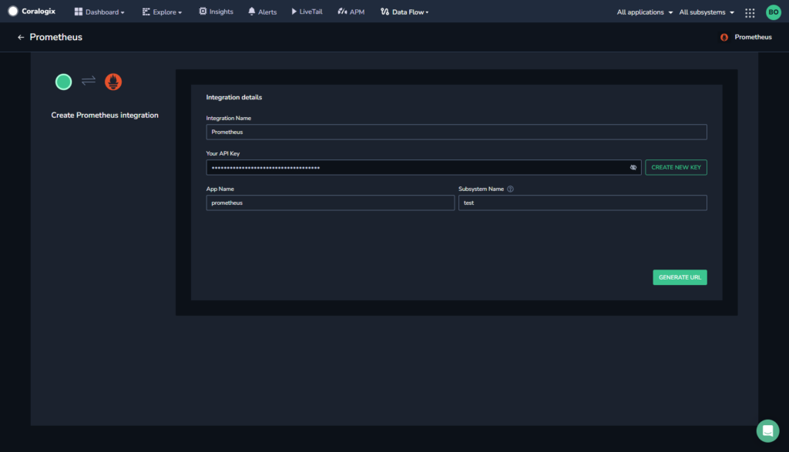
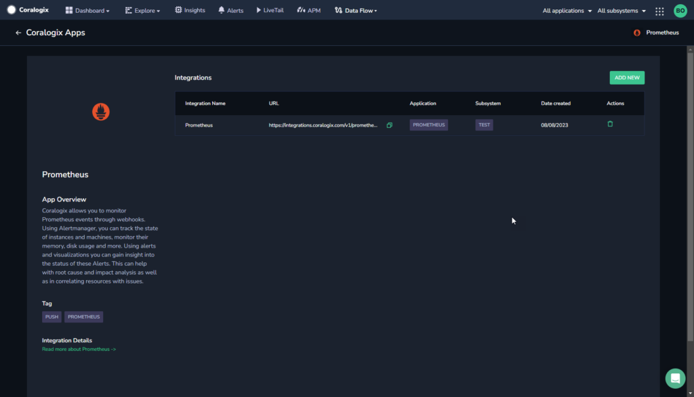
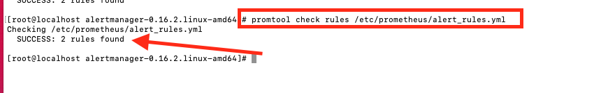
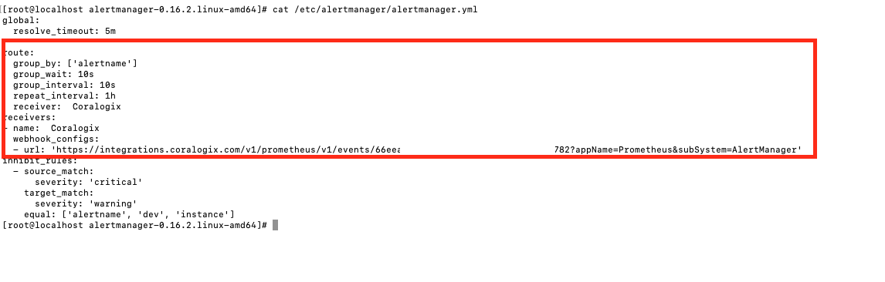
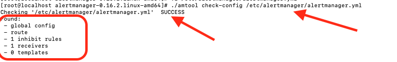
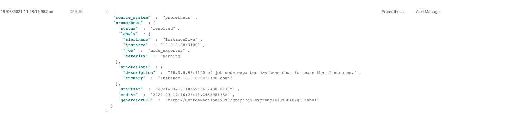

Collect your Prometheus alerts in the Coralogix platform using our automatic **Contextual Data Integration Package**. The package automatically generates a URL to be used when creating a Prometheus webhook.

## Overview

Prometheus is an open-source monitoring and alerting toolkit initially developed by SoundCloud. It is widely used in modern cloud-native environments to monitor the health and performance of applications and infrastructure. Prometheus collects time-series data from various sources through a pull model and stores it in a time-series database. With its flexible query language, Prometheus allows users to explore and analyze metrics data, enabling proactive monitoring and troubleshooting. Additionally, it features a powerful alerting system that can be configured to send notifications when predefined conditions are met, empowering teams to respond promptly to potential issues and maintain the reliability of their systems. As a key component of the Cloud Native Computing Foundation (CNCF) landscape, Prometheus has become a fundamental tool for monitoring in containerized and distributed architectures.

Sending your Prometheus alerts to Coralogix streamlines alert aggregation, enhances monitoring capabilities, and facilitates comprehensive incident analysis. By directing your Prometheus alerts into Coralogix, you gain a centralized view of your alerting activities, enabling rapid incident detection, proactive troubleshooting, and data-driven decision-making. This integration empowers teams to optimize response workflows, strengthen system reliability, and ensure operational efficiency, leveraging Coralogix's analytics, alerts, and visualization tools to extract valuable insights from Prometheus alerts and ensure a streamlined and resilient incident response process.

## Get Started

**STEP 1.** In your navigation pane, click **Data Flow** > **Contextual Data**.

**STEP 2.** In the **Contextual Data** section, select **Prometheus** and click **+** **ADD**.



**STEP 3.** Click **ADD NEW**.

**STEP 4.** Fill in the **Integration Details**:

- **Name.** Name your integration.

- **Your API Key**. Click **CREATE NEW KEY** to generate an API key and name it.

- **Application Name and Subsystem Name**. Enter an [application and subsystem name](https://coralogixstg.wpengine.com/docs/application-and-subsystem-names/).



**STEP 5.** Click **GENERATE URL**. The URL for the integration will be automatically created. Use this when creating a Prometheus webhook.



## **Create a Prometheus Webhook**

Create a Prometheus webhook using your Coralogix generated URL.

**STEP 1**. Make sure you have Prometheus configured with Alertmanager.

**STEP 2.** Add some rules in your `alert_file.yml` (you can add as many rules as you like).

**STEP 3.** Make sure to confirm your rules are working properly by using:

```
     Promtool check rules  /path to your rules.yml file.
```



**STEP 4.** Configure your alertmanager to trigger an alert once any of the rules in your `rules.yml` file has been satisfied.

**STEP 5.** Open `alertmanager.yml` (it is usually located under `/etc/alertmanger/alertmanager.yml`, however the path depends on your installation).



**STEP 6.** Add the following to the file:

```
route:
  receiver: Coralogix

receivers:
  - name: Coralogix
    webhook_configs:
      - url: Coralogix-url
        send_resolved: true
```

**STEP 6.** Replace `Coralogix-url` with the Coralogix generated URL from the previous section.

**STEP 7.** Use amtool to check the alert manager config and make sure it passes. Your alert manager will not start if this config is not correct.

If the config passes you will get a success message with details about what you have configured in your `alertmanger.yml`.



## Example Log



## Support

**Need help?**

Our world-class customer success team is available 24/7 to walk you through your setup and answer any questions that may come up.

Feel free to reach out to us **via our in-app chat** or by sending us an email at [support@coralogixstg.wpengine.com](mailto:support@coralogixstg.wpengine.com).
