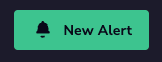
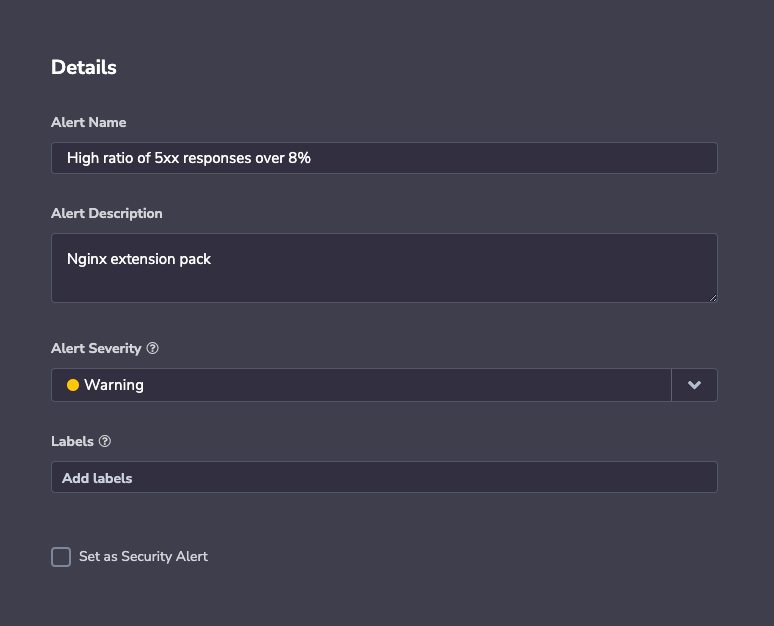
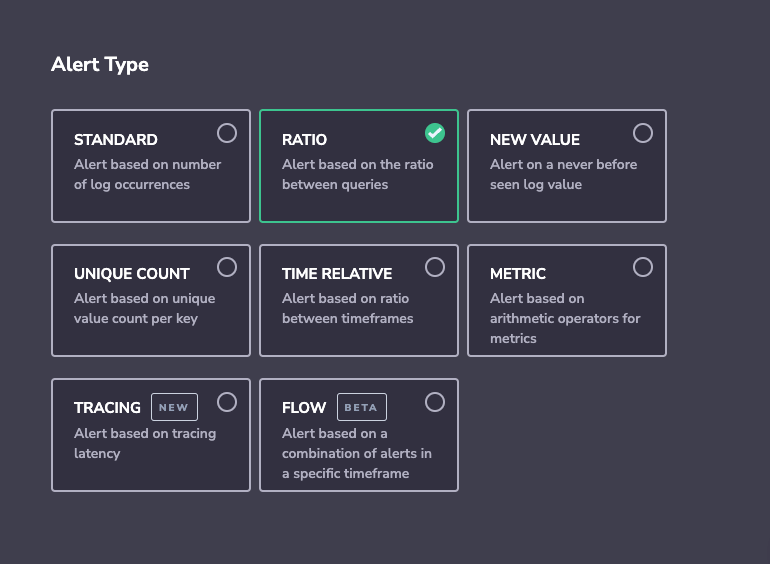
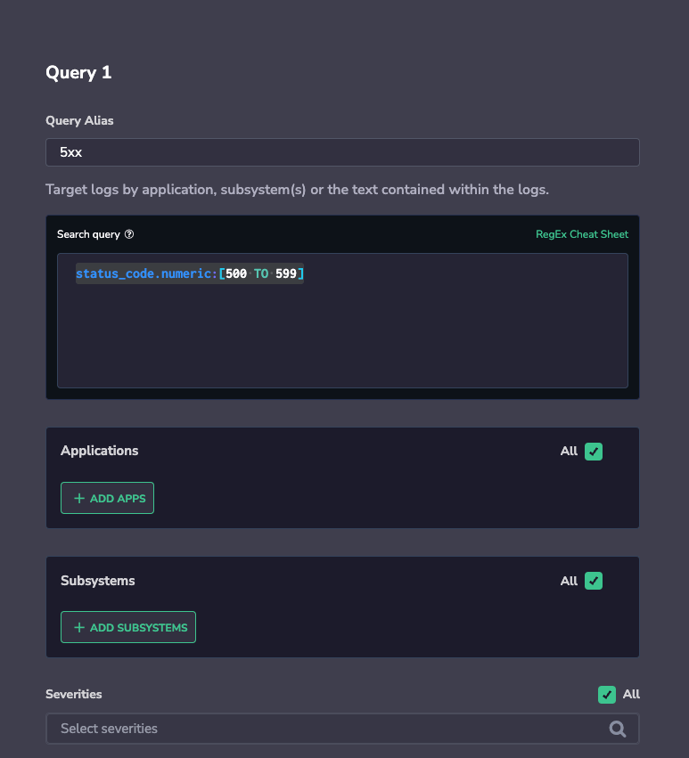
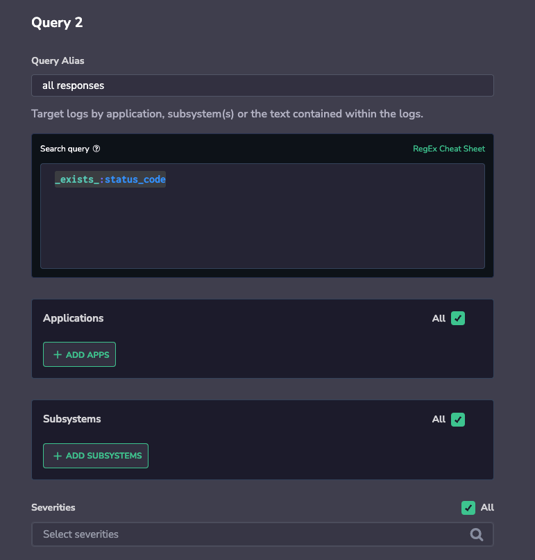
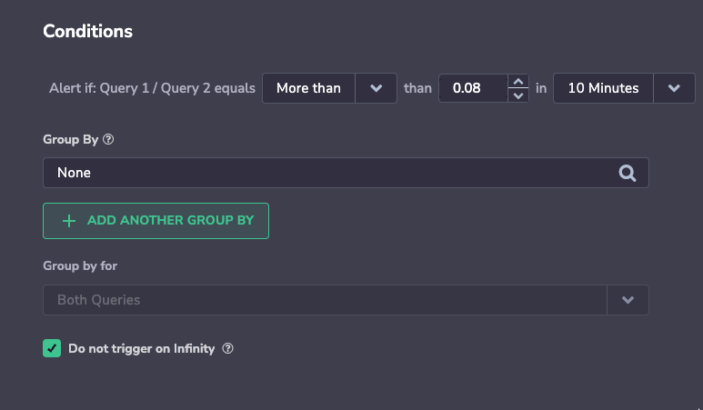
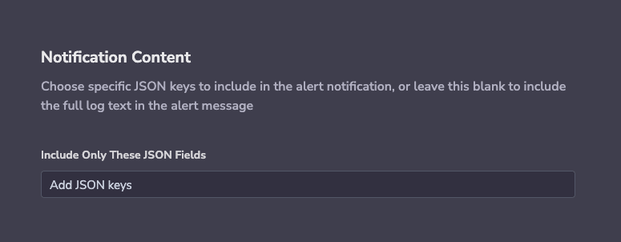

Ratio alerts allow you to easily calculate a ratio between two log queries and trigger an alert when the ratio reaches a set threshold.

## Feature

Use this feature to monitor:

- **Operational Health.** Monitor the number of outgoing responses to incoming requests or the ratio of specific error codes to the overall number of errors.

- **Marketing.** Monitor the ratio between traffic from specific regions to overall traffic following regional campaigns.

- **Security.** Monitor the ratio of denied requests, specific admin operations, or requests originating from blocked network domains compared to all requests.

## Create a Ratio Alert

**STEP 1**. In the navigation pane, click **Alerts > Alert Management.** Click **NEW ALERT** on the top-right area of the UI.

## Details

**STEP 2**. Define the **Alert Details**.

- Please enter:
    - **Alert Name.**
    
    - **Alert Description**.
    
    - **Alert Severity**. Choose from one of four options: **Info**, **Warning**, **Error**, **Critical**.
    
    - **Labels**. Define a new label or choose from an existing one. Nest a label using `key:value`.
    
    - **Set as Security Alert**. Check this option to create an alert related to [Coralogix Security solutions](https://coralogixstg.wpengine.com/docs/cloud-security-quick-start/).

## Alert Type

**STEP 3.** Select **RATIO** **Alert Type**.

## Define Queries

**STEP 4**. Define **Query 1** & **Query 2**.

- Create a meaningful name (**Alias**) for your query, as it will appear in your alert notifications

- Input a new query. Using the available RegEx cheat sheet for support.

- Filter by **Application**, **Subsystem** and **Severity**.

### Additional Query Examples

- **Example 1**
    - Query1: `status:504`
    
    - Query2: `_exists_:status`
    
    - Result: Finds the ratio between error code 504 and the overall number of response codes received. Higher-than-usual ratios may indicate operational issues.

- **Example 2**
    - Query1: `NOT client_addr:/172\\.[0-9]{1,3}\\.[0-9]{1,3}\\.[0-9]{1,3}/`
    
    - Query2: `_exists_:client_addr`
    
    - Result: Assume addresses outside [172.xxx.xxx.xxx](http://172.xxx.xxx.xxx) are restricted. An abnormal ratio of restricted traffic to all traffic may indicate an attack.

- **Example 3**
    - Query1: request\_status:success
    
    - Query2: response\_status:rejectrequest
    
    - Result: Calculates how many requests were not answered successfully out of all successful requests. A higher-than-usual ratio may indicate operational issues.

## Conditions

**STEP 5**. Set the **Conditions** to trigger the alert.

An alert will trigger when the count of the entries matching the alert definition will be more / less than the chosen threshold (the ratio chosen in the Query1/Query2 drop-down list). Hit count will present the actual number of entries that match within the selected time window.

### Group By

- **Group By** alerts by aggregating one or more values into a histogram. An alert is triggered whenever the condition threshold is met for a specific aggregated value within the specified timeframe.

- If using 2 values for **Group By**, matching logs will first be aggregated by the parent field (ie. **region**), then by the child field (ie. **pod\_name**). An alert will fire when the threshold meets the unique combination of both parent and child. Only logs that include the **Group By** fields will be included in the count.

### Trigger on Infinity

Choose whether you would like to be alerted on Infinity. The infinity value is met when the value of the second query is 0. In that case, the ratio result will be infinite.

## Notifications

**STEP 6**. Define **Notification** settings.

In the notification settings, you have different options, depending on whether or not you are using the **Group By** condition.

### Using Group By

When using **Group By** conditions, you will see the following options:

- **Trigger a single alert when at least one combination of** the group by values meets the condition. A single notification, aggregating all values matching an alert query and conditions, will be sent to your Coralogix Incidents screen.

- **Trigger a separate alert for each combination that meets the condition**. Multiple individual notifications for each Group By field value may be sent to your Coralogix Incidents screen when query conditions are met. Select one or more Keys – consisting of a subset of the fields selected in the alert conditions – in the drop-down menu. A separate notification will be sent for each Key selected.

- The number of **Group By** permutations is limited to 1000. If there are more permutations, then only the first 1000 are tracked.

### Not Using Group By

When not using the **Group By** condition, **a single alert will be triggered** and sent to your [Incidents Screen](https://coralogixstg.wpengine.com/docs/incidents/) when the query meets the condition.

You can define additional alert recipient(s) and notification channels in both cases by clicking **\+ ADD WEBHOOK**. Once you add a webhook, you can choose the parameters of your notification:

- **Notify Every**. Sets the alert cadence. After an alert is triggered and a notification is sent, the alert will continue to work, but notifications will be suppressed for the duration of the suppression period.

- **Notify When Resolved**. Activate to receive an automatic update once an alert has ceased.

## Schedule

**STEP 7**. Set a **Schedule**. Limit triggering to specific days & times.

## Notification Content

**STEP 8**. Define **Notification Content**.

- Choose a specific JSON key or keys to include in the alert notification.

- Leave blank to view the full log text.

## Finalize Alert

**STEP 9**. Click **CREATE ALERT** on the upper-right side of the screen.

After saving your alert, it may take up to 15 minutes for the alert to be active in the cluster.

## **Support**

**Need help?**

Our world-class customer success team is available 24/7 to walk you through your setup and answer any questions that may come up.

Contact us **via our in-app chat** or by emailing [support@coralogixstg.wpengine.com](mailto:support@coralogixstg.wpengine.com).
