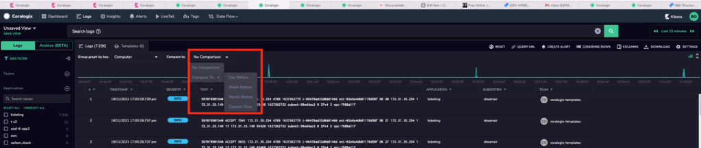
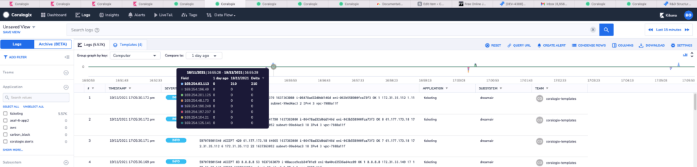

Time-series graphs are a great way to visualize your search results. Identifying trends and spotting outliers is much easier on a graph.

Relative graphs on Coralogix allow you to compare the current search result with a single time-frame in the past. You gain the ability to perform a time-series comparison of any key in your logs, when used together with the “**Group-by key**”.

Examples of graphs that you can plot include:

- Counts of exceptions with a past time-frame.
- Events such failed login attempts with past time-frame.

## Getting started:

- Navigate to the log screen. Perform a search to display the first graph of results.
- Click on the “Compare to” drop-down. Select your preferred time-frame from comparison.

- Hovering your mouse over the graph displays a tool-tip. The tool-tip shows a count of values in the “**Group-by key**”

## Notes:

- Your team's retention period determines how much time-shifted data is available.
- Compare to feature is not available for archive queries.
