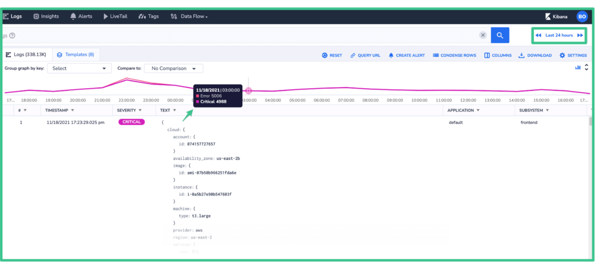
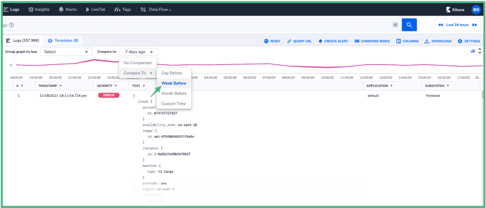
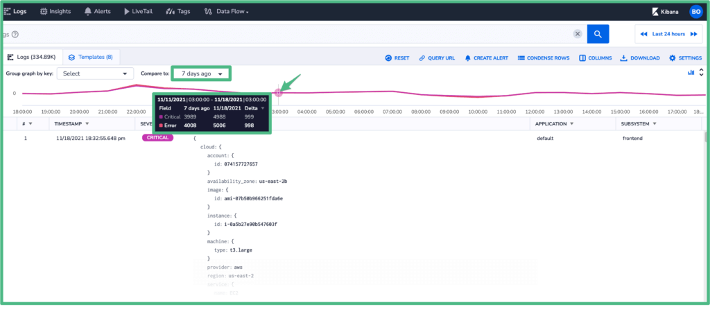
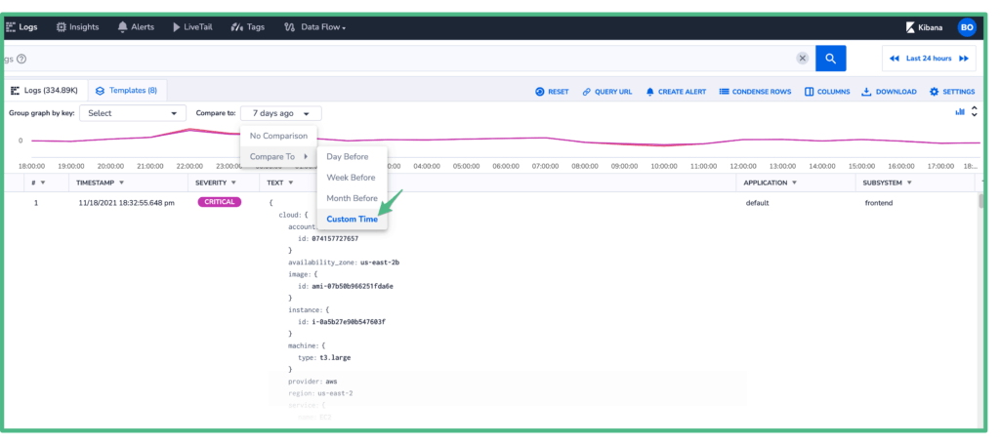
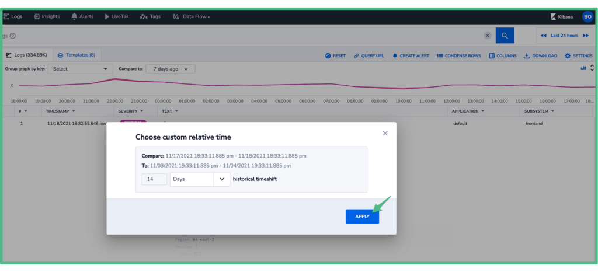
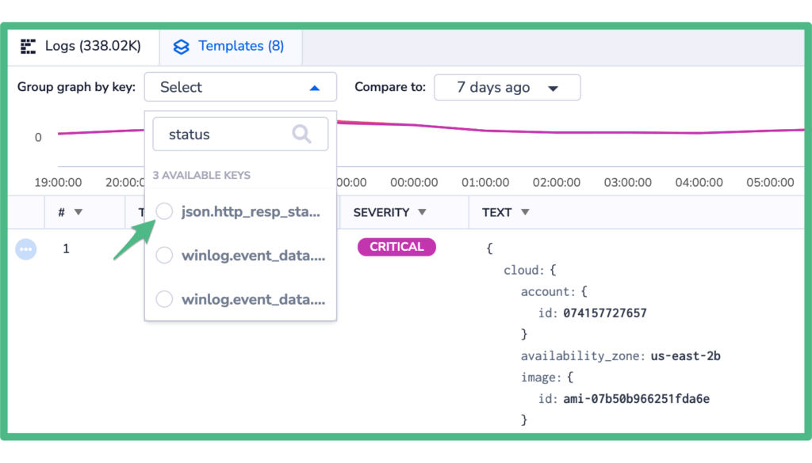
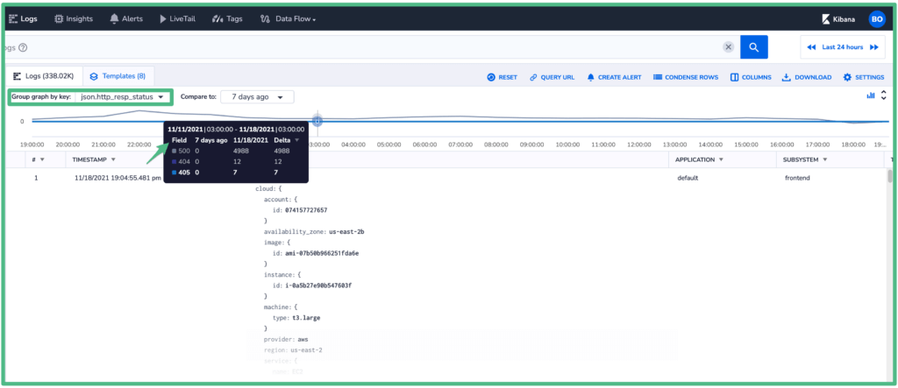

The top graph in the Logs screen supports the comparison of the current query with any baseline in the past.

This feature allows you to quickly determine the current state of your logs, and compare it to the state of logs previously received matching the same query criteria. Relative Time Series Graphs are a great way to visualize your search results and allow for easier identification of trends and outliers.

For the comparison, the historical time-shift can be set to seconds, minutes, hours, or days.

Examples of graphs that you could plot include:

- Counts of exceptions within a given time-frame.
- Events such as failed login attempts within a given time-frame.

With this feature, trends are easily identifiable. It is possible to determine if more/less/no errors are being received - Has an error trend previously seen in the logs been corrected? Or on the contrary, has a new error trend been identified?

## \[Video Tutorial\]

Let's illustrate how this feature works using the following example:  
  
1\. We are interested in analyzing logs with Error and Critical priority for the frontend subsystem for the last 24 hours:  

2\. Following are the resulting logs:

3\. At the 3:00 AM mark we show a total of 5,006 logs with Error severity, and 4,988 logs with Critical severity for the current day. Let's compare this to the same time a week ago:

Please note that the comparison criteria can be set to:

- The Day Before
- The Week Before
- The Month Before
- A Custom Time  
    

4\. Upon selecting the desired comparison baseline, the graph will automatically refresh. Following are the comparison results:

The tooltip in the image above at the 3:00 AM mark, shows the baseline behavior on the left (from 7 days ago), the current behavior in the middle, and the difference between them on the right under the "Delta column". If the value under investigation has decreased for the comparison period it will show a negative number, which is not the case in this example.

5\. The Custom Time criteria can be set by clicking “Custom Time” and entering the desired time criteria.

And clicking 'apply' to display the comparison results:

6\. Finally, it is also possible to perform a time-series comparison for any key in your logs, when used with the “**Group graph by key**” option. For example:

**Notes:**

- Your team’s retention period determines how much time-shifted data is available.
- The "Compare to" feature is not yet available for archive queries.

For any questions, please visit us via our in-app chat. We are always here to help!
