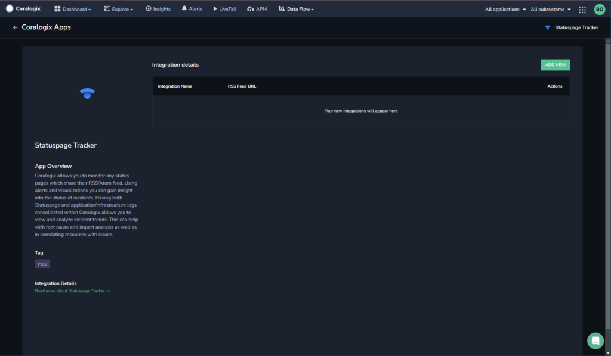
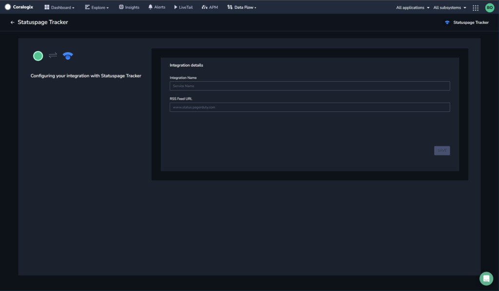
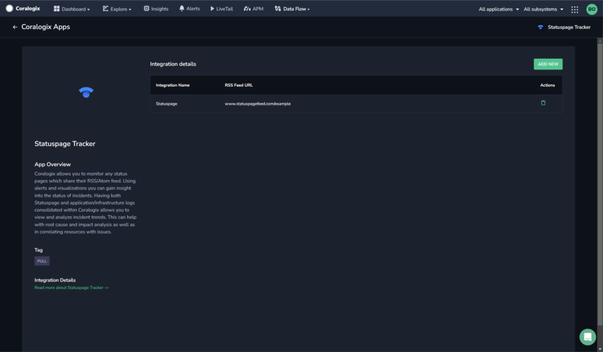

Monitor your Statuspage RSS feed in the Coralogix platform using our automatic **Contextual Data Integration Package**.

## Overview

Statuspage is a communication platform that enables businesses to maintain transparent and real-time communication with their customers, partners, and internal teams during incidents or disruptions. It allows organizations to create a dedicated status page where they can provide updates on the status of their services, applications, and systems. With customizable incident templates, automated notifications, and integration with various monitoring tools, Statuspage helps organizations manage incidents effectively, minimize customer impact, and build trust by delivering timely and accurate information about service availability and performance.

Sending the Statuspage feed to Coralogix facilitates centralized incident monitoring, analysis, and streamlined communication. By directing Statuspage updates into Coralogix's log management platform, organizations can consolidate incident-related information, gain insights into the impact of service disruptions, and correlate these events with other operational data. This integration empowers teams to enhance incident response, analyze patterns, and improve communication by leveraging Coralogix's log analysis and visualization tools to extract valuable insights from Statuspage feeds, ultimately leading to improved service reliability, customer satisfaction, and operational resilience.

## Get Started

**STEP 1.** Go to the status page which you want to monitor. Example: [https://metastatuspage.com/#](https://metastatuspage.com/#)

**STEP 2.** Click on the **SUBSCRIBE TO UPDATES** button.

**STEP 3.** Click on the **RSS** icon.

**STEP 4.** Copy the URL of the link under the text **Atom Feed**.

**STEP 5.** On your Coralogix toolbar, click **Data Flow** > **Contextual Data**.

**STEP 6.** In the **Contextual Data** section, select **Statuspage** and click **+** **ADD**.

**STEP 7.** Click **ADD NEW**.

**STEP 8.** Fill in the **Integration Details**:

- **Name.** Name your integration.

- **RSS Feed URL.** Enter the URL for your Statuspage RSS feed that you copied above.

**STEP 9.** Click **SAVE**.

## Support

**Need help?**

Our world-class customer success team is available 24/7 to walk you through your setup and answer any questions that may come up.

Feel free to reach out to us **via our in-app chat** or by sending us an email at [support@coralogixstg.wpengine.com](mailto:support@coralogixstg.wpengine.com).
