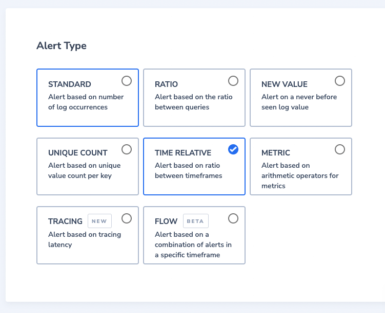
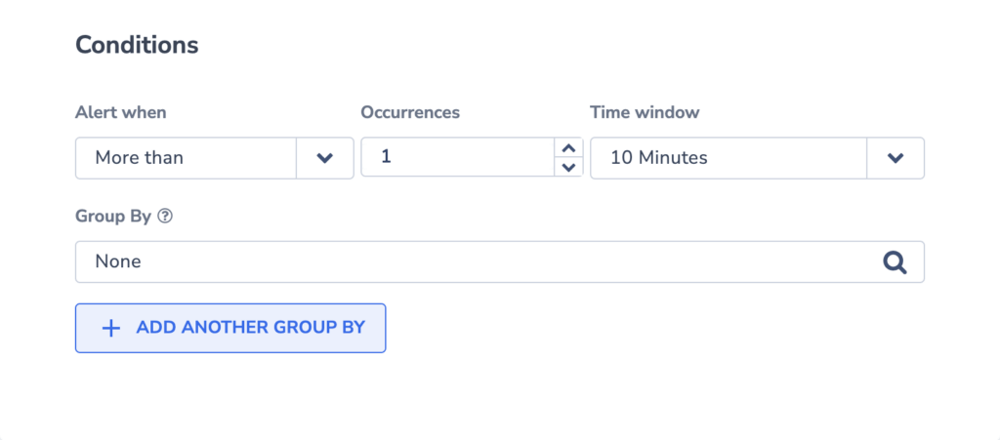
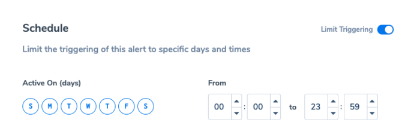
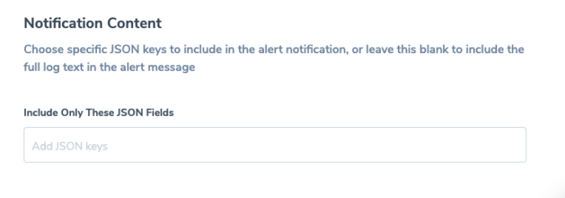
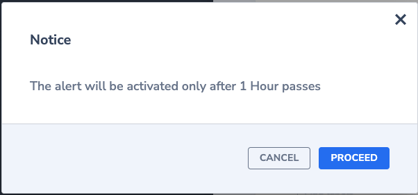
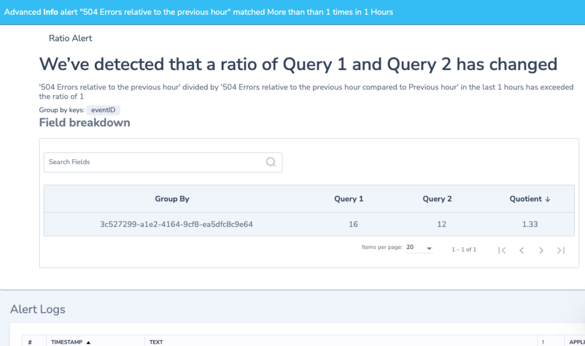

Automatically detect abnormal behavior in your system using the **Time Relative Alert.** Such alerts are triggered when a fixed ratio reaches a set threshold compared to a past time frame.

## Feature

Use this feature to:

- Receive automatic alerts regarding changes in your system’s security, operations, and / or business behaviors over time

- Compare between each behavior across different time periods

### Track & Compare Your System Behavior Over Time

**Security**. Receive automatic alerts comparing suspicious behavior. Compare, for instance, the amount of NX domain name responses or admin logins across days or weeks.

**Operations**. Receive automatic alerts regarding error rates and page loading times in your applications. Compare, for instance, errors rates and page loading times in the past day or hour.

**Business**. Receive automatic alerts when there is a shift in sales or user signups. Compare, for instance, the amount of purchases on the same day last week or the user signups over the last month.

## Create an Alert

**STEP 1**. Create a new alert.

- Click on **Alerts** < **Alert Management** in the Coralogix toolbar.

- Click **NEW ALERT** on the upper right-hand corner of your dashboard.

## Alert Details

**STEP 2**. Define **Alert Details**.

- Define:
    - **Alert Name.**
    
    - **Description**.
    
    - **Severity**. Choose from one of four options: **info**, **warning**, **error**, **critical**.
    
    - **Labels**. Define a new label or choose from an existing one. Nest a label using `key:value`.

## Alert Type

**STEP 3.** Select **TIME RELATIVE** **Alert Type**.

## Query

**STEP 4**. Define a **Query**.

- Input a new **Query**. Using the available RegEx cheat sheet for support.

- Filter by **Application**, **Subsystem** and **Severities**.

## Conditions

**STEP 5**. Set the **Conditions** for triggering an alert.

### Alert When

The Alert will trigger when the query matching the alert definition will be **more than/less than** a number of **occurrences** when compared to the query results of a particular **time window**.

For example, a query returns for the last hour 180 error logs. The same query but in a different timeframe (e.g. previous hour) returns 60 error logs. It means the ratio is 3. If the ratio is more than 1, then the alert will be triggered when the threshold is reached.

### Time Window

Choose a particular timeframe for comparison.

Options include:

- Previous hour - compare the timeframe “now-1hour TO now” to “now-2hour TO now-1hour” (1 hour)

- Same hour yesterday - compare the timeframe “now-1hour TO now” to “now-25hours TO now-24hours” (1 hour)

- Same hour last week - compare the timeframe “now-1hour TO now” to “now-1week and 1 hour TO now-1week” (1 hour)

- Yesterday - compare the timeframe “now-24hours TO now” to “now-48hours TO now-24 hours” (24 hours)

- Same day last week - compare the timeframe “now-24hours TO now” to “now-8days TO now-7days” (24 hours)

- Same day last month - compare the timeframe “now-24hours TO now” to “now-29days TO now-28days” (24 hours)

- A comparison between timeframes is made either every 5 minutes (for: Previous hour, Same hour yesterday, Same hour last week) or every 10 minutes (for: Yesterday, Same day last week, Same day last month).

### Group By

Group your alerts using one or more aggregated values into a histogram.

- An alert is triggered whenever the condition threshold is met for a specific aggregated value within the specified timeframe.

- If using 2 values for **Group By**, matching logs will first be aggregated by the parent field (ie. **region**), then by the child field (ie. **pod\_name**). An alert will fire when the threshold meets the unique combination of both parent and child. Only logs that include the **Group By** fields will be included in the count.

## Notifications

**STEP 6**. Define **Notification** settings.

In the notification settings, you have different options, depending on whether or not you are using the **Group By** condition.

### With Group By

When using **Group By** conditions, you will see the following options:

- **Trigger a single alert when at least one combination of** the group by values meets the condition. A single notification, aggregating all values matching an alert query and conditions, will be sent to your Coralogix Incidents screen.

- **Trigger a separate alert for each combination that meets the condition**. Multiple individual notifications for each Group By field value may be sent to your Coralogix Incidents screen when query conditions are met. Select one or more Keys - consisting of a subset of the fields selected in the alert conditions - in the drop-down menu. A separate notification will be sent for each Key selected.

- The number of **Group By** permutations is limited to 1000. If there are more permutations, then only the first 1000 are tracked.

### Without Group By

When not using the **Group By** condition, **a single alert will be triggered** and sent to your [Incidents Screen](https://coralogixstg.wpengine.com/docs/incidents/) when the query meets the condition.

You can define additional alert recipient(s) and notification channels in both cases by clicking **\+ ADD WEBHOOK**. Once you add a webhook, you can choose the parameters of your notification:

- **Notify Every**. Sets the alert cadence. After an alert is triggered and a notification is sent, the alert will continue to work, but notifications will be suppressed for the duration of the suppression period.

- **Notify when resolved**. Activate to receive an automatic update once an alert has ceased.

### Advanced Notifications

Once you add a webhook to the notification group, a toggle appears which enables you to move to **Advanced Mode**. Advanced mode lets you set the **notify every** & **notify when resolved** settings for each webhook individually. Note that the toggle affects all notification groups, and when activate the toggle in one notification group, it will be turned on in all notification groups.

## Schedule

**STEP 7**. Set a **Schedule.**

Limit triggering to specific days and times.

## Notification Content

**STEP 8**. Define **Notification Content**.

- Choose a specific JSON key or keys to include in the alert notification.

- Leave blank to view the full log text.

## Alert Finalization

**STEP 9.** Click **Create Alert** on the upper-right side of the screen.

- The alert will be activated after the **Time Window** is set in the Conditions.

- Once triggered, the alert will display the count of logs for the current timeframe, for the compared timeframe, and the quotient of both.

## **Support**

**Need help?**

Our world-class customer success team is available 24/7 to walk you through your setup and answer any questions that may come up.

Contact us **via our in-app chat** or by emailing [support@coralogixstg.wpengine.com](mailto:support@coralogixstg.wpengine.com).
