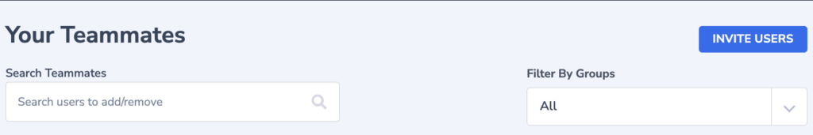

## Overview

A **Coralogix Team** is a platform environment with its unique URL, settings, and [Send-Your-Data API key](https://coralogixstg.wpengine.com/docs/send-your-data-api-key/). Teams are used to group users together based on their project, department, or any other relevant criteria. Teams provide a convenient way to collectively manage permissions and settings for a group of users. You can assign teams to specific logs, alerts, or dashboards, ensuring that the right people can access the relevant information. Users may view data only of those teams of which they are members.

Teams can consist of users from different [Groups](https://coralogixstg.wpengine.com/docs/groups/), allowing you to create flexible and dynamic access controls. For example, you can have a Development Team with users from the Engineering, Operations, and Support groups. This allows you to [grant permissions and manage access](https://coralogixstg.wpengine.com/docs/roles-permissions/) granularly, aligning with your organization's structure and requirements.

## Create a Team

If you haven't already done so, [sign up](https://dashboard.eu2.coralogixstg.wpengine.com/#/signup) for a free Coralogix account. You will be prompted to create a new team. Input a team name and click **CREATE TEAM**.

If you already have an account, click **CREATE NEW TEAM** in your login screen.

Alternatively, click **\+ CREATE NEW TEAM** in the upper right-hand corner of your Coralogix dashboard.

## Manage Existing Team Members

**STEP 1**. Access your settings in the upper-right hand corner of your Coralogix dashboard.

**STEP 2**. In the left-hand sidebar, click **Team Members**. A list of existing team members will appear.

**STEP 3**. **Search** existing team members. You may filter your search according to member roles.

**STEP 4**. **Administrators** (admins) may add team members, remove them, or change their [permissions](https://coralogixstg.wpengine.com/docs/roles-permissions/) by clicking on the drop-down menu right of the user's name.  
**Notes**:

- Users can be assigned to more than one team.

- Users may view data only of those teams of which they are members.

- Upon logging in, users may select the team within which they would like to work.

- Each team has its own unique [Send-Your-Data API key](https://coralogixstg.wpengine.com/docs/send-your-data-api-key/).

## SSO Login

For instructions on how to set up a single sign-on (SSO) with your IDP, follow our tutorial [here](https://coralogixstg.wpengine.com/tutorials/sso-with-saml/).

**Notes**:

- If your admin configures a SAML SSO, no password is necessary for you to sign in to Coralogix.

- Only the admin is authorized to change the password if an SSO is enabled.

## Session Length Management

Team administrators can define the **duration of idle sessions** for all users in the team. Enabling this option will end all current login sessions and require users to log in again. Find out more [here](https://coralogixstg.wpengine.com/docs/session-length-management/).

## Role-Based Access Control

**Role-based access control** **(RBAC)** allows account administrators to grant some or all team members specific [application and subsystem](https://coralogixstg.wpengine.com/docs/application-and-subsystem-names/) data scope permissions for logs and traces, as well as action permissions.

- **RBAC for logs**. Find out more [here](https://coralogixstg.wpengine.com/docs/role-based-access-control-logs/).

- **RBAC for traces**. Find out more [here](https://coralogixstg.wpengine.com/docs/role-based-access-control-traces/).

## Support

**Need help?**

Our world-class customer success team is available 24/7 to walk you through your setup and answer any questions that may come up.

Feel free to reach out to us **via our in-app chat** or by sending us an email at [support@coralogixstg.wpengine.com](mailto:support@coralogixstg.wpengine.com).
